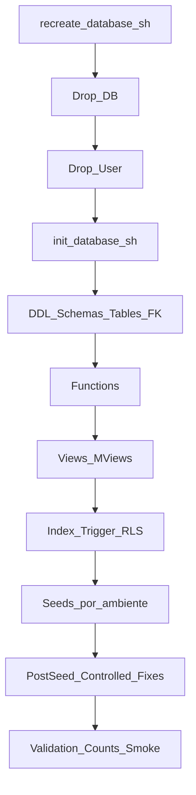

# Analisis Pipeline de Recreacion de Base de Datos

**Version:** 1.0.0  
**Fecha:** 2026-02-17  
**Estado:** Activo

---

## 1) Objetivo

Validar el flujo tecnico real de recreacion de BD para asegurar cumplimiento de politica DDL-first:

- sin migrations incrementales operativas,
- sin fixes manuales fuera del pipeline,
- con orden de ejecucion reproducible para carga limpia.

---

## 2) Scripts auditados

| Script | Ruta | Rol en pipeline |
|-------|------|-----------------|
| `init-database.sh` | `apps/database/scripts/init-database.sh` | Inicializa usuario+BD y carga DDL/funciones/vistas/indices/triggers/RLS/seeds |
| `recreate-database.sh` | `apps/database/scripts/recreate-database.sh` | Drop total (BD+usuario) y delega en `init-database.sh` |
| `reset-database.sh` | `apps/database/scripts/reset-database.sh` | Drop BD y recreacion manteniendo usuario |
| `create-database.sh` | `apps/database/create-database.sh` | Carga por fases de DDL/seed en escenario donde BD ya existe |

---

## 3) Flujo de ejecucion (pipeline limpio)

---

## 4) Hallazgos tecnicos

### Cumplimiento confirmado

1. **Pipeline principal sin migrations incrementales**
   - El flujo operativo usa recreacion completa con DDL+seeds.
   - No depende de carpeta `apps/database/migrations/` para ejecutar.

2. **Orden de ejecucion definido**
   - Se respeta secuencia estructural: DDL -> funciones -> vistas -> indices -> triggers -> RLS -> seeds.
   - Hay validaciones de conteo post-carga en script de inicializacion.

3. **Segregacion por ambiente**
   - Configuracion en `scripts/config/dev.conf` y `scripts/config/prod.conf`.
   - Seeds por ambiente (`seeds/dev`, `seeds/prod`).

### Riesgos observados

| Riesgo | Prioridad | Descripcion |
|-------|-----------|-------------|
| Ejecucion prod sin password explicito | P0 | Puede desalinear credenciales entre DB y `.env.production` |
| Error humano de ambiente (`--env`) | P0 | Ejecutar `dev` en servidor prod puede cargar datos no deseados |
| Dependencias de post-seed sensibles | P1 | Si falla post-seed de funciones/permisos, requiere recarga controlada |
| Validaciones no centralizadas en un checklist unico | P1 | Puede quedar recreacion “exitosa” sin smoke completo |

---

## 5) Politica de “sin migrations/fixes”

Estado validado:

- **Permitido:** fixes controlados dentro del flujo oficial de inicializacion/recreacion.
- **No permitido:** fixes manuales ad-hoc fuera del pipeline y migrations incrementales como via principal.

Regla operativa:

1. Cambiar DDL/seed en repo.
2. Ejecutar recreacion limpia.
3. Validar.
4. Si falla, corregir DDL/seed y repetir.

---

## 6) Controles minimos obligatorios por corrida

- [ ] Ambiente correcto (`--env dev|prod`) validado.
- [ ] En prod: backup previo confirmado.
- [ ] En prod: password leido desde `apps/backend/.env.production`.
- [ ] PM2 detenido antes de recrear en prod.
- [ ] Post-recreate: validacion de tablas/RLS + health endpoint backend.

---

## 7) Referencias

- `apps/database/scripts/recreate-database.sh`
- `apps/database/scripts/init-database.sh`
- `apps/database/scripts/config/dev.conf`
- `apps/database/scripts/config/prod.conf`
- `orchestration/directivas/simco/SIMCO-DDL.md`
- `orchestration/directivas/simco/SIMCO-RECREAR-BD.md`
