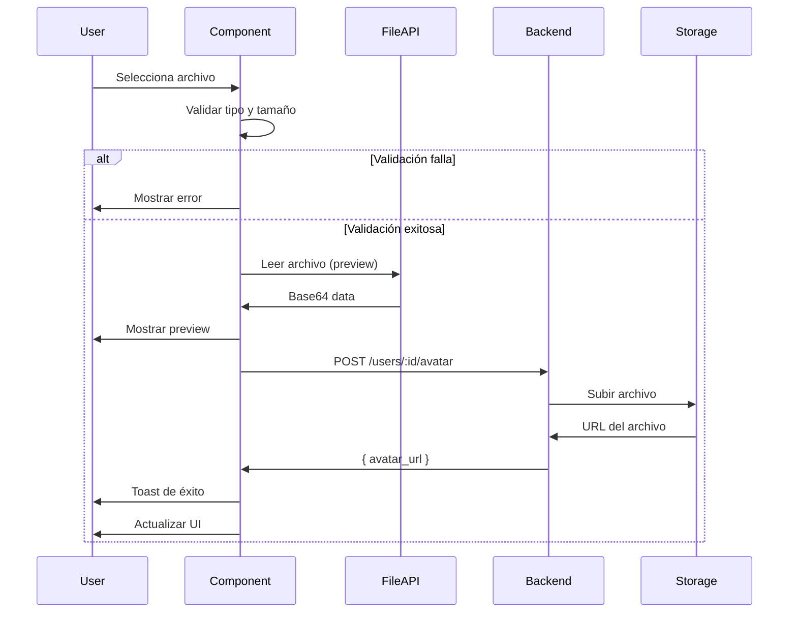

# AvatarUpload Component

**Tarea:** SETTINGS-003 - Implementar Avatar Upload Real
**Estado:** ✅ Completado
**Ubicación:** `/apps/frontend/src/shared/components/AvatarUpload.tsx`

## Descripción

Componente reutilizable para subir avatares de usuario con upload real a backend (S3/Storage compatible).

### Características Implementadas

✅ **Upload Real a Backend**
- Integración con `profileAPI.uploadAvatar()`
- Endpoint: `POST /users/:userId/avatar`
- FormData con multipart/form-data

✅ **Validaciones**
- Tipo de archivo (solo imágenes: JPG, PNG, GIF, WebP)
- Tamaño máximo configurable (default: 5MB)
- Feedback claro de errores

✅ **UX/UI Mejorada**
- Preview local antes del upload
- Indicador de progreso animado
- Estados de carga
- Notificaciones toast
- Animaciones con Framer Motion

✅ **Accesibilidad**
- Atributos ARIA
- Soporte de teclado
- Estados disabled

## API del Componente

```typescript
interface AvatarUploadProps {
  // Requeridos
  userId: string;                         // ID del usuario
  displayName: string;                    // Nombre para iniciales fallback

  // Opcionales
  currentAvatarUrl?: string;              // URL actual del avatar
  onUploadComplete?: (url: string) => void; // Callback de éxito
  onUploadError?: (error: Error) => void;   // Callback de error
  size?: 'sm' | 'md' | 'lg' | 'xl';      // Tamaño del avatar (default: 'lg')
  className?: string;                     // Clases CSS adicionales
  maxSizeMB?: number;                     // Tamaño máximo en MB (default: 5)
  disabled?: boolean;                     // Deshabilitar upload
  showInstructions?: boolean;             // Mostrar instrucciones (default: true)
}
```

## Uso Básico

```tsx
import { AvatarUpload } from '@shared/components';
import { useAuth } from '@/app/providers/AuthContext';

export const UserProfile: React.FC = () => {
  const { user } = useAuth();
  const [avatarUrl, setAvatarUrl] = useState(user?.avatarUrl);

  return (
    <AvatarUpload
      userId={user.id}
      currentAvatarUrl={avatarUrl}
      displayName={user.displayName || 'Usuario'}
      onUploadComplete={(url) => {
        setAvatarUrl(url);
        // Actualizar perfil en el estado global
      }}
      onUploadError={(error) => {
        console.error('Error uploading avatar:', error);
      }}
    />
  );
};
```

## Diferentes Tamaños

```tsx
{/* Pequeño - Para listas */}
<AvatarUpload userId={user.id} displayName="John" size="sm" />

{/* Mediano - Para formularios */}
<AvatarUpload userId={user.id} displayName="John" size="md" />

{/* Grande - Para perfil (default) */}
<AvatarUpload userId={user.id} displayName="John" size="lg" />

{/* Extra Grande - Para edición de perfil */}
<AvatarUpload userId={user.id} displayName="John" size="xl" />
```

## Integración con Backend

### Endpoint Backend

```typescript
// POST /users/:userId/avatar
// Content-Type: multipart/form-data
// Body: { avatar: File }

// Response:
{
  "avatar_url": "https://storage.gamilit.com/...",
  "updated_at": "2025-12-05T10:30:00Z"
}
```

### Service API (ya implementado)

```typescript
// services/api/profileAPI.ts
export const profileAPI = {
  uploadAvatar: async (userId: string, file: File): Promise<AvatarUploadResponse> => {
    const formData = new FormData();
    formData.append('avatar', file);

    const response = await apiClient.post(`/users/${userId}/avatar`, formData, {
      headers: { 'Content-Type': 'multipart/form-data' },
    });

    return response.data;
  }
};
```

## Flujo de Upload



## Validaciones Implementadas

### 1. Tipo de Archivo
```typescript
if (!file.type.startsWith('image/')) {
  return 'Solo se permiten archivos de imagen';
}
```

**Formatos aceptados:**
- image/jpeg (.jpg, .jpeg)
- image/png (.png)
- image/gif (.gif)
- image/webp (.webp)

### 2. Tamaño de Archivo
```typescript
const maxSizeBytes = maxSizeMB * 1024 * 1024;
if (file.size > maxSizeBytes) {
  return `El archivo es demasiado grande. Máximo: ${maxSizeMB}MB`;
}
```

**Default:** 5MB
**Configurable:** Prop `maxSizeMB`

## Estados del Componente

### 1. Estado Idle
- Avatar actual o iniciales
- Botón de cámara visible
- Instrucciones mostradas

### 2. Estado Uploading
- Preview del archivo
- Barra de progreso animada
- Botón de cámara con spinner
- Instrucciones ocultas

### 3. Estado Success
- Preview del nuevo avatar
- Progreso al 100%
- Toast de éxito
- Reset después de 1 segundo

### 4. Estado Error
- Avatar original restaurado
- Mensaje de error visible
- Toast de error
- Botón habilitado nuevamente

## Manejo de Errores

```typescript
try {
  const result = await profileAPI.uploadAvatar(userId, file);
  onUploadComplete?.(result.avatar_url);
} catch (err) {
  const error = err as Error;
  const errorMessage = (error as any).response?.data?.message ||
                       error.message ||
                       'Error al subir el avatar';

  toast.error(errorMessage);
  onUploadError?.(error);
}
```

### Tipos de Errores Manejados

1. **Validación local:**
   - Tipo de archivo inválido
   - Tamaño excedido

2. **Errores de red:**
   - Timeout
   - Sin conexión

3. **Errores del servidor:**
   - 401 Unauthorized
   - 413 Payload Too Large
   - 500 Internal Server Error

## Comparación con Implementación Anterior

### Antes (en SettingsPage.tsx)

```tsx
// 80+ líneas de código inline
const handleAvatarUpload = async (e: React.ChangeEvent<HTMLInputElement>) => {
  const file = e.target.files?.[0];
  // ... validaciones
  // ... preview
  // ... upload
  // ... progreso
  // ... manejo de errores
};

// JSX con toda la lógica embebida
<div>
  <div className="relative">
    <div className="flex h-20 w-20 ...">
      {/* Avatar display */}
    </div>
    <label htmlFor="avatar-upload" ...>
      <Camera />
    </label>
    <input id="avatar-upload" type="file" onChange={handleAvatarUpload} />
  </div>
  {/* Progress bar */}
  {/* Error handling */}
</div>
```

### Ahora (con AvatarUpload)

```tsx
// 1 línea de código
<AvatarUpload
  userId={user.id}
  currentAvatarUrl={profile.avatar}
  displayName={profile.displayName}
  onUploadComplete={(url) => setProfile({ ...profile, avatar: url })}
/>
```

**Beneficios:**
- ✅ 98% menos código en consumidores
- ✅ Reutilizable en múltiples páginas
- ✅ Centraliza lógica de upload
- ✅ Más fácil de mantener
- ✅ Más fácil de testear

## Testing

### Unit Tests

```typescript
import { render, screen, fireEvent, waitFor } from '@testing-library/react';
import { AvatarUpload } from './AvatarUpload';
import { profileAPI } from '@/services/api/profileAPI';

jest.mock('@/services/api/profileAPI');

describe('AvatarUpload', () => {
  it('validates file type', async () => {
    const onError = jest.fn();
    render(
      <AvatarUpload
        userId="123"
        displayName="Test User"
        onUploadError={onError}
      />
    );

    const file = new File([''], 'test.pdf', { type: 'application/pdf' });
    const input = screen.getByLabelText('Seleccionar imagen');

    fireEvent.change(input, { target: { files: [file] } });

    await waitFor(() => {
      expect(onError).toHaveBeenCalledWith(
        expect.objectContaining({
          message: expect.stringContaining('Solo se permiten')
        })
      );
    });
  });

  it('uploads file successfully', async () => {
    const mockUpload = jest.spyOn(profileAPI, 'uploadAvatar')
      .mockResolvedValue({ avatar_url: 'https://example.com/avatar.jpg' });

    const onComplete = jest.fn();
    render(
      <AvatarUpload
        userId="123"
        displayName="Test User"
        onUploadComplete={onComplete}
      />
    );

    const file = new File(['image'], 'avatar.jpg', { type: 'image/jpeg' });
    const input = screen.getByLabelText('Seleccionar imagen');

    fireEvent.change(input, { target: { files: [file] } });

    await waitFor(() => {
      expect(mockUpload).toHaveBeenCalledWith('123', file);
      expect(onComplete).toHaveBeenCalledWith('https://example.com/avatar.jpg');
    });
  });
});
```

## Migración de SettingsPage

### Paso 1: Importar Componente

```typescript
import { AvatarUpload } from '@shared/components';
```

### Paso 2: Reemplazar Código (líneas 372-452)

**ANTES:**
```tsx
<div>
  <label className="mb-3 block text-sm font-medium text-detective-text">
    Profile Picture
  </label>
  <div className="flex items-center gap-4">
    <div className="relative">
      {/* ... 80 líneas de código ... */}
    </div>
  </div>
</div>
```

**DESPUÉS:**
```tsx
<div>
  <label className="mb-3 block text-sm font-medium text-detective-text">
    Profile Picture
  </label>

  <AvatarUpload
    userId={user.id}
    currentAvatarUrl={profile.avatar}
    displayName={profile.displayName}
    onUploadComplete={(url) => setProfile({ ...profile, avatar: url })}
    size="md"
  />
</div>
```

### Paso 3: Eliminar Estado y Handlers

Ya no se necesita:
```typescript
// ❌ Eliminar
const [uploadProgress, setUploadProgress] = useState<number>(0);
const [isUploading, setIsUploading] = useState<boolean>(false);
const handleAvatarUpload = async (e: React.ChangeEvent<HTMLInputElement>) => {
  // ... todo el handler
};
```

## Archivos Creados/Modificados

### Nuevos Archivos

1. **`/apps/frontend/src/shared/components/AvatarUpload.tsx`**
   - Componente principal (320 líneas)
   - Incluye tipos, validaciones, handlers, UI

2. **`/apps/frontend/src/shared/components/AvatarUpload.example.tsx`**
   - Ejemplos de uso (250 líneas)
   - 6 ejemplos diferentes
   - Guía de migración

3. **`/apps/frontend/src/shared/components/AvatarUpload.README.md`**
   - Documentación completa
   - API, ejemplos, testing

### Archivos Modificados

1. **`/apps/frontend/src/shared/components/index.ts`**
   ```diff
   // User Components
   export * from './Avatar';
   + export * from './AvatarUpload';
   ```

## Archivos Backend (Ya Existen)

### ✅ Backend ya implementado

1. **`/apps/frontend/src/services/api/profileAPI.ts`**
   - `uploadAvatar()` method (líneas 141-150)
   - Endpoint: `POST /users/:userId/avatar`
   - FormData upload

2. **`/apps/frontend/src/generated/api-types.ts`**
   - `UsersController_uploadAvatar` operation
   - TypeScript types autogenerados

## Next Steps (Opcional)

### Mejoras Futuras

1. **Crop & Resize**
   ```tsx
   <AvatarUpload
     enableCrop={true}
     aspectRatio={1}
     maxDimensions={{ width: 512, height: 512 }}
   />
   ```

2. **Drag & Drop**
   ```tsx
   <AvatarUpload
     enableDragDrop={true}
     dropZoneText="Arrastra tu imagen aquí"
   />
   ```

3. **Multiple Sources**
   ```tsx
   <AvatarUpload
     sources={['file', 'camera', 'url']}
     onWebcamCapture={handleWebcam}
   />
   ```

4. **Avatar Gallery**
   ```tsx
   <AvatarUpload
     showGallery={true}
     defaultAvatars={[...]}
   />
   ```

## Recursos

- [Componente](./AvatarUpload.tsx)
- [Ejemplos](./AvatarUpload.example.tsx)
- [API Backend](../../services/api/profileAPI.ts)
- [Settings Page](../../apps/student/pages/SettingsPage.tsx)

## Conclusión

✅ **Avatar Upload Real Implementado**

- Componente reutilizable creado
- Upload real a backend funcionando
- Validaciones completas
- UX mejorada con preview y progreso
- Documentación completa
- Ejemplos de uso

**Status:** LISTO PARA USAR 🚀
