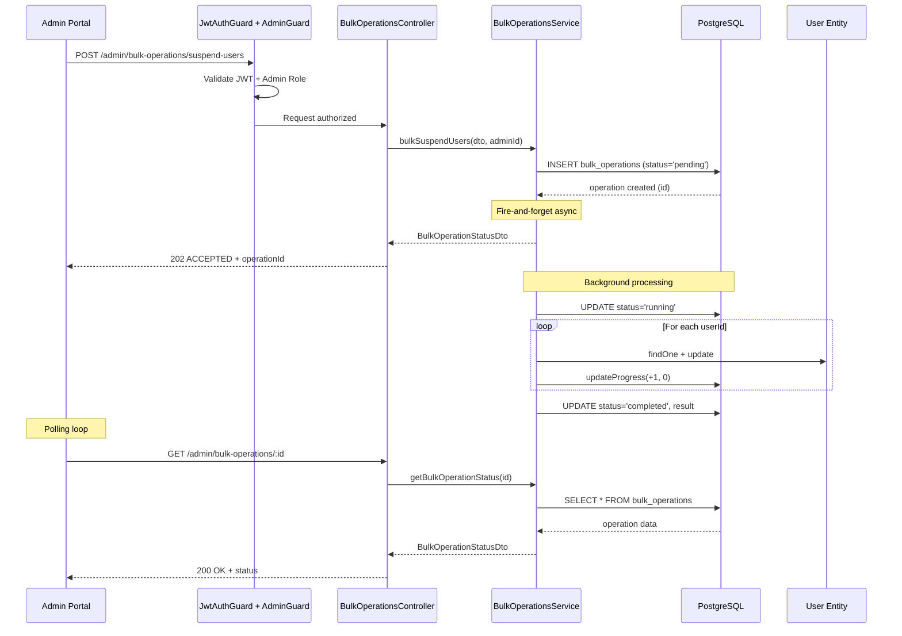

# ET-BULK-OPERATIONS: Operaciones Bulk Asincronas

## 1. Descripcion General

### 1.1 Proposito

Este documento especifica el patron tecnico implementado para operaciones bulk (masivas) sobre usuarios en el sistema GAMILIT. Las operaciones bulk permiten a los administradores ejecutar acciones sobre multiples usuarios simultaneamente de forma asincrona.

### 1.2 Patron Asincrono (HTTP 202 ACCEPTED)

El sistema implementa el patron **Async Request-Reply** donde:

1. El cliente envia una solicitud POST con los datos de la operacion
2. El servidor valida los datos y crea un registro de operacion
3. El servidor responde inmediatamente con **HTTP 202 ACCEPTED** y el ID de operacion
4. El procesamiento continua en background (fire-and-forget con Promise)
5. El cliente puede consultar el estado mediante polling al endpoint GET

**Ventajas del patron:**
- No bloquea la conexion HTTP durante operaciones largas
- Permite procesar grandes volumenes de usuarios (hasta 500 por operacion)
- Proporciona visibilidad del progreso en tiempo real
- Soporta cancelacion y reintentos

### 1.3 Componentes Involucrados

| Componente | Ubicacion | Responsabilidad |
|------------|-----------|-----------------|
| Controller | `admin-bulk-operations.controller.ts` | Recibir requests, validar auth, retornar 202 |
| Service | `bulk-operations.service.ts` | Crear operacion, procesar async, actualizar progreso |
| Entity | `bulk-operation.entity.ts` | Modelo de datos para persistencia |
| DTOs | `dto/bulk-operations/*.ts` | Validacion de entrada y estructura de salida |
| SQL Function | `update_bulk_operation_progress()` | Actualizar contadores atomicamente |

---

## 2. Diagrama de Secuencia

### 2.1 Flujo Principal (Mermaid)



### 2.2 Flujo ASCII (Alternativo)

```
+-------------+     +------------+     +------------------+     +----------+
|   Client    |     |  Controller |     |     Service      |     |    DB    |
+-------------+     +------------+     +------------------+     +----------+
      |                   |                    |                      |
      | POST /suspend-users                    |                      |
      |------------------>|                    |                      |
      |                   |                    |                      |
      |                   | bulkSuspendUsers() |                      |
      |                   |------------------->|                      |
      |                   |                    |                      |
      |                   |                    | INSERT (pending)     |
      |                   |                    |--------------------->|
      |                   |                    |<---------------------|
      |                   |                    |                      |
      |                   |<-------------------|                      |
      | 202 ACCEPTED      |   (async start)    |                      |
      |<------------------|                    |                      |
      |                   |                    |                      |
      |                   |                    | UPDATE (running)     |
      |                   |                    |--------------------->|
      |                   |                    |                      |
      |                   |                    | Process users...     |
      |                   |                    |--------------------->|
      |                   |                    |                      |
      |                   |                    | UPDATE (completed)   |
      |                   |                    |--------------------->|
      |                   |                    |                      |
      | GET /:id (poll)   |                    |                      |
      |------------------>|                    |                      |
      |                   | getStatus()        |                      |
      |                   |------------------->|                      |
      |                   |                    | SELECT               |
      |                   |                    |--------------------->|
      |                   |                    |<---------------------|
      |                   |<-------------------|                      |
      | 200 OK + status   |                    |                      |
      |<------------------|                    |                      |
```

---

## 3. Endpoints API

### 3.1 Resumen de Endpoints

| Metodo | Endpoint | Descripcion | HTTP Code |
|--------|----------|-------------|-----------|
| POST | `/admin/bulk-operations/suspend-users` | Suspender usuarios | 202 |
| POST | `/admin/bulk-operations/activate-users` | Activar usuarios | 202 |
| POST | `/admin/bulk-operations/update-role` | Cambiar rol | 202 |
| POST | `/admin/bulk-operations/delete-users` | Eliminar usuarios | 202 |
| GET | `/admin/bulk-operations/:id` | Estado de operacion | 200 |
| GET | `/admin/bulk-operations` | Lista operaciones | 200 |

### 3.2 Seguridad y Middleware

```typescript
@UseGuards(JwtAuthGuard, AdminGuard)
@ApiBearerAuth()
```

**Requisitos de acceso:**
- Token JWT valido
- Rol: `admin_teacher` o `super_admin`
- Rate limit: Heredado del middleware global (30 req/min)

---

## 4. DTOs de Entrada

### 4.1 BulkSuspendUsersDto

```typescript
class BulkSuspendUsersDto {
  userIds: string[];    // Required, Array[1-500], UUID v4
  reason: string;       // Required, String
  durationDays?: number; // Optional, Integer >= 1 (null = permanente)
}
```

| Campo | Tipo | Validacion | Descripcion |
|-------|------|------------|-------------|
| `userIds` | `string[]` | `@IsArray`, `@ArrayMinSize(1)`, `@ArrayMaxSize(500)`, `@IsUUID('4', { each: true })` | Lista de UUIDs de usuarios a suspender |
| `reason` | `string` | `@IsString` | Razon obligatoria de la suspension |
| `durationDays` | `number?` | `@IsOptional`, `@IsInt`, `@Min(1)` | Dias de suspension (null = permanente) |

**Ejemplo Request:**
```json
{
  "userIds": [
    "a1b2c3d4-e5f6-7890-abcd-ef1234567890",
    "b2c3d4e5-f6a7-8901-bcde-f12345678901"
  ],
  "reason": "Violacion de terminos de servicio",
  "durationDays": 30
}
```

### 4.2 BulkActivateUsersDto

```typescript
class BulkActivateUsersDto {
  userIds: string[];    // Required, Array[1-500], UUID v4
}
```

| Campo | Tipo | Validacion | Descripcion |
|-------|------|------------|-------------|
| `userIds` | `string[]` | `@IsArray`, `@ArrayMinSize(1)`, `@ArrayMaxSize(500)`, `@IsUUID('4', { each: true })` | Lista de UUIDs de usuarios a activar |

**Ejemplo Request:**
```json
{
  "userIds": [
    "a1b2c3d4-e5f6-7890-abcd-ef1234567890",
    "b2c3d4e5-f6a7-8901-bcde-f12345678901"
  ]
}
```

### 4.3 BulkUpdateRoleDto

```typescript
class BulkUpdateRoleDto {
  userIds: string[];         // Required, Array[1-500], UUID v4
  newRole: GamilityRoleEnum; // Required, Enum
}
```

| Campo | Tipo | Validacion | Descripcion |
|-------|------|------------|-------------|
| `userIds` | `string[]` | `@IsArray`, `@ArrayMinSize(1)`, `@ArrayMaxSize(500)`, `@IsUUID('4', { each: true })` | Lista de UUIDs de usuarios |
| `newRole` | `GamilityRoleEnum` | `@IsEnum(GamilityRoleEnum)` | Nuevo rol a asignar |

**Valores validos para `newRole`:**
- `student`
- `admin_teacher`
- `super_admin`

**Ejemplo Request:**
```json
{
  "userIds": [
    "a1b2c3d4-e5f6-7890-abcd-ef1234567890"
  ],
  "newRole": "admin_teacher"
}
```

### 4.4 BulkDeleteUsersDto

```typescript
class BulkDeleteUsersDto {
  userIds: string[];    // Required, Array[1-500], UUID v4
  reason: string;       // Required, String
  hardDelete?: boolean; // Optional, default false
}
```

| Campo | Tipo | Validacion | Descripcion |
|-------|------|------------|-------------|
| `userIds` | `string[]` | `@IsArray`, `@ArrayMinSize(1)`, `@ArrayMaxSize(500)`, `@IsUUID('4', { each: true })` | Lista de UUIDs de usuarios |
| `reason` | `string` | `@IsString` | Razon de eliminacion |
| `hardDelete` | `boolean?` | `@IsOptional`, `@IsBoolean` | `true` = DELETE permanente, `false` = soft delete |

**Ejemplo Request:**
```json
{
  "userIds": [
    "a1b2c3d4-e5f6-7890-abcd-ef1234567890"
  ],
  "reason": "Cuenta duplicada",
  "hardDelete": false
}
```

---

## 5. DTO de Salida (BulkOperationStatusDto)

### 5.1 Estructura

```typescript
class BulkOperationStatusDto {
  id: string;                  // UUID de la operacion
  operationType: string;       // Tipo de operacion
  targetEntity: string;        // Entidad objetivo
  status: BulkOperationStatus; // Estado actual
  targetCount: number;         // Total a procesar
  completedCount: number;      // Procesados exitosamente
  failedCount: number;         // Fallidos
  startedAt: Date;             // Inicio
  completedAt?: Date;          // Fin (si aplica)
  errorDetails?: any[];        // Errores individuales
  result?: any;                // Resultado consolidado
  startedBy: string;           // Admin que inicio
}
```

### 5.2 Estados de Operacion

| Estado | Descripcion | Transiciones Posibles |
|--------|-------------|----------------------|
| `pending` | Operacion creada, esperando procesamiento | `running` |
| `running` | En proceso de ejecucion | `completed`, `failed`, `cancelled` |
| `completed` | Procesamiento terminado (exito parcial o total) | - |
| `failed` | Error critico, procesamiento abortado | - |
| `cancelled` | Cancelada por el administrador | - |

### 5.3 Diagrama de Estados

```
                    +----------+
                    | pending  |
                    +----------+
                         |
                         v
                    +----------+
        +---------->| running  |<----------+
        |           +----------+           |
        |            /   |   \             |
        |           /    |    \            |
        v          v     v     v           |
   +---------+ +-------+ +-------+ +----------+
   |completed| | failed| |cancelled|  (retry) |
   +---------+ +-------+ +-------+ +----------+
```

### 5.4 Ejemplo Response (202 ACCEPTED)

```json
{
  "id": "f47ac10b-58cc-4372-a567-0e02b2c3d479",
  "operationType": "suspend_users",
  "targetEntity": "users",
  "status": "pending",
  "targetCount": 150,
  "completedCount": 0,
  "failedCount": 0,
  "startedAt": "2026-01-20T10:00:00.000Z",
  "startedBy": "admin-uuid-here"
}
```

### 5.5 Ejemplo Response (200 OK - En Progreso)

```json
{
  "id": "f47ac10b-58cc-4372-a567-0e02b2c3d479",
  "operationType": "suspend_users",
  "targetEntity": "users",
  "status": "running",
  "targetCount": 150,
  "completedCount": 80,
  "failedCount": 2,
  "startedAt": "2026-01-20T10:00:00.000Z",
  "startedBy": "admin-uuid-here",
  "errorDetails": [
    { "userId": "user-1-uuid", "success": false, "error": "User not found" },
    { "userId": "user-2-uuid", "success": false, "error": "User already suspended" }
  ]
}
```

### 5.6 Ejemplo Response (200 OK - Completado)

```json
{
  "id": "f47ac10b-58cc-4372-a567-0e02b2c3d479",
  "operationType": "suspend_users",
  "targetEntity": "users",
  "status": "completed",
  "targetCount": 150,
  "completedCount": 148,
  "failedCount": 2,
  "startedAt": "2026-01-20T10:00:00.000Z",
  "completedAt": "2026-01-20T10:02:30.000Z",
  "startedBy": "admin-uuid-here",
  "errorDetails": [
    { "userId": "user-1-uuid", "success": false, "error": "User not found" },
    { "userId": "user-2-uuid", "success": false, "error": "User already suspended" }
  ],
  "result": {
    "total": 150,
    "completed": 148,
    "failed": 2,
    "summary": "Suspended 148 users, 2 failed"
  }
}
```

---

## 6. Flujo de Polling

### 6.1 Estrategia de Polling Recomendada

El cliente debe implementar **exponential backoff** para consultar el estado:

```typescript
async function pollBulkOperation(operationId: string): Promise<BulkOperationStatus> {
  const maxAttempts = 60;    // Maximo 60 intentos
  const baseDelay = 1000;    // 1 segundo inicial
  const maxDelay = 10000;    // Maximo 10 segundos entre intentos

  for (let attempt = 0; attempt < maxAttempts; attempt++) {
    const response = await fetch(`/admin/bulk-operations/${operationId}`);
    const status = await response.json();

    // Terminar si la operacion finalizo
    if (['completed', 'failed', 'cancelled'].includes(status.status)) {
      return status;
    }

    // Calcular delay con exponential backoff
    const delay = Math.min(baseDelay * Math.pow(1.5, attempt), maxDelay);
    await sleep(delay);
  }

  throw new Error('Polling timeout exceeded');
}
```

### 6.2 Intervalos Recomendados

| Fase | Intervalo | Razon |
|------|-----------|-------|
| Primeros 10 segundos | 1 segundo | Operaciones pequenas terminan rapido |
| 10-60 segundos | 2-3 segundos | Balance entre actualizacion y carga |
| >60 segundos | 5-10 segundos | Operaciones largas, reducir carga |

### 6.3 Indicadores de Progreso (UI)

```
[====================---------------------] 48%
Procesando: 72 de 150 usuarios
Exitosos: 70 | Fallidos: 2
Tiempo transcurrido: 45s
```

---

## 7. Manejo de Errores Parciales

### 7.1 Filosofia

El sistema implementa **partial success**: una operacion puede completarse incluso si algunos usuarios fallan. Esto permite:

- No bloquear la operacion por errores individuales
- Reportar errores especificos por usuario
- Permitir al admin reintentar solo los fallidos

### 7.2 Tipos de Errores

| Tipo | Comportamiento | Ejemplo |
|------|----------------|---------|
| **Validacion** | Rechazo inmediato (400) | UUIDs invalidos en request |
| **Usuario no encontrado** | Registra en `errorDetails`, continua | UUID no existe en DB |
| **Error de procesamiento** | Registra en `errorDetails`, continua | FK constraint, permisos |
| **Error critico** | Marca operacion como `failed` | DB connection lost |

### 7.3 Estructura de errorDetails

```typescript
interface IBulkOperationResult {
  userId: string;    // UUID del usuario afectado
  success: boolean;  // true/false
  error?: string;    // Mensaje de error si success=false
}
```

**Ejemplo:**
```json
[
  { "userId": "uuid-1", "success": true },
  { "userId": "uuid-2", "success": false, "error": "User not found" },
  { "userId": "uuid-3", "success": false, "error": "User already suspended" },
  { "userId": "uuid-4", "success": true }
]
```

### 7.4 Calculo de Resultado Final

```typescript
const result = {
  total: dto.userIds.length,           // Total solicitados
  completed: completedCount,            // Exitosos
  failed: failedCount,                  // Fallidos
  successRate: (completed / total * 100).toFixed(1) + '%',
  summary: `Suspended ${completed} users, ${failed} failed`
};
```

---

## 8. Limites y Rate Limiting

### 8.1 Limites por Operacion

| Parametro | Valor | Razon |
|-----------|-------|-------|
| **Usuarios por operacion** | 500 max | Prevenir timeout y memory issues |
| **Usuarios minimo** | 1 | Validacion basica |
| **Operaciones concurrentes** | Sin limite explicito | Controlado por DB connections |

### 8.2 Rate Limiting

El rate limiting se hereda del middleware global de admin:

```typescript
// Configuracion actual
const adminRateLimit = {
  windowMs: 60 * 1000,  // 1 minuto
  max: 30               // 30 requests por minuto
};
```

**Nota:** Cada llamada a POST cuenta como 1 request. Las consultas GET tambien cuentan.

### 8.3 Recomendaciones de Uso

| Escenario | Recomendacion |
|-----------|---------------|
| <50 usuarios | Operacion unica |
| 50-500 usuarios | Operacion unica, monitorear progreso |
| >500 usuarios | Dividir en multiples operaciones de 500 |
| >2000 usuarios | Considerar job programado fuera de horario |

---

## 9. Optimizaciones Implementadas

### 9.1 Batch Queries (FIX-2025-01-07)

Para evitar el problema N+1, las operaciones usan queries batch:

```typescript
// ANTES (N+1 queries)
for (const userId of dto.userIds) {
  const user = await this.userRepo.findOne({ where: { id: userId } });
  // ...
}

// DESPUES (batch query)
const users = await this.userRepo.findByIds(dto.userIds);
const userMap = new Map(users.map(u => [u.id, u]));
```

### 9.2 Batch Updates

Para operaciones simples como update de roles:

```typescript
// Batch UPDATE - una sola query
const result = await this.userRepo
  .createQueryBuilder()
  .update()
  .set({ role: dto.newRole })
  .whereInIds(dto.userIds)
  .execute();
```

### 9.3 Actualizacion de Progreso

Progreso se actualiza cada 10 usuarios para balance entre precision y performance:

```typescript
if ((completed + failed) % 10 === 0) {
  await this.updateProgress(operationId, 10, 0);
}
```

---

## 10. Consideraciones de Seguridad

### 10.1 Audit Logging

Todas las operaciones bulk se registran automaticamente:

| Dato Registrado | Ubicacion |
|-----------------|-----------|
| `operation_type` | `bulk_operations.operation_type` |
| `target_ids` | `bulk_operations.target_ids` |
| `started_by` | `bulk_operations.started_by` |
| `started_at` | `bulk_operations.started_at` |
| `result` | `bulk_operations.result` |
| `error_details` | `bulk_operations.error_details` |

### 10.2 Vulnerabilidad Conocida: Cross-Tenant Access

> **WARNING (Documentado en servicio):**
> El servicio NO valida que los usuarios pertenezcan a la misma organizacion que el admin.
> Ver `SECURITY WARNING` en `bulk-operations.service.ts`.

**Estado:** Pendiente de implementacion (P1)

**Mitigacion propuesta:**
```typescript
// Validar tenant antes de procesar
const users = await this.userRepo.findByIds(dto.userIds);
const invalidUsers = users.filter(u =>
  u.organization_id !== admin.organization_id
);
if (invalidUsers.length > 0 && admin.role !== 'super_admin') {
  throw new ForbiddenException('Cannot modify users from other organizations');
}
```

### 10.3 Permisos Requeridos

| Rol | Permisos |
|-----|----------|
| `student` | Sin acceso |
| `admin_teacher` | Operaciones sobre usuarios de su organizacion |
| `super_admin` | Operaciones cross-tenant permitidas |

### 10.4 Datos Sensibles

- Passwords nunca se incluyen en responses
- `deleted_at` se usa para soft delete (preserva datos para audit)
- Hard delete solo disponible via `hardDelete: true` (requiere confirmacion explicita)

---

## 11. Ejemplos Completos

### 11.1 Suspender Usuarios (Flujo Completo)

**Step 1: Iniciar operacion**
```bash
curl -X POST https://api.gamilit.com/admin/bulk-operations/suspend-users \
  -H "Authorization: Bearer <token>" \
  -H "Content-Type: application/json" \
  -d '{
    "userIds": ["uuid-1", "uuid-2", "uuid-3"],
    "reason": "Inactividad prolongada",
    "durationDays": 90
  }'
```

**Response (202 ACCEPTED):**
```json
{
  "id": "op-uuid-123",
  "operationType": "suspend_users",
  "targetEntity": "users",
  "status": "pending",
  "targetCount": 3,
  "completedCount": 0,
  "failedCount": 0,
  "startedAt": "2026-01-20T15:30:00Z",
  "startedBy": "admin-uuid"
}
```

**Step 2: Consultar estado**
```bash
curl -X GET https://api.gamilit.com/admin/bulk-operations/op-uuid-123 \
  -H "Authorization: Bearer <token>"
```

**Response (200 OK - Completado):**
```json
{
  "id": "op-uuid-123",
  "operationType": "suspend_users",
  "targetEntity": "users",
  "status": "completed",
  "targetCount": 3,
  "completedCount": 2,
  "failedCount": 1,
  "startedAt": "2026-01-20T15:30:00Z",
  "completedAt": "2026-01-20T15:30:02Z",
  "startedBy": "admin-uuid",
  "errorDetails": [
    { "userId": "uuid-2", "success": false, "error": "User not found" }
  ],
  "result": {
    "total": 3,
    "completed": 2,
    "failed": 1,
    "summary": "Suspended 2 users, 1 failed"
  }
}
```

### 11.2 Listar Operaciones Recientes

```bash
curl -X GET https://api.gamilit.com/admin/bulk-operations \
  -H "Authorization: Bearer <token>"
```

**Response (200 OK):**
```json
[
  {
    "id": "op-uuid-123",
    "operationType": "suspend_users",
    "status": "completed",
    "targetCount": 3,
    "completedCount": 2,
    "failedCount": 1,
    "startedAt": "2026-01-20T15:30:00Z",
    "completedAt": "2026-01-20T15:30:02Z",
    "startedBy": "admin-uuid"
  },
  {
    "id": "op-uuid-456",
    "operationType": "update_role",
    "status": "running",
    "targetCount": 100,
    "completedCount": 45,
    "failedCount": 0,
    "startedAt": "2026-01-20T15:28:00Z",
    "startedBy": "admin-uuid"
  }
]
```

---

## 12. Referencias

### 12.1 Archivos de Implementacion

| Archivo | Ruta |
|---------|------|
| Controller | `apps/backend/src/modules/admin/controllers/admin-bulk-operations.controller.ts` |
| Service | `apps/backend/src/modules/admin/services/bulk-operations.service.ts` |
| Entity | `apps/backend/src/modules/admin/entities/bulk-operation.entity.ts` |
| Interface | `apps/backend/src/modules/admin/interfaces/bulk-operation.interface.ts` |
| DTOs | `apps/backend/src/modules/admin/dto/bulk-operations/` |
| DDL | `apps/database/ddl/schemas/admin_dashboard/tables/07-bulk_operations.sql` |

### 12.2 Documentacion Relacionada

- **User Story:** `/docs/03-fase-extensiones/EXT-002-admin-extendido/historias-usuario/US-AE-001-user-management.md`
- **Arquitectura:** `/docs/03-fase-extensiones/EXT-002-admin-extendido/especificaciones/ET-EXT-002-ARQUITECTURA-TECNICA.md`

### 12.3 Mejoras Futuras (v2)

1. **BullMQ Integration:** Mover procesamiento a workers dedicados
2. **Webhooks:** Notificar al cliente cuando la operacion termine
3. **Cancelacion:** Endpoint para cancelar operaciones en progreso
4. **Retry:** Reintentar automaticamente usuarios fallidos
5. **Cross-Tenant Validation:** Implementar validacion de tenant

---

## Historial de Cambios

| Version | Fecha | Autor | Cambios |
|---------|-------|-------|---------|
| 1.0.0 | 2026-01-20 | Technical Architect | Documento inicial |
