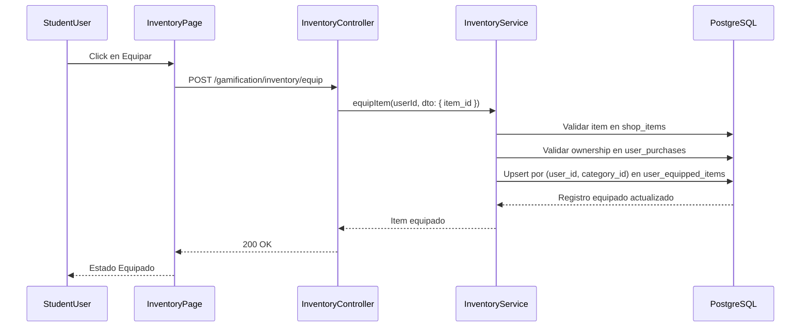

# FLUJO-TECNICO-EQUIPAMIENTO

> Flujo tecnico end-to-end para equipamiento cosmético usando `shop_items.metadata` y `user_equipped_items`.

**Version:** 2.0.0
**Fecha:** 2026-02-21
**Estado:** Activo  
**Contrato canónico metadata:** `docs/40-standards/ESTANDAR-METADATA-ITEMS.md`

---

## 1. Objetivo

Definir el proceso tecnico completo FE -> API -> Service -> DB para:
- Equipar item.
- Quitar item.
- Consultar estado equipado.

---

## 2. Diagrama de secuencia

---

## 3. Reglas de negocio técnicas

1. **Ownership obligatorio:** no se equipa item no comprado.
2. **Solo cosméticos:** item consumible no se puede equipar.
3. **Unicidad por categoría:** un solo item activo por `(user_id, category_id)`.
4. **Metadata canónica:** render basado en contrato de `ESTANDAR-METADATA-ITEMS`.
5. **Fallback de render:** si metadata no válida, usar fallback seguro.
6. **Seguridad de datos:** acceso condicionado por políticas RLS de `user_purchases` y `user_equipped_items`.

---

## 4. Flujo por operación

### 4.1 Equipar (`POST /gamification/inventory/equip`)

1. Validar `item_id` (UUID, via `EquipItemDto`).
2. Buscar item + categoría.
3. Validar que no sea consumible.
4. Validar compra completada del usuario.
5. Actualizar o crear registro equipado por categoría (UPSERT por `user_id, category_id`).
6. Responder con estado actualizado.

Errores:
- `400` item no equipable.
- `403` item no comprado.
- `404` item inexistente.

### 4.2 Quitar (`POST /gamification/inventory/unequip`)

1. Validar `item_id` (UUID, via `EquipItemDto`).
2. Eliminar relación equipada de usuario/item.
3. Si no existe, responder `404`.

### 4.3 Consultar (`GET /gamification/inventory/equipped`)

1. Consultar `user_equipped_items` por `user_id`.
2. Incluir relaciones `item` y `category`.
3. Aplicar `mergeVisualConfig()` a cada item — copia claves visuales (`type`, `asset_url`, `border_color`, `display_text`, `color`, `animated`, `animation`, `glow_color`) desde `effect_data` hacia `metadata`.
4. Retornar payload enriquecido para render frontend.

### 4.4 Consultar Batch (`GET /gamification/inventory/equipped/batch`)

1. Recibir `userIds` (query param, separados por coma, max 50).
2. Consultar `user_equipped_items` para todos los IDs con relaciones `item` y `category`.
3. Aplicar `mergeVisualConfig()` a cada item.
4. Retornar mapa `{ userId: { categoryName: { itemId, name, assetUrl, type, data } } }`.
5. Usado por leaderboards, listas de amigos para evitar N+1 queries.

---

## 5. Contratos mínimos FE-BE

El frontend requiere en cada entrada equipada:
- `item_id`
- `category_id`
- `equipped_at`
- `item.metadata` canónica

El frontend debe:
- despachar render por `metadata.type`,
- aplicar whitelist de clases para `css_class`,
- usar fallback al detectar metadata inválida.

---

## 6. Trazabilidad

### Backend
- `apps/backend/src/modules/gamification/controllers/inventory.controller.ts`
- `apps/backend/src/modules/gamification/services/inventory.service.ts`
- `apps/backend/src/modules/gamification/services/shop.service.ts` (getUserPurchases con relacion item)
- `apps/backend/src/modules/gamification/dto/inventory/equip-item.dto.ts`
- `apps/backend/src/modules/gamification/utils/visual-config.util.ts` (mergeVisualConfig)

### Datos
- `gamification_system.shop_items`
- `gamification_system.user_purchases`
- `gamification_system.user_equipped_items`

### Frontend
- `apps/frontend/src/features/gamification/social/api/inventory.api.ts`
- `apps/frontend/src/features/gamification/social/types/inventory.types.ts`
- `apps/frontend/src/apps/student/components/profile/ProfileHero.tsx`

### Assets
- `apps/frontend/public/assets/` (10 SVGs placeholder maya-themed)

### Documentación relacionada
- `docs/40-api/ENDPOINTS-INVENTORY-EQUIP.md`
- `docs/40-standards/ESTANDAR-METADATA-ITEMS.md`
- `docs/30-ux-ui/flujos/student/FLUJO-EQUIPAMIENTO-ITEMS-COSMETICOS.md`
