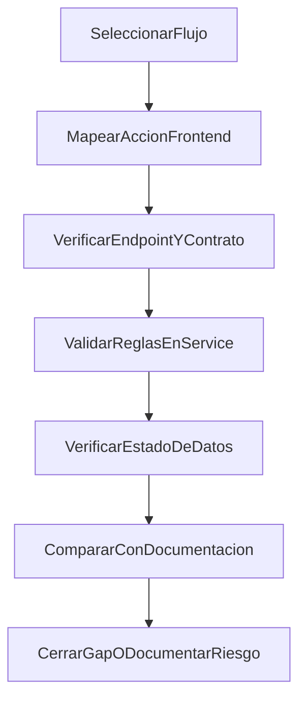

# Fase 2 - Auditoria de Consistencia FE-BE-DB

**Version:** 1.0.0  
**Fecha:** 2026-02-17  
**Estado:** Activo

---

## Objetivo

Ejecutar una auditoria detallada de consistencia funcional por flujo para validar que:

1. La accion en frontend dispare el endpoint correcto.
2. El backend aplique validaciones/reglas esperadas.
3. La persistencia de datos sea coherente con el resultado funcional.
4. El resultado documentado coincida con el comportamiento integrado.

---

## Alcance de auditoria

Flujos incluidos:

- FL-AUTH-01, FL-AUTH-02, FL-AUTH-03
- FL-STU-01, FL-STU-02, FL-STU-03, FL-STU-04
- FL-SHR-01
- FL-TCH-01

---

## Priorizacion por riesgo

| Prioridad | Flujos | Motivo |
|----------|--------|--------|
| P0 | FL-STU-03, FL-STU-04, FL-TCH-01 | Impacto directo en recompensas, consistencia de economia y cierre academico |
| P1 | FL-STU-01, FL-STU-02, FL-SHR-01 | Impacto en progreso y datos de perfil/configuracion |
| P2 | FL-AUTH-01, FL-AUTH-02, FL-AUTH-03 | Flujo base estabilizado; requiere validacion de completitud documental y edge cases |

---

## Metodo de ejecucion

---

## Checklist operativo por flujo

| Check | Descripcion | Evidencia esperada |
|------|-------------|--------------------|
| FE-01 | Boton/accion existe y esta conectado | Componente + handler + hook/store |
| FE-02 | Request payload coincide con contrato | API client + DTO esperado |
| BE-01 | Endpoint/controller mapeado correctamente | Controller + ruta documentada |
| BE-02 | Reglas de negocio aplicadas | Service/use-case y validaciones |
| DB-01 | Persistencia esperada se ejecuta | Tabla/estado/transaccion actualizados |
| DB-02 | No hay estado parcial critico | Comportamiento atomico o compensacion |
| DOC-01 | Flujo coincide con documento de flujo | Diagrama + secuencia FE->BE->DB |
| DOC-02 | Matriz trazabilidad actualizada | `TRACEABILITY-MATRIX.md` vigente |

---

## Plan de ejecucion por oleadas

### Oleada 1 (P0)

- FL-STU-03: tienda compra y asignacion.
- FL-STU-04: claim de logros/misiones.
- FL-TCH-01: cierre de revision manual M3-M5.

**Salida:** reporte de gaps P0 con severidad y accion sugerida.

**Resultado documentado:** `AUDITORIA-P0-RESULTADOS.md`

### Oleada 2 (P1)

- FL-STU-01 y FL-STU-02.
- FL-SHR-01.

**Salida:** validacion de consistencia de progreso, estados y configuracion.

**Resultado documentado:** `AUDITORIA-RESIDUAL-FULL.md`

### Oleada 3 (P2)

- FL-AUTH-01, FL-AUTH-02, FL-AUTH-03.

**Salida:** cierre de cobertura auth extendido y edge cases.

**Resultado documentado:** `AUDITORIA-RESIDUAL-FULL.md`

### Oleada Full (Cobertura total transversal)

- FL-TCH-02, FL-TCH-03.
- FL-ADM-01, FL-ADM-02, FL-ADM-03, FL-ADM-04.
- FL-PRN-01, FL-PRN-02, FL-PRN-03.

**Salida:** consolidado de cobertura total de todos los portales/modulos/componentes.

**Resultado documentado:** `COBERTURA-TOTAL-PROCESOS.md` + `AUDITORIA-RESIDUAL-FULL.md`

---

## Criterios de cierre fase 2

- 100% de checks FE-01..DOC-02 ejecutados por flujo.
- 0 gaps P0 abiertos sin accion definida.
- Riesgos residuales documentados en `VALIDACION-ANALISIS-VS-INTEGRACION.md`.
- Matriz de trazabilidad sincronizada con resultado final.
