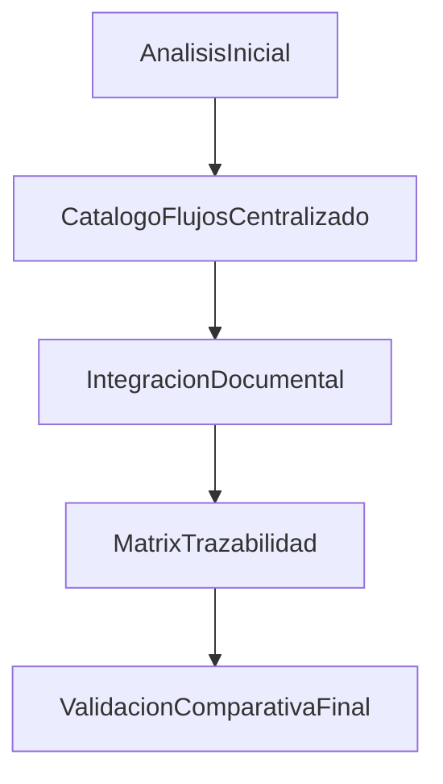

# Validacion - Analisis Inicial vs Integracion Documental

**Version:** 1.3.0  
**Fecha:** 2026-02-17  
**Estado:** Cerrado

---

## 1) Cobertura comparativa

| Criterio | Analisis inicial | Integracion final | Estado |
|----------|------------------|-------------------|--------|
| Catalogo maestro de flujos | No centralizado | Centralizado en `docs/30-ux-ui/flujos/README.md` | Cerrado |
| Mermaid por flujo critico | Parcial/no uniforme | Implementado en 34 flujos catalogados | Cerrado |
| Plantilla unica de flujos | No | `_TEMPLATE-FLUJO.md` creado | Cerrado |
| Matriz de trazabilidad FE/BE/DB | Parcial/dispersa | `TRACEABILITY-MATRIX.md` consolidada + ampliada multi-portal | Cerrado |
| Cobertura proceso->requerimiento->pagina->componente->endpoint->datos->doc | No consolidada | `COBERTURA-TOTAL-PROCESOS.md` | Cerrado |
| Validacion final documentada | No | Este documento | Cerrado |

---

## 2) Checklist de consistencia cruzada

| Validacion | Resultado | Evidencia |
|------------|-----------|-----------|
| Flujo <-> API/endpoints | OK | `TRACEABILITY-MATRIX.md` + `docs/40-api/API-REFERENCE.md` |
| Flujo <-> Datos/tablas | OK | `TRACEABILITY-MATRIX.md` |
| Flujo <-> Frontend accion/componente | OK | Documentos en `flujos/student`, `flujos/teacher`, `flujos/shared` |
| Flujo <-> Guias de portal | OK | `docs/60-portals/*` |
| Flujo <-> UX/UI indice global | OK | Enlaces agregados en `docs/30-ux-ui/*` |

---

## 3) Gaps cerrados y residuales

### Gaps cerrados en documentacion

- Recuperacion de password documentada end-to-end.
- Verificacion de email documentada.
- Flujo Student ejercicio completo (auto-grade) documentado.
- Flujo Student M3-M5 con revision manual documentado.
- Flujo de tienda compra + asignacion documentado.
- Flujo logros/misiones claim documentado.
- Flujo shared de perfil/configuracion mult-portal documentado.
- Flujo teacher de revision manual M3-M5 documentado.

### Riesgos residuales funcionales (sin cambio de codigo)

- Sin pendientes documentales. Cobertura E2E y trazabilidad completadas.

### Actualizacion Oleada 1 (P0)

Se ejecuta auditoria prioritaria en flujos criticos y se registran issues operativos:

- Evidencia: `AUDITORIA-P0-RESULTADOS.md`
- Tarea operativa: `orchestration/tareas/TASK-2026-02-17-AUDITORIA-FLUJOS-P0/`
- Implementado en codigo:
  - `ISSUE-P0-STORE-001` (validacion bloqueante de logro requerido en tienda)
  - `ISSUE-P0-STORE-002` (atomicidad transaccional en `purchaseItem()`)
  - `ISSUE-P0-MISS-001` (consistencia de claim de misiones con ruta transaccional)
  - `ISSUE-P1-REV-001` (cierre de review condicionado a rewards exitosas)

### Actualizacion Oleada Full (P1/P2/Transversal)

- Evidencia: `AUDITORIA-RESIDUAL-FULL.md`
- Matriz integral: `COBERTURA-TOTAL-PROCESOS.md`
- Nuevos documentos de flujo:
  - `flujos/teacher/FLUJO-ASIGNACIONES-CLASE.md`
  - `flujos/teacher/FLUJO-MONITOREO-ALERTAS.md`
  - `flujos/admin/FLUJO-GESTION-USUARIOS-ROLES.md`
  - `flujos/admin/FLUJO-CONFIGURACION-SISTEMA.md`
  - `flujos/admin/FLUJO-APROBACION-CONTENIDO.md`
  - `flujos/admin/FLUJO-MONITOREO-SISTEMA.md`
  - `flujos/parents/FLUJO-VINCULACION-PADRE-ESTUDIANTE.md`
  - `flujos/parents/FLUJO-SEGUIMIENTO-PROGRESO.md`
  - `flujos/parents/FLUJO-NOTIFICACIONES-PADRES.md`

---

## 4) Resultado de integracion

## 5) Criterio de cierre

Se considera completada la implementacion documental del alcance actual porque:

- Existe catalogo global de flujos.
- Cada flujo critico del alcance tiene documento propio y Mermaid.
- Existe trazabilidad cruzada consolidada.
- Existe validacion comparativa formal con evidencia por archivos.
- Todo gap no implementado en codigo queda registrado con responsable y criterio de aceptacion en:
  - `orchestration/tareas/TASK-2026-02-17-CIERRE-RIESGOS-RESIDUALES-FULL/`
  - `orchestration/tareas/TASK-2026-02-15-PLAN-DESARROLLO-INTEGRAL/02-PLAN-DESARROLLO.md`
