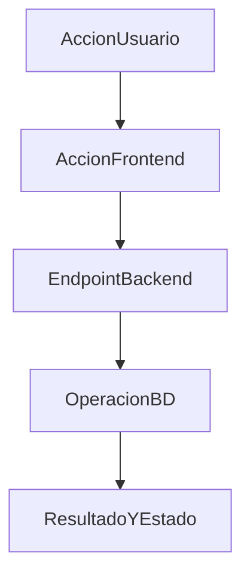

# FLUJO-[DOMINIO]-[NOMBRE]

**Version:** 1.0.0  
**Fecha:** YYYY-MM-DD  
**Estado:** Borrador | Activo | Validado

---

## 1. Resumen

Descripcion corta del proceso y su impacto funcional.

## 2. Precondiciones

- Estado minimo de usuario/sesion
- Configuracion/requisitos previos
- Datos requeridos

## 3. Diagrama Mermaid

## 4. Secuencia FE -> BE -> DB

1. Frontend: pagina/componente/hook/store
2. Backend: endpoint/controller/service
3. Base de datos: tablas/funciones/estados
4. Respuesta y efectos en UI

## 5. Componentes y artefactos implicados

### Frontend
- Pagina:
- Componente de accion:
- Hook/store:
- API service:

### Backend
- Endpoint:
- Controller:
- Service:
- DTOs:

### Datos
- Schema/tabla:
- Entidad:
- Estados:

## 6. Reglas y validaciones

- Regla 1
- Regla 2
- Regla 3

## 7. Manejo de errores

| Escenario | Capa | Comportamiento esperado |
|-----------|------|-------------------------|
| Error de validacion | FE/BE | Mensaje claro + no mutar estado |
| Error de persistencia | BE/DB | rollback/log + respuesta controlada |

## 8. Trazabilidad cruzada

| Capa | Archivo | Evidencia |
|------|---------|----------|
| Frontend | `ruta` | accion/boton/hook |
| Backend | `ruta` | endpoint/metodo |
| Database | `ruta` | tabla/estado/regla |

## 9. Referencias

- Documento funcional:
- Guia de portal:
- API:
