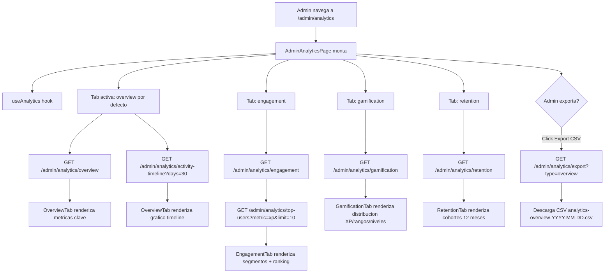

# FL-ADM-16 - Analytics Avanzado Admin

**ID:** FL-ADM-16
**Version:** 1.0.0
**Fecha:** 2026-02-27
**Estado:** Activo
**Portal:** Admin
**Prioridad:** P1

---

## 1. Resumen

Flujo de la pagina `/admin/analytics` donde el super_admin accede a analytics comprehensivos de la plataforma. La pagina presenta cuatro pestanas: Overview (metricas clave + timeline de actividad), Engagement (usuarios por segmento: inactivo/principiante/intermedio/avanzado), Gamificacion (distribucion XP, rangos maya, niveles) y Retencion (analisis de cohortes de los ultimos 12 meses). Incluye funcionalidad de exportacion a CSV por tipo de dato. Todos los datos provienen de vistas materializadas en la base de datos para rendimiento optimo.

---

## 2. Precondiciones

- Usuario autenticado con rol `super_admin`.
- Sesion activa con JWT valido.
- Vistas materializadas de analytics actualizadas (actualizacion periodica via cron).

---

## 3. Diagrama Mermaid



---

## 4. Secuencia FE -> BE -> DB

```
=== Carga tab Overview ===
1. FE: AdminAnalyticsPage monta -> useAnalytics hook
2. FE: GET /api/v1/admin/analytics/overview
3. BE: AdminAnalyticsController.getAnalyticsOverview()
4. BE: AdminAnalyticsService -> consulta materialized views
5. DB: SELECT FROM vistas materializadas de analytics (user counts, averages, segmentation)
6. BE: Retorna AnalyticsOverviewDto { totalUsers, activeUsers, avgSessionDuration,
        usersByRole, usersByGrade, newUsersLast30Days, ... }
7. FE: OverviewTab renderiza metricas y KPIs

8. FE: GET /api/v1/admin/analytics/activity-timeline?days=30
9. BE: AdminAnalyticsService -> datos diarios de actividad
10. DB: SELECT date, unique_users, exercises_completed, logins FROM materialized view
11. BE: Retorna ActivityTimelineDto { timeline: [{date, uniqueUsers, exercisesCompleted, logins}] }
12. FE: Grafico de lineas con timeline 30 dias

=== Tab Engagement ===
13. FE: GET /api/v1/admin/analytics/engagement
14. BE: AdminAnalyticsService.getEngagementAnalytics()
15. DB: SELECT segment, user_count, avg_sessions FROM materialized view GROUP BY segment
16. BE: Retorna { segments: [{segment, userCount, avgSessionsPerWeek, avgExercisesPerSession}] }
17. FE: Renderiza grafico de barras por segmento

18. FE: GET /api/v1/admin/analytics/top-users?metric=xp&limit=10
19. BE: Retorna top 10 usuarios por XP
20. FE: Tabla de ranking

=== Tab Gamificacion ===
21. FE: GET /api/v1/admin/analytics/gamification
22. BE: AdminAnalyticsService.getGamificationAnalytics()
23. DB: SELECT rank, COUNT(*) FROM gamification tables GROUP BY rank
24. BE: Retorna { xpDistribution: [], rankDistribution: [], levelDistribution: [] }
25. FE: GamificationTab renderiza graficos de distribucion

=== Tab Retencion ===
26. FE: GET /api/v1/admin/analytics/retention
27. BE: AdminAnalyticsService.getRetentionAnalytics()
28. DB: Consulta cohortes ultimos 12 meses
29. BE: Retorna { cohorts: [{month, totalUsers, retainedAfter30d, retainedAfter60d, retainedAfter90d}] }
30. FE: RetentionTab renderiza tabla de cohortes

=== Exportar a CSV ===
31. FE: Admin selecciona tipo y click "Exportar CSV"
32. FE: GET /api/v1/admin/analytics/export?type=overview
33. BE: AdminAnalyticsService.exportAnalytics('overview')
34. BE: Genera CSV con datos de overview
35. BE: Retorna Response con Content-Type: text/csv, Content-Disposition: attachment
36. FE: Browser descarga archivo CSV
```

---

## 5. Componentes y artefactos implicados

### Frontend

| Tipo | Archivo |
|------|---------|
| Pagina | `apps/frontend/src/apps/admin/pages/AdminAnalyticsPage.tsx` |
| Hook | `apps/frontend/src/apps/admin/hooks/useAnalytics.ts` |
| Tab overview | `apps/frontend/src/apps/admin/components/analytics/OverviewTab.tsx` |
| Tab engagement | `apps/frontend/src/apps/admin/components/analytics/EngagementTab.tsx` |
| Tab gamification | `apps/frontend/src/apps/admin/components/analytics/GamificationTab.tsx` |
| Tab retention | `apps/frontend/src/apps/admin/components/analytics/RetentionTab.tsx` |
| Tab navigation | `apps/frontend/src/apps/admin/components/shared/AdminTabBar.tsx` |
| Layout | `apps/frontend/src/apps/admin/components/shared/AdminPageShell.tsx` |

### Backend

| Tipo | Archivo |
|------|---------|
| Controller | `apps/backend/src/modules/admin/controllers/admin-analytics.controller.ts` |
| Service | `apps/backend/src/modules/admin/services/admin-analytics.service.ts` |
| DTOs analytics | `apps/backend/src/modules/admin/dto/analytics/` |

### Base de Datos

| Tipo | Archivo |
|------|---------|
| Materialized views | `apps/database/ddl/schemas/` (vistas de analytics) |

---

## 6. Reglas y validaciones

| Regla | Capa | Descripcion |
|-------|------|-------------|
| Solo super_admin | BE | JwtAuthGuard + AdminGuard |
| Datos de vistas materializadas | BE | Analytics usa materialized views para rendimiento |
| Timeline max 90 dias | BE | Parametro days limitado a 1-90 |
| Top users limit max 100 | BE | Parametro limit limitado a 1-100 |
| Export tipos validos | BE | Enum: overview, users, engagement, gamification |
| Filtros engagement opcionales | BE | role y date_from son opcionales |

---

## 7. Manejo de errores

| Escenario | Capa | Codigo HTTP | Comportamiento |
|-----------|------|-------------|----------------|
| Token JWT expirado | BE | 401 | Redirige a login |
| Rol insuficiente | BE | 403 | ForbiddenException |
| Parametros invalidos | BE | 400 | "Invalid query parameters" |
| Error interno | BE | 500 | FE muestra retry button |
| Sin datos de analytics | FE | 200 | Empty state con mensaje descriptivo |
| Error de export | FE | N/A | Toast error, no descarga |

---

## 8. Trazabilidad cruzada

| Capa | Archivo | Evidencia |
|------|---------|-----------|
| Frontend Pagina | `apps/frontend/src/apps/admin/pages/AdminAnalyticsPage.tsx` | Dashboard analitico completo |
| Frontend Hook | `apps/frontend/src/apps/admin/hooks/useAnalytics.ts` | Estado de analytics |
| Backend Controller | `apps/backend/src/modules/admin/controllers/admin-analytics.controller.ts` | 7 endpoints analytics |
| Backend Service | `apps/backend/src/modules/admin/services/admin-analytics.service.ts` | Consultas analytics |

---

## 9. Referencias

- Flujo reportes: [FL-ADM-11](./FLUJO-REPORTES-ANALYTICS-ADMIN.md)
- Flujo progreso: [FL-ADM-17](./FLUJO-PROGRESO-ESTUDIANTES.md)
- Flujo dashboard admin: [FL-ADM-09](./FLUJO-DASHBOARD-ADMIN.md)
