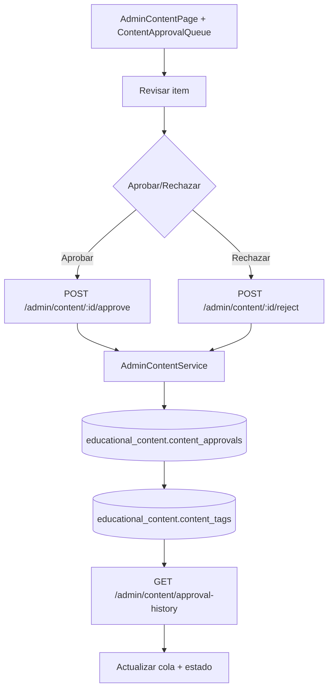

# FL-ADM-03 - Aprobacion de Contenido Educativo

**Portal:** Admin
**Prioridad:** Media-Alta
**Estado:** Documentado

---

## Resumen

Flujo de revision y aprobacion/rechazo de contenido propuesto para modulos y ejercicios.

## Precondiciones

- **Rol requerido:** `super_admin` o `admin_teacher` con permiso `can_approve_content`.
- **Sesion activa:** JWT valido emitido por `auth/login`, con token no expirado y sesion no revocada.
- **Estado del sistema:** Debe existir al menos un item de contenido con estado `pending` en la cola de aprobacion. La plataforma no debe estar en modo mantenimiento.
- **Datos previos:** El contenido debe haber sido creado por un autor (maestro o admin) y estar registrado en `educational_content.content_approvals` con estado pendiente.

## Diagrama Mermaid

## Secuencia FE -> BE -> DB

1. Admin abre `AdminContentPage.tsx` que renderiza `ContentApprovalQueue.tsx` con la cola de aprobacion.
2. FE consulta items pendientes via `GET /admin/content/pending` usando `useContentManagement` hook.
3. Admin selecciona elemento, revisa detalles con `ExercisePreviewModal.tsx` y ejecuta decision.
4. Backend registra aprobacion/rechazo via `AdminContentService`, persiste en `educational_content.content_approvals` con metadatos del revisor.
5. Se actualiza estado del contenido y etiquetas asociadas en `educational_content.content_tags`.
6. FE refresca la cola y muestra resultado con toast de confirmacion.

## Componentes y artefactos implicados

### Frontend

| Tipo | Archivo |
|------|---------|
| Pagina | `apps/frontend/src/apps/admin/pages/AdminContentPage.tsx` |
| Componente | `apps/frontend/src/apps/admin/components/content/ContentApprovalQueue.tsx` |
| Componente | `apps/frontend/src/apps/admin/components/content/ExercisePreviewModal.tsx` |
| Componente | `apps/frontend/src/apps/admin/components/content/ExerciseContentEditor.tsx` |
| Componente | `apps/frontend/src/apps/admin/components/content/ContentVersionControl.tsx` |
| Componente | `apps/frontend/src/apps/admin/components/content/MediaLibraryManager.tsx` |
| Hook | `apps/frontend/src/apps/admin/hooks/useContentManagement.ts` |
| API Service | `apps/frontend/src/services/api/adminAPI.ts` (seccion CONTENT) |

### Backend

| Tipo | Ruta / Archivo |
|------|----------------|
| Endpoint | `GET /admin/content/pending` — Listar contenido pendiente de aprobacion con filtros y paginacion |
| Endpoint | `GET /admin/content/exercises/pending` — Listar ejercicios pendientes (alias con filtro exercise) |
| Endpoint | `POST /admin/content/:id/approve` — Aprobar contenido por ID |
| Endpoint | `POST /admin/content/exercises/:id/approve` — Aprobar ejercicio (alias) |
| Endpoint | `POST /admin/content/:id/reject` — Rechazar contenido con motivo |
| Endpoint | `POST /admin/content/exercises/:id/reject` — Rechazar ejercicio (alias) |
| Endpoint | `POST /admin/content/version` — Crear snapshot de version de contenido |
| Endpoint | `GET /admin/content/media` — Listar biblioteca de medios |
| Endpoint | `DELETE /admin/content/media/:id` — Eliminar archivo de medios (soft delete) |
| Endpoint | `GET /admin/content/approval-history` — Historial de aprobaciones con filtros |
| Controller | `apps/backend/src/modules/admin/controllers/admin-content.controller.ts` |
| Service | `apps/backend/src/modules/admin/services/admin-content.service.ts` |
| Guard | `apps/backend/src/modules/admin/guards/admin.guard.ts` |
| DTOs | `apps/backend/src/modules/admin/dto/content/` (ListContentDto, ApproveContentDto, RejectContentDto, ContentDto, PaginatedContentDto, CreateVersionDto, VersionResponseDto, ListMediaDto, PaginatedMediaDto, ListApprovalHistoryDto, PaginatedApprovalHistoryDto) |

### Datos

| Schema.Tabla | Entity |
|--------------|--------|
| `educational_content.content_approvals` | DDL: `apps/database/ddl/schemas/educational_content/tables/content_approvals.sql` |
| `educational_content.content_tags` | DDL: `apps/database/ddl/schemas/educational_content/tables/content_tags.sql` |
| `content_management.media_files` | Controlador: `apps/backend/src/modules/content/controllers/media-files.controller.ts` |
| `content_management.content_versions` | Controlador: `apps/backend/src/modules/content/controllers/content-versions.controller.ts` |
| `content_management.content_templates` | Controlador: `apps/backend/src/modules/content/controllers/content-templates.controller.ts` |

## Reglas y validaciones

- **RBAC:** Solo `super_admin` y `admin_teacher` con permiso `can_approve_content` pueden aprobar o rechazar. Un autor no puede aprobar su propio contenido.
- **Aislamiento por tenant:** El contenido visible en la cola esta filtrado por el tenant del administrador. RLS activa en `educational_content.content_approvals`.
- **Motivo obligatorio en rechazo:** Al rechazar contenido, el campo `reason` en `RejectContentDto` es obligatorio y debe tener al menos 10 caracteres.
- **Aprobacion irreversible parcial:** Una vez aprobado y publicado, el contenido puede ser archivado pero no revertido a estado draft sin crear nueva version.
- **Versionado:** Al crear un snapshot de version, el sistema auto-incrementa el numero de version minor por defecto. Se almacena historial completo en metadatos.
- **Content type:** Los tipos validos para filtro `content_type` son: `module`, `exercise`, `template`.
- **Media files:** La eliminacion de archivos de medios es soft-delete (campo `is_active = false`), no eliminacion fisica.

## Manejo de errores

| Escenario | Capa | Codigo HTTP | Comportamiento esperado |
|-----------|------|-------------|-------------------------|
| Token JWT expirado o invalido | Backend (JwtAuthGuard) | 401 | FE redirige a login |
| Usuario sin permisos de aprobacion | Backend (AdminGuard) | 403 | FE muestra toast "No tiene permisos para aprobar contenido" |
| Contenido no encontrado por ID | Backend (AdminContentService) | 404 | FE muestra toast "Contenido no encontrado" y refresca cola |
| Rechazo sin motivo o motivo demasiado corto | Backend (ValidationPipe) | 400 | FE muestra error en campo de motivo del formulario |
| Content type invalido en filtro | Backend (ValidationPipe) | 400 | FE muestra toast "Tipo de contenido no valido" |
| Intento de aprobar contenido ya aprobado | Backend (AdminContentService) | 409 | FE muestra toast "Contenido ya fue aprobado" y refresca estado |
| Error al crear version (formato invalido) | Backend (AdminContentService) | 400 | FE muestra error detallado en formulario de version |
| Error de conexion a base de datos | Backend (TypeORM) | 500 | FE muestra toast generico "Error del servidor" con opcion de reintentar |

## Trazabilidad cruzada

| Capa | Archivo | Evidencia |
|------|---------|-----------|
| FE Page | `apps/frontend/src/apps/admin/pages/AdminContentPage.tsx` | Pagina de gestion de contenido |
| FE Component | `apps/frontend/src/apps/admin/components/content/ContentApprovalQueue.tsx` | Cola de aprobacion de contenido |
| FE Component | `apps/frontend/src/apps/admin/components/content/ExercisePreviewModal.tsx` | Modal de preview de ejercicio |
| FE Hook | `apps/frontend/src/apps/admin/hooks/useContentManagement.ts` | Hook con operaciones de contenido |
| FE API | `apps/frontend/src/services/api/adminAPI.ts` | Cliente API seccion CONTENT |
| BE Controller | `apps/backend/src/modules/admin/controllers/admin-content.controller.ts` | Controlador con 10 endpoints de contenido |
| BE Service | `apps/backend/src/modules/admin/services/admin-content.service.ts` | Logica de negocio de aprobacion |
| DB Table | `apps/database/ddl/schemas/educational_content/tables/content_approvals.sql` | DDL de tabla de aprobaciones |
| DB Table | `apps/database/ddl/schemas/educational_content/tables/content_tags.sql` | DDL de tabla de etiquetas |

## Referencias

- Requerimiento: `EPIC-GAM-F3-CONTENT`
- Matriz: `../TRACEABILITY-MATRIX.md`
- Cobertura total: `../COBERTURA-TOTAL-PROCESOS.md`
