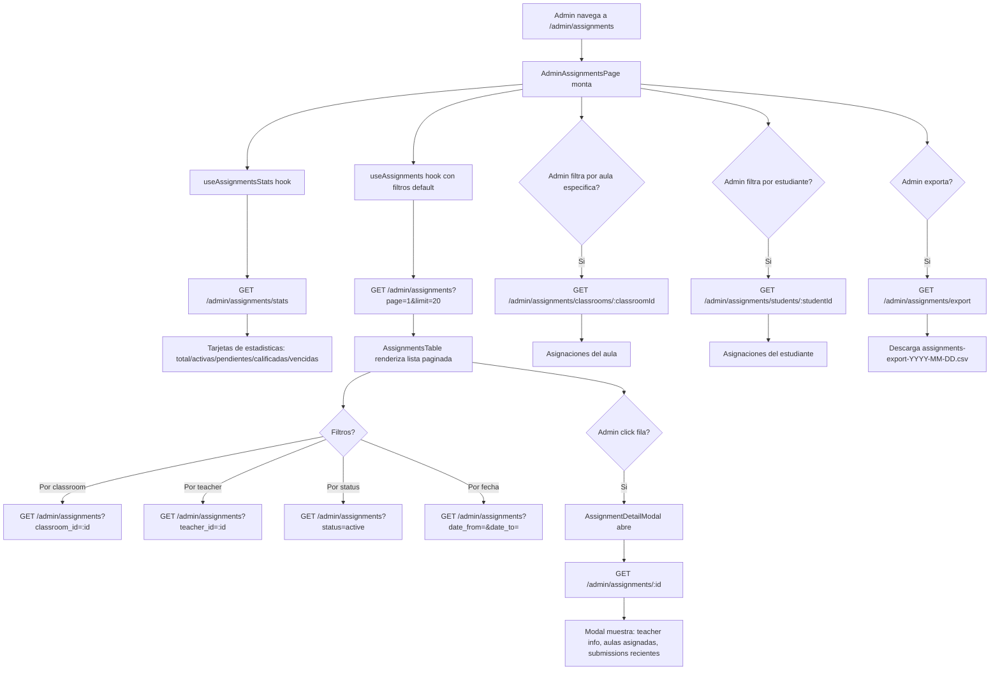

# FL-ADM-19 - Supervision de Asignaciones de Ejercicios

**ID:** FL-ADM-19
**Version:** 1.0.0
**Fecha:** 2026-02-27
**Estado:** Activo
**Portal:** Admin
**Prioridad:** P2

---

## 1. Resumen

Flujo de la pagina `/admin/assignments` donde el super_admin supervisa todas las asignaciones de ejercicios creadas por los docentes en la plataforma. Es una vista de solo lectura que permite al admin tener visibilidad global sobre el estado de las asignaciones. Muestra tarjetas de estadisticas (total, activas, pendientes, calificadas, vencidas), una tabla filtrable con paginacion y un modal de detalle por asignacion. Incluye exportacion a CSV. Los datos son de lectura global (a diferencia del portal docente que solo ve sus propias asignaciones). El backend es `AdminAssignmentsController` que accede a `AdminAssignmentsService`.

---

## 2. Precondiciones

- Usuario autenticado con rol `super_admin`.
- Sesion activa con JWT valido.
- Existencia de asignaciones creadas por docentes.

---

## 3. Diagrama Mermaid



---

## 4. Secuencia FE -> BE -> DB

```
=== Carga de estadisticas globales ===
1. FE: AdminAssignmentsPage monta -> useAssignmentsStats hook
2. FE: GET /api/v1/admin/assignments/stats
3. BE: AdminAssignmentsController.getStats()
4. BE: AdminAssignmentsService.getStats()
5. DB: SELECT COUNT(*), COUNT(CASE WHEN status='active'), COUNT(CASE WHEN status='pending'),
        COUNT(CASE WHEN graded=true), COUNT(CASE WHEN due_date < NOW() AND status!='completed')
        FROM teacher_schema.assignments
6. BE: Retorna AdminAssignmentStatsDto { total, active, pending, graded, late, avgScore,
        breakdownByType: [], breakdownByTeacher: [] }
7. FE: Tarjetas de estadisticas renderizadas

=== Carga lista de asignaciones paginada ===
8. FE: useAssignments(filters) -> GET /api/v1/admin/assignments?page=1&limit=20
9. BE: AdminAssignmentsController.findAll(filters)
10. BE: AdminAssignmentsService.findAll(filters) -> query con filtros opcionales
11. DB: SELECT a.*, t.name as teacher_name, c.name as classroom_name
        FROM assignments a
        JOIN users t ON a.teacher_id = t.id
        JOIN classrooms c ON a.classroom_id = c.id
        WHERE [filtros opcionales]
        ORDER BY a.created_at DESC
        LIMIT :limit OFFSET :offset
12. BE: Retorna PaginatedAdminAssignmentsDto { data: AdminAssignmentDto[], total, page, limit }
13. FE: AssignmentsTable renderiza filas

=== Detalle de asignacion ===
14. FE: Admin click fila -> setSelectedAssignment -> AssignmentDetailModal abre
15. FE: GET /api/v1/admin/assignments/:id
16. BE: AdminAssignmentsController.findOne(id)
17. BE: AdminAssignmentsService.findOne(id) -> incluye teacher, classrooms asignadas, submissions recientes
18. DB: SELECT con JOINs a users, classrooms, submissions
19. BE: Retorna AdminAssignmentDetailDto { assignment, teacher, classrooms, recentSubmissions }
20. FE: Modal renderiza informacion completa

=== Asignaciones por aula ===
21. FE: GET /api/v1/admin/assignments/classrooms/:classroomId
22. BE: AdminAssignmentsController.getByClassroom(classroomId)
23. DB: SELECT FROM assignments WHERE classroom_id = :classroomId
24. BE: Retorna AdminAssignmentDto[] para el aula

=== Asignaciones por estudiante ===
25. FE: GET /api/v1/admin/assignments/students/:studentId
26. BE: AdminAssignmentsController.getByStudent(studentId)
27. DB: SELECT FROM assignments JOIN student_classrooms
        WHERE student_id = :studentId
28. BE: Retorna AdminAssignmentDto[] con status de submissions del estudiante

=== Exportar a CSV ===
29. FE: Admin click "Descargar CSV" -> downloadAssignmentsCSV(filters)
30. FE: GET /api/v1/admin/assignments/export con filtros activos
31. BE: AdminAssignmentsController.exportToCsv(filters, req, res)
32. BE: AdminAssignmentsService.exportToCsv(filters, tenantId)
33. BE: StreamableFile con CSV generado
34. FE: Browser descarga archivo CSV
```

---

## 5. Componentes y artefactos implicados

### Frontend

| Tipo | Archivo |
|------|---------|
| Pagina | `apps/frontend/src/apps/admin/pages/AdminAssignmentsPage.tsx` |
| Hook asignaciones | `apps/frontend/src/apps/admin/hooks/useAdminAssignments.ts` |
| Componente tabla | `apps/frontend/src/apps/admin/components/assignments/AssignmentsTable.tsx` |
| Modal detalle | `apps/frontend/src/apps/admin/components/assignments/AssignmentDetailModal.tsx` |
| Componente filtros | `apps/frontend/src/apps/admin/components/assignments/AssignmentFilters.tsx` |
| Componente paginacion | `apps/frontend/src/shared/components/Pagination.tsx` |
| Layout | `apps/frontend/src/apps/admin/components/shared/AdminPageShell.tsx` |

### Backend

| Tipo | Archivo |
|------|---------|
| Controller | `apps/backend/src/modules/admin/controllers/admin-assignments.controller.ts` |
| Service | `apps/backend/src/modules/admin/services/admin-assignments.service.ts` |
| DTOs | `apps/backend/src/modules/admin/dto/assignments/` |

---

## 6. Reglas y validaciones

| Regla | Capa | Descripcion |
|-------|------|-------------|
| Solo super_admin | BE | JwtAuthGuard + AdminGuard |
| Solo lectura | BE | Todos los endpoints son GET (sin POST/PUT/DELETE) |
| UUID validos | BE | ParseUUIDPipe en classroomId y studentId |
| Export usa filtros activos | BE | Los mismos filtros de la vista se aplican al CSV |
| Tenant scope en export | BE | tenantId del request para filtrar por tenant |
| Orden por created_at desc | BE | Mas recientes primero |

---

## 7. Manejo de errores

| Escenario | Capa | Codigo HTTP | Comportamiento |
|-----------|------|-------------|----------------|
| Token JWT expirado | BE | 401 | Redirige a login |
| Rol insuficiente | BE | 403 | ForbiddenException |
| Asignacion no encontrada | BE | 404 | NotFoundException |
| UUID invalido | BE | 400 | BadRequestException |
| Error de exportacion | FE | N/A | Toast error con mensaje |
| Sin asignaciones | FE | 200 | Empty state con mensaje |

---

## 8. Trazabilidad cruzada

| Capa | Archivo | Evidencia |
|------|---------|-----------|
| Frontend Pagina | `apps/frontend/src/apps/admin/pages/AdminAssignmentsPage.tsx` | Vista global asignaciones |
| Frontend Hook | `apps/frontend/src/apps/admin/hooks/useAdminAssignments.ts` | Estado y queries asignaciones |
| Backend Controller | `apps/backend/src/modules/admin/controllers/admin-assignments.controller.ts` | 6 endpoints GET + export |
| Backend Service | `apps/backend/src/modules/admin/services/admin-assignments.service.ts` | Logica de lectura global |

---

## 9. Referencias

- Flujo asignaciones docente: Portal Teacher flujos
- Flujo progreso estudiantes: [FL-ADM-17](./FLUJO-PROGRESO-ESTUDIANTES.md)
- Flujo aula-docente: [FL-ADM-18](./FLUJO-ASIGNACIONES-AULA-DOCENTE.md)
