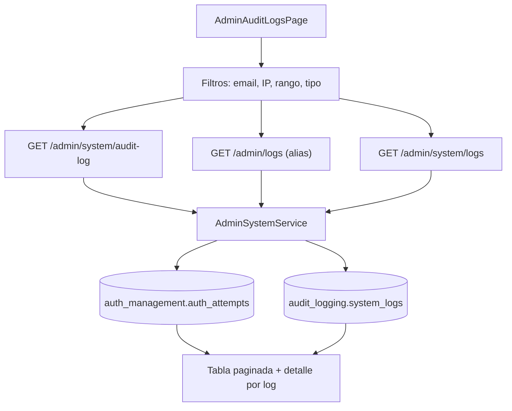

# FL-ADM-06 - Audit Logs

**Version:** 1.1.0
**Fecha:** 2026-02-18
**Portal:** Admin
**Prioridad:** Alta
**Estado:** Documentado

---

## Resumen

Flujo para consultar logs de auditoria de autenticacion y logs del sistema con filtros avanzados y paginacion.

## Precondiciones

- **Rol requerido:** `super_admin`. Los logs de auditoria contienen informacion sensible (IPs, emails, intentos de login) y solo son accesibles por administradores de nivel superior.
- **Sesion activa:** JWT valido emitido por `auth/login`, con token no expirado y sesion no revocada.
- **Estado del sistema:** La plataforma debe estar operativa. Los logs de auditoria se almacenan en `auth_management.auth_attempts` (intentos de login) y `audit_logging.system_logs` (logs del sistema).
- **Datos previos:** Deben existir registros de actividad en las tablas de auditoria. Los logs se generan automaticamente por el sistema conforme ocurren eventos.

## Diagrama Mermaid

## Secuencia FE -> BE -> DB

1. Admin abre `AdminAuditLogsPage.tsx` que muestra el visor de logs de auditoria.
2. FE consulta logs con filtros (email, IP, rango de fechas, tipo de evento) via `useAuditLogs` hook.
3. Hook invoca `GET /admin/system/audit-log` (ruta canonica) o `GET /admin/logs` (alias de compatibilidad) con parametros de `AuditLogQueryDto`.
4. Backend aplica criterios de filtrado, paginacion y retorna `PaginatedAuditLogDto`.
5. FE muestra tabla paginada con detalle por log, incluyendo informacion de IP, user-agent, resultado del intento.

## Componentes y artefactos implicados

### Frontend

| Tipo | Archivo |
|------|---------|
| Pagina | `apps/frontend/src/apps/admin/pages/AdminAuditLogsPage.tsx` |
| Wrapper | `apps/frontend/src/apps/admin/components/shared/AdminPageShell.tsx` |
| Componente | `apps/frontend/src/apps/admin/components/dashboard/SystemLogsViewer.tsx` |
| Componente | `apps/frontend/src/apps/admin/components/monitoring/LogsViewer.tsx` |
| Hook | `apps/frontend/src/apps/admin/hooks/useAuditLogs.ts` |
| Hook | `apps/frontend/src/apps/admin/hooks/useSystemLogs.ts` |
| Hook | `apps/frontend/src/apps/admin/hooks/useAdminPageSetup.ts` |
| API Service | `apps/frontend/src/services/api/adminAPI.ts` (seccion AUDIT LOGS, MONITORING) |

### Backend

| Tipo | Ruta / Archivo |
|------|----------------|
| Endpoint | `GET /admin/system/audit-log` — Logs de intentos de autenticacion con filtros (ruta canonica) |
| Endpoint | `GET /admin/logs` — Alias de compatibilidad para frontend, delega a `AdminSystemService.getAuditLog()` |
| Endpoint | `GET /admin/system/logs` — Logs del sistema (audit_logging.system_logs) con filtros diferentes a audit-log |
| Endpoint | `POST /admin/system/maintenance/cleanup-logs` — Limpiar logs antiguos por retencion |
| Endpoint | `POST /admin/system/maintenance/cleanup-activity` — Limpiar actividad de usuario antigua |
| Controller | `apps/backend/src/modules/admin/controllers/admin-system.controller.ts` |
| Controller | `apps/backend/src/modules/admin/controllers/admin-logs.controller.ts` (alias controller) |
| Service | `apps/backend/src/modules/admin/services/admin-system.service.ts` |
| Guard | `apps/backend/src/modules/admin/guards/admin.guard.ts` |
| DTOs | `apps/backend/src/modules/admin/dto/system/audit-log-query.dto.ts` (AuditLogQueryDto) |
| DTOs | `apps/backend/src/modules/admin/dto/system/audit-log.dto.ts` |
| DTOs | `apps/backend/src/modules/admin/dto/system/paginated-audit-log.dto.ts` (PaginatedAuditLogDto) |
| DTOs | `apps/backend/src/modules/admin/dto/system/system-logs.dto.ts` (SystemLogsQueryDto, PaginatedSystemLogsDto) |
| DTOs | `apps/backend/src/modules/admin/dto/system/maintenance-operations.dto.ts` (CleanupLogsDto, CleanupUserActivityDto, MaintenanceOperationResultDto) |

### Datos

| Schema.Tabla | Entity |
|--------------|--------|
| `auth_management.auth_attempts` | `apps/backend/src/modules/auth/entities/auth-attempt.entity.ts` |
| `audit_logging.system_logs` | `apps/backend/src/modules/admin/entities/system-log.entity.ts` |
| `audit_logging.user_activity_logs` | (consultada por cleanup-activity) |
| `admin_dashboard.activity_logs` | `apps/backend/src/modules/admin/entities/activity-log.entity.ts` |

## Reglas y validaciones

- **RBAC:** Solo `super_admin` puede acceder a logs de auditoria. `JwtAuthGuard` + `AdminGuard` aplicados en ambos controllers (`admin-system.controller.ts` y `admin-logs.controller.ts`).
- **Aislamiento por tenant:** Los logs se filtran automaticamente por el tenant del administrador. RLS activa en tablas de auditoria.
- **Dos tipos de logs:** `audit-log` retorna intentos de autenticacion (login attempts con IP, email, resultado); `logs` retorna logs del sistema (errores, warnings, eventos operativos).
- **Filtros soportados en audit-log:** `email` (busqueda parcial), `ip_address` (exacta), `success` (boolean), `start_date` y `end_date` (rango temporal), `page` y `limit` (paginacion).
- **Filtros soportados en system logs:** nivel de log, fuente, rango temporal, busqueda de texto.
- **Retencion de logs:** Los logs pueden limpiarse via `POST /admin/system/maintenance/cleanup-logs` con parametro de dias de retencion. Accion irreversible que elimina registros antiguos.
- **Paginacion obligatoria:** Todos los endpoints de logs retornan resultados paginados para evitar sobrecarga. Tamano de pagina por defecto: 20 items.
- **Compatibilidad frontend:** `GET /admin/logs` existe como alias porque el frontend originalmente consumia esa ruta. La ruta canonica es `GET /admin/system/audit-log`.

## Manejo de errores

| Escenario | Capa | Codigo HTTP | Comportamiento esperado |
|-----------|------|-------------|-------------------------|
| Token JWT expirado o invalido | Backend (JwtAuthGuard) | 401 | FE redirige a login |
| Usuario no es super_admin | Backend (AdminGuard) | 403 | FE muestra toast "Acceso restringido a super_admin" |
| Formato de fecha invalido en filtros | Backend (ValidationPipe) | 400 | FE muestra toast "Formato de fecha invalido, use YYYY-MM-DD" |
| Pagina solicitada excede total de paginas | Backend (AdminSystemService) | 200 | Retorna resultado vacio con metadata de paginacion correcta |
| Error de query en base de datos | Backend (TypeORM) | 500 | FE muestra toast "Error al consultar logs" con opcion de reintentar |
| Operacion de cleanup en curso (concurrencia) | Backend (AdminSystemService) | 409 | FE muestra toast "Operacion de limpieza en progreso, espere" |
| Tabla de logs vacia (sin registros) | Backend (AdminSystemService) | 200 | FE muestra estado vacio con mensaje "No se encontraron logs con los filtros seleccionados" |

## Trazabilidad cruzada

| Capa | Archivo | Evidencia |
|------|---------|-----------|
| FE Page | `apps/frontend/src/apps/admin/pages/AdminAuditLogsPage.tsx` | Pagina principal de visor de audit logs |
| FE Wrapper | `apps/frontend/src/apps/admin/components/shared/AdminPageShell.tsx` | Wrapper comun de paginas admin |
| FE Component | `apps/frontend/src/apps/admin/components/dashboard/SystemLogsViewer.tsx` | Visor de logs en dashboard |
| FE Component | `apps/frontend/src/apps/admin/components/monitoring/LogsViewer.tsx` | Visor de logs en monitoring |
| FE Hook | `apps/frontend/src/apps/admin/hooks/useAuditLogs.ts` | Hook con filtros y paginacion de audit logs |
| FE Hook | `apps/frontend/src/apps/admin/hooks/useSystemLogs.ts` | Hook de logs del sistema |
| FE API | `apps/frontend/src/services/api/adminAPI.ts` | Cliente API seccion audit/monitoring |
| BE Controller | `apps/backend/src/modules/admin/controllers/admin-system.controller.ts` | Controlador canonic con endpoint audit-log y logs |
| BE Controller | `apps/backend/src/modules/admin/controllers/admin-logs.controller.ts` | Controlador alias para /admin/logs |
| BE Service | `apps/backend/src/modules/admin/services/admin-system.service.ts` | Logica de negocio de auditoria |
| DB Table | `auth_management.auth_attempts` | Tabla de intentos de autenticacion |
| DB Table | `audit_logging.system_logs` | Tabla de logs del sistema |

## Referencias

- Requerimiento: `EPIC-GAM-F3-ADMIN-EXTENDED`
- Matriz: `../TRACEABILITY-MATRIX.md`
- Cobertura total: `../COBERTURA-TOTAL-PROCESOS.md`
