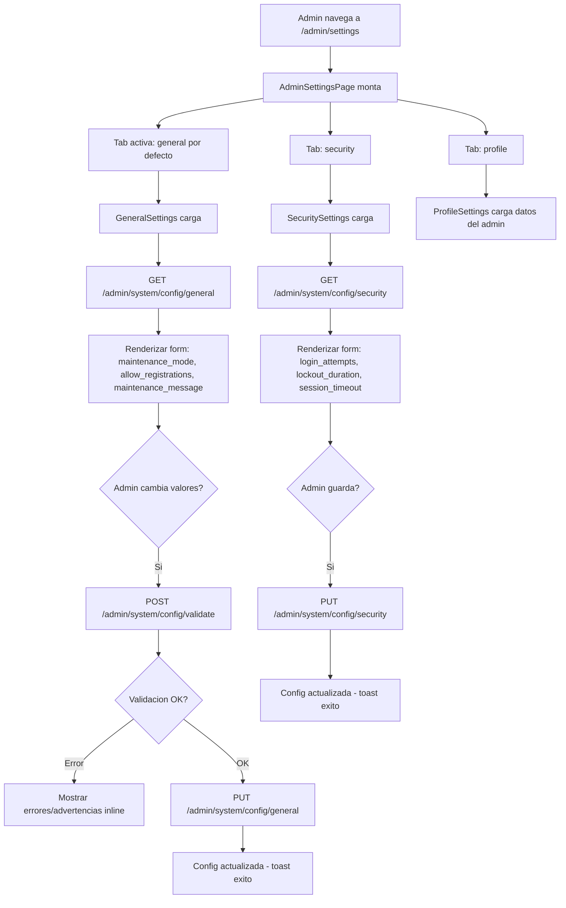

# FL-ADM-12 - Configuracion de Ajustes del Sistema

**ID:** FL-ADM-12
**Version:** 1.0.0
**Fecha:** 2026-02-27
**Estado:** Activo
**Portal:** Admin
**Prioridad:** P1

---

## 1. Resumen

Flujo de la pagina `/admin/settings` donde el super_admin gestiona la configuracion global del sistema. La pagina presenta tres pestanas: General (modo mantenimiento, registros, mensaje de mantenimiento), Seguridad (intentos de login, duracion de bloqueo, timeout de sesion) y Mi Perfil (datos de la cuenta del administrador). Cada pestana consume endpoints `GET/PUT /admin/system/config/:category` con validacion previa opcional via `POST /admin/system/config/validate`.

---

## 2. Precondiciones

- Usuario autenticado con rol `super_admin`.
- Sesion activa con JWT valido.
- Al menos un tenant configurado en el sistema.

---

## 3. Diagrama Mermaid



---

## 4. Secuencia FE -> BE -> DB

```
=== Carga de configuracion general ===
1. FE: AdminSettingsPage monta -> tab 'general' activa por defecto
2. FE: GET /api/v1/admin/system/config/general
3. BE: AdminSystemController.getConfigByCategory('general')
4. BE: AdminSystemService -> busca en admin_dashboard.system_config (o tabla de configuracion)
5. BE: Retorna { maintenance_mode: bool, allow_registrations: bool, maintenance_message: string }
6. FE: GeneralSettings renderiza formulario con valores actuales

=== Validacion antes de guardar ===
7. FE: Admin modifica valores -> POST /api/v1/admin/system/config/validate { category: 'general', values: {...} }
8. BE: AdminSystemController.validateConfig() -> revisa tipos, rangos, formato
9. BE: Retorna { valid: bool, errors: [], warnings: [] }
10. FE: Si valid -> procede; si errores -> muestra inline

=== Guardar configuracion general ===
11. FE: PUT /api/v1/admin/system/config/general { maintenance_mode: true, ... }
12. BE: AdminSystemController.updateConfigByCategory('general', dto, adminId)
13. BE: AdminSystemService -> UPDATE en tabla de configuracion
14. DB: Persistencia en admin schema (system_config o equivalente)
15. BE: Retorna configuracion actualizada
16. FE: Toast "Configuracion guardada"

=== Carga de configuracion de seguridad ===
17. FE: Admin click tab 'security' -> GET /api/v1/admin/system/config/security
18. BE: Retorna { max_login_attempts, lockout_duration_minutes, session_timeout_minutes }
19. FE: SecuritySettings renderiza formulario

=== Toggle modo mantenimiento rapido ===
20. FE: Admin toggle mantenimiento -> POST /api/v1/admin/system/maintenance { enabled: true, message: '...' }
21. BE: AdminSystemController.toggleMaintenance() -> actualiza flag global
22. DB: UPDATE system_config SET value = 'true' WHERE key = 'maintenance_mode'
23. FE: Estado actualizado en tiempo real
```

---

## 5. Componentes y artefactos implicados

### Frontend

| Tipo | Archivo |
|------|---------|
| Pagina | `apps/frontend/src/apps/admin/pages/AdminSettingsPage.tsx` |
| Componente general | `apps/frontend/src/apps/admin/components/settings/GeneralSettings.tsx` |
| Componente seguridad | `apps/frontend/src/apps/admin/components/settings/SecuritySettings.tsx` |
| Componente perfil | `apps/frontend/src/apps/admin/components/settings/ProfileSettings.tsx` |
| Layout | `apps/frontend/src/apps/admin/components/shared/AdminPageShell.tsx` |
| Tab navigation | `apps/frontend/src/apps/admin/components/shared/AdminTabBar.tsx` |

### Backend

| Tipo | Archivo |
|------|---------|
| Controller system | `apps/backend/src/modules/admin/controllers/admin-system.controller.ts` |
| Service system | `apps/backend/src/modules/admin/services/admin-system.service.ts` |
| DTO system | `apps/backend/src/modules/admin/dto/system/` |
| Guard JWT + Admin | `apps/backend/src/modules/auth/guards/jwt-auth.guard.ts`, `apps/backend/src/modules/admin/guards/admin.guard.ts` |

---

## 6. Reglas y validaciones

| Regla | Capa | Descripcion |
|-------|------|-------------|
| Solo super_admin | BE | AdminGuard verifica rol super_admin |
| Validacion antes de persistir | BE | POST /config/validate previo al PUT |
| Categorias soportadas | BE | general, security, email, notifications, maintenance |
| Auditoria de cambios | BE | Cambios de config registrados con adminId en audit log |
| Modo mantenimiento bloquea usuarios | BE | Solo admins pueden acceder durante mantenimiento |

---

## 7. Manejo de errores

| Escenario | Capa | Codigo HTTP | Comportamiento |
|-----------|------|-------------|----------------|
| Token JWT expirado | BE | 401 | Redirige a login |
| Rol insuficiente | BE | 403 | ForbiddenException |
| Categoria desconocida | BE | 400 | BadRequestException |
| Error de validacion | BE | 400 | Retorna errores/advertencias sin persistir |
| Error al guardar | BE | 500 | Toast error en FE |

---

## 8. Trazabilidad cruzada

| Capa | Archivo | Evidencia |
|------|---------|-----------|
| Frontend Pagina | `apps/frontend/src/apps/admin/pages/AdminSettingsPage.tsx` | Tabs: general/security/profile |
| Frontend Componente | `apps/frontend/src/apps/admin/components/settings/GeneralSettings.tsx` | Formulario config general |
| Frontend Componente | `apps/frontend/src/apps/admin/components/settings/SecuritySettings.tsx` | Formulario config seguridad |
| Backend Controller | `apps/backend/src/modules/admin/controllers/admin-system.controller.ts` | GET/PUT /config/:category |
| Backend Service | `apps/backend/src/modules/admin/services/admin-system.service.ts` | Logica de configuracion |

---

## 9. Referencias

- Flujo configuracion sistema legado: [FL-ADM-02](./FLUJO-CONFIGURACION-SISTEMA.md)
- Flujo monitoreo sistema: [FL-ADM-04](./FLUJO-MONITOREO-SISTEMA.md)
- Flujo notificaciones admin: [FL-ADM-13](./FLUJO-NOTIFICACIONES-ADMIN.md)
