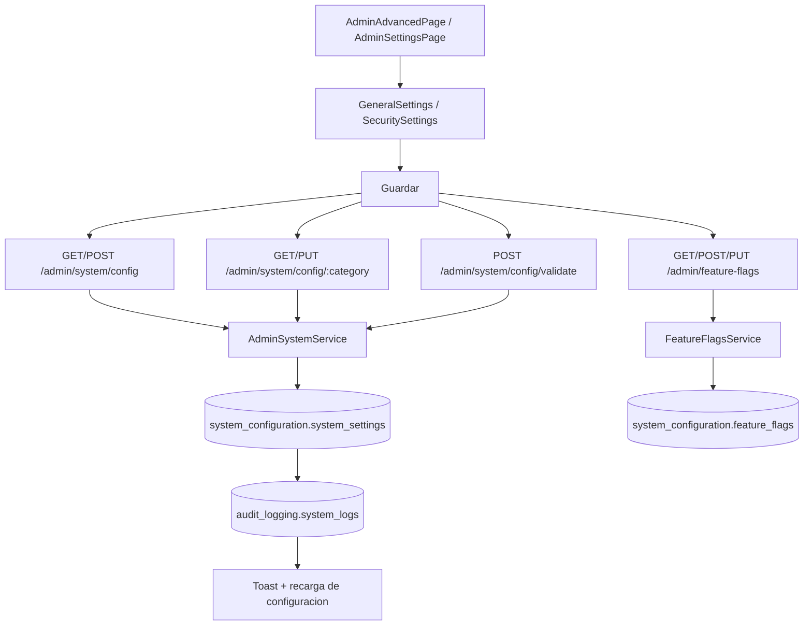

# FL-ADM-02 - Configuracion Global del Sistema

**Version:** 1.1.0
**Fecha:** 2026-02-18
**Portal:** Admin
**Prioridad:** Alta
**Estado:** Documentado

---

## Resumen

Flujo para actualizar configuraciones globales (seguridad, parametros academicos, opciones operativas) desde el panel administrativo.

## Precondiciones

- **Rol requerido:** `super_admin`. La configuracion del sistema es exclusiva para administradores de nivel superior.
- **Sesion activa:** JWT valido emitido por `auth/login`, con token no expirado.
- **Estado del sistema:** La plataforma debe estar operativa. Cambios de configuracion no requieren modo mantenimiento, pero la activacion de modo mantenimiento bloquea el acceso a usuarios no-admin.
- **Datos previos:** Las categorias de configuracion (`general`, `email`, `notifications`, `security`, `maintenance`) deben estar inicializadas en `system_configuration.system_settings`.

## Diagrama Mermaid

## Secuencia FE -> BE -> DB

1. Admin navega a `AdminAdvancedPage.tsx` o `AdminSettingsPage.tsx` y edita formularios de configuracion (`GeneralSettings.tsx`, `SecuritySettings.tsx`).
2. FE envia payload validado a endpoints de `admin/system/config` via `useSystemConfig` hook y `adminAPI.ts`.
3. Backend valida formato con `ValidateConfigDto` y permisos de cambio con `AdminGuard`.
4. Datos se persisten en `system_configuration.system_settings` y cambios se registran en `audit_logging.system_logs`.
5. FE invalida cache y refleja nuevo estado con toast de confirmacion.

## Componentes y artefactos implicados

### Frontend

| Tipo | Archivo |
|------|---------|
| Pagina | `apps/frontend/src/apps/admin/pages/AdminAdvancedPage.tsx` |
| Pagina | `apps/frontend/src/apps/admin/pages/AdminSettingsPage.tsx` |
| Wrapper | `apps/frontend/src/apps/admin/components/shared/AdminPageShell.tsx` |
| Tab Bar | `apps/frontend/src/apps/admin/components/shared/AdminTabBar.tsx` |
| Componente | `apps/frontend/src/apps/admin/components/settings/GeneralSettings.tsx` |
| Componente | `apps/frontend/src/apps/admin/components/settings/SecuritySettings.tsx` |
| Componente | `apps/frontend/src/apps/admin/components/settings/ProfileSettings.tsx` |
| Componente | `apps/frontend/src/apps/admin/components/advanced/FeatureFlagsPanel.tsx` |
| Componente | `apps/frontend/src/apps/admin/components/advanced/FeatureFlagEditor.tsx` |
| Componente | `apps/frontend/src/apps/admin/components/advanced/FeatureFlagControls.tsx` |
| Componente | `apps/frontend/src/apps/admin/components/advanced/RolloutSlider.tsx` |
| Componente | `apps/frontend/src/apps/admin/components/advanced/TargetingConfig.tsx` |
| Componente | `apps/frontend/src/apps/admin/components/advanced/TenantManagementPanel.tsx` |
| Hook | `apps/frontend/src/apps/admin/hooks/useSystemConfig.ts` |
| Hook | `apps/frontend/src/apps/admin/hooks/useConfigCategories.ts` |
| Hook | `apps/frontend/src/apps/admin/hooks/useFeatureFlags.ts` |
| Hook | `apps/frontend/src/apps/admin/hooks/useSettings.ts` (deprecated, usar useSystemConfig) |
| API Service | `apps/frontend/src/services/api/adminAPI.ts` (secciones SETTINGS, SYSTEM) |

### Backend

| Tipo | Ruta / Archivo |
|------|----------------|
| Endpoint | `GET /admin/system/config` — Obtener configuracion actual del sistema |
| Endpoint | `POST /admin/system/config` — Actualizar configuracion del sistema |
| Endpoint | `GET /admin/system/config/categories` — Listar categorias de configuracion disponibles |
| Endpoint | `POST /admin/system/config/validate` — Validar configuracion antes de aplicar |
| Endpoint | `GET /admin/system/config/:category` — Obtener configuracion por categoria |
| Endpoint | `PUT /admin/system/config/:category` — Actualizar configuracion por categoria |
| Endpoint | `POST /admin/system/maintenance` — Activar/desactivar modo mantenimiento |
| Endpoint | `POST /admin/system/maintenance/cleanup-logs` — Limpiar logs antiguos |
| Endpoint | `POST /admin/system/maintenance/cleanup-activity` — Limpiar actividad antigua |
| Endpoint | `POST /admin/system/maintenance/optimize-database` — Optimizar base de datos (VACUUM) |
| Endpoint | `POST /admin/system/maintenance/clear-cache` — Limpiar cache de aplicacion |
| Endpoint | `POST /admin/system/maintenance/cleanup-sessions` — Limpiar sesiones expiradas |
| Endpoint | `GET /admin/feature-flags` — Listar feature flags |
| Endpoint | `GET /admin/feature-flags/:key` — Obtener feature flag por key |
| Endpoint | `POST /admin/feature-flags` — Crear nueva feature flag |
| Endpoint | `PUT /admin/feature-flags/:key` — Actualizar feature flag |
| Endpoint | `POST /admin/feature-flags/:key/enable` — Habilitar feature flag |
| Endpoint | `POST /admin/feature-flags/:key/disable` — Deshabilitar feature flag |
| Endpoint | `PUT /admin/feature-flags/:key/rollout` — Actualizar porcentaje de rollout |
| Endpoint | `DELETE /admin/feature-flags/:key` — Eliminar feature flag |
| Controller | `apps/backend/src/modules/admin/controllers/admin-system.controller.ts` |
| Controller | `apps/backend/src/modules/admin/controllers/feature-flags.controller.ts` |
| Service | `apps/backend/src/modules/admin/services/admin-system.service.ts` |
| Service | `apps/backend/src/modules/admin/services/feature-flags.service.ts` |
| Guard | `apps/backend/src/modules/admin/guards/admin.guard.ts` |
| DTOs | `apps/backend/src/modules/admin/dto/system/` (SystemConfigDto, UpdateSystemConfigDto, ValidateConfigDto, ConfigCategoryDto, ToggleMaintenanceDto, MaintenanceStatusDto, CleanupLogsDto, CleanupUserActivityDto) |
| DTOs | `apps/backend/src/modules/admin/dto/feature-flags/` (CreateFeatureFlagDto, UpdateFeatureFlagDto, FeatureFlagQueryDto, CheckFeatureFlagDto) |

### Datos

| Schema.Tabla | Entity |
|--------------|--------|
| `system_configuration.system_settings` | `apps/backend/src/modules/admin/entities/system-setting.entity.ts` |
| `system_configuration.environment_configs` | `apps/backend/src/modules/admin/entities/environment-config.entity.ts` |
| `system_configuration.feature_flags` | `apps/backend/src/modules/admin/entities/feature-flag.entity.ts` |
| `admin_dashboard.tenant_configurations` | `apps/backend/src/modules/admin/entities/tenant-configuration.entity.ts` |
| `admin_dashboard.notification_settings` | `apps/backend/src/modules/admin/entities/notification-settings.entity.ts` |
| `admin_dashboard.notification_settings_global` | `apps/backend/src/modules/admin/entities/notification-settings-global.entity.ts` |
| `audit_logging.system_logs` | `apps/backend/src/modules/admin/entities/system-log.entity.ts` |

## Reglas y validaciones

- **RBAC:** Solo `super_admin` puede modificar configuraciones del sistema, feature flags y modo mantenimiento.
- **Validacion previa:** Antes de aplicar cambios, se puede invocar `POST /admin/system/config/validate` para obtener errores y advertencias sin persistir.
- **Categorias validas:** Los valores aceptados para `category` son: `general`, `email`, `notifications`, `security`, `maintenance`.
- **Modo mantenimiento:** Al activarse, todos los usuarios no-admin reciben respuesta 503. Solo `super_admin` mantiene acceso completo.
- **Feature flags:** El porcentaje de rollout debe ser un entero entre 0 y 100. Las keys deben ser unicas y seguir formato `snake_case`.
- **Auditoria obligatoria:** Todo cambio de configuracion registra el `adminId` del ejecutor en el log de auditoria.
- **Operaciones de mantenimiento:** `cleanup-logs` y `cleanup-activity` aceptan parametro de retencion en dias; los valores por defecto los define el backend.

## Manejo de errores

| Escenario | Capa | Codigo HTTP | Comportamiento esperado |
|-----------|------|-------------|-------------------------|
| Token JWT expirado o invalido | Backend (JwtAuthGuard) | 401 | FE redirige a login |
| Usuario no es super_admin | Backend (AdminGuard) | 403 | FE muestra toast "Solo super_admin puede cambiar configuracion" |
| Categoria de configuracion invalida | Backend (AdminSystemService) | 400 | FE muestra error "Categoria no reconocida" |
| Validacion de configuracion falla | Backend (AdminSystemService) | 422 | FE muestra errores detallados por campo desde ConfigValidationResultDto |
| Feature flag key duplicada al crear | Backend (FeatureFlagsService) | 409 | FE muestra error "Feature flag ya existe" |
| Feature flag no encontrada | Backend (FeatureFlagsService) | 404 | FE muestra toast "Feature flag no encontrada" |
| Error al ejecutar VACUUM en base de datos | Backend (AdminSystemService) | 500 | FE muestra toast "Error en optimizacion de BD" con detalle |
| Error al limpiar cache Redis | Backend (AdminSystemService) | 500 | FE muestra toast "Error al limpiar cache" con opcion de reintentar |

## Trazabilidad cruzada

| Capa | Archivo | Evidencia |
|------|---------|-----------|
| FE Page | `apps/frontend/src/apps/admin/pages/AdminAdvancedPage.tsx` | Pagina de configuracion avanzada |
| FE Page | `apps/frontend/src/apps/admin/pages/AdminSettingsPage.tsx` | Pagina de configuracion general |
| FE Wrapper | `apps/frontend/src/apps/admin/components/shared/AdminPageShell.tsx` | Wrapper comun de paginas admin |
| FE Tab Bar | `apps/frontend/src/apps/admin/components/shared/AdminTabBar.tsx` | Tab bar reutilizable para paginas admin |
| FE Component | `apps/frontend/src/apps/admin/components/settings/GeneralSettings.tsx` | Formulario de settings generales |
| FE Component | `apps/frontend/src/apps/admin/components/settings/SecuritySettings.tsx` | Formulario de settings de seguridad |
| FE Component | `apps/frontend/src/apps/admin/components/settings/ProfileSettings.tsx` | Formulario de perfil de admin |
| FE Hook | `apps/frontend/src/apps/admin/hooks/useSystemConfig.ts` | Hook de configuracion por categoria |
| FE Hook | `apps/frontend/src/apps/admin/hooks/useFeatureFlags.ts` | Hook de gestion de feature flags |
| FE API | `apps/frontend/src/services/api/adminAPI.ts` | Cliente API secciones SETTINGS y SYSTEM |
| BE Controller | `apps/backend/src/modules/admin/controllers/admin-system.controller.ts` | Controlador de sistema con 12 endpoints |
| BE Controller | `apps/backend/src/modules/admin/controllers/feature-flags.controller.ts` | Controlador de feature flags con 8 endpoints |
| BE Service | `apps/backend/src/modules/admin/services/admin-system.service.ts` | Logica de negocio de configuracion |
| BE Service | `apps/backend/src/modules/admin/services/feature-flags.service.ts` | Logica de negocio de feature flags |
| DB Schema | `apps/database/ddl/schemas/system_configuration/` | DDL de tablas de configuracion |

## Referencias

- Requerimiento: `EPIC-GAM-F1-CONFIG`
- Matriz: `../TRACEABILITY-MATRIX.md`
- Cobertura total: `../COBERTURA-TOTAL-PROCESOS.md`
