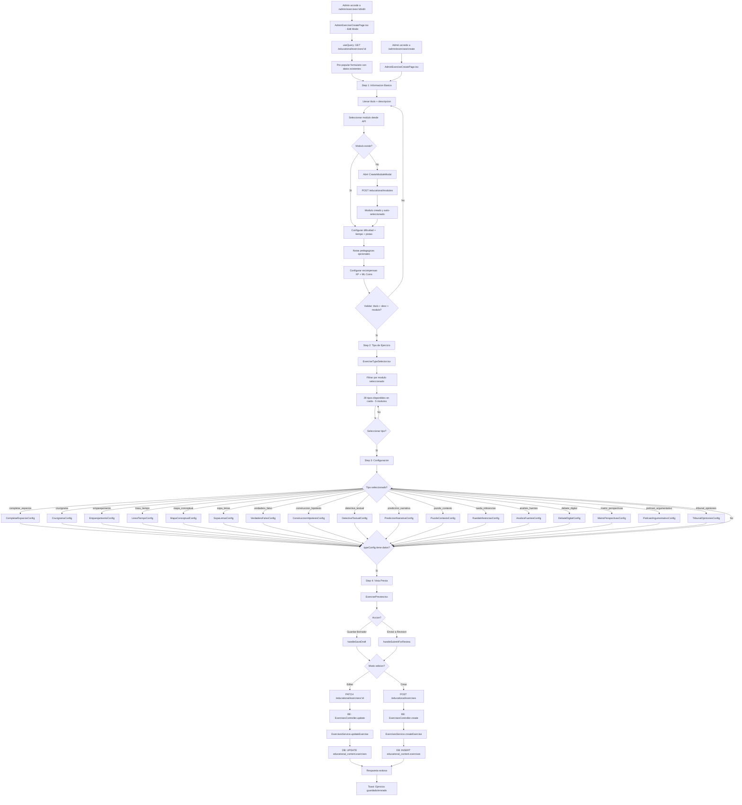

# FL-ADM-07 - Exercise Builder (Admin)

**ID:** FL-ADM-07
**Version:** 1.4.0
**Fecha:** 2026-02-21
**Estado:** Activo
**Portal:** Admin
**Prioridad:** P1

---

## 1. Resumen

Flujo del constructor de ejercicios en el portal de administracion. Un administrador o maestro autorizado crea o edita ejercicios educativos mediante un asistente de 4 pasos: (1) Informacion Basica (titulo, descripcion, modulo, dificultad, recompensas), (2) Seleccion de Tipo de Ejercicio (29 tipos disponibles en 5 modulos), (3) Configuracion Especifica del tipo seleccionado (contenido, opciones, respuestas correctas), y (4) Vista Previa con opcion de guardar como borrador o enviar a revision/publicar.

El builder soporta 29 tipos de ejercicios agrupados en 5 modulos: M1 Comprension Literal (7 tipos), M2 Comprension Inferencial (5 tipos), M3 Comprension Critica (5 tipos), M4 Lectura Digital (9 tipos), M5 Produccion Creativa (3 tipos). Los tipos M1-M3 tienen componentes de configuracion dedicados (`TypeConfigComponent`). Los tipos M4-M5 son seleccionables pero aun no tienen configs dedicados (fallback: mensaje indicando seleccionar tipo).

**v1.4.0:** Soporte completo de edicion de ejercicios existentes. La ruta `/admin/exercises/:id/edit` ahora detecta el parametro `id` via `useParams`, fetcha el ejercicio con `GET /educational/exercises/:id` (React Query), pre-popula el formulario con datos existentes, y usa `PATCH /educational/exercises/:id` para actualizar en lugar de `POST`. Header y botones cambian dinamicamente: "Editar Ejercicio" vs "Crear Ejercicio", "Guardar y Publicar" vs "Enviar a Revision". ExerciseTypeSelector expandido de 17 a 29 tipos (M4+M5 agregados).

**v1.3.0:** El selector de modulos en Step 1 ahora usa datos dinamicos del API (`GET /educational/modules`) en lugar de opciones hardcodeadas. Incluye un boton "+ Nuevo" que abre un modal (CreateModuleModal) para crear modulos inline sin salir del wizard. Esto implementa parcialmente EXT-001 de RF-ADM-004 (creacion de modulos custom). El Step 2 mapea UUIDs reales a IDs logicos (`module-{order_index}`) para el filtrado por tabs.

Impacto funcional: Permite la creacion y edicion estructurada y validada de contenido educativo, asegurando que cada ejercicio cumpla con los estandares pedagogicos y gamificacion (XP, ML Coins, pistas) antes de su publicacion.

## 2. Precondiciones

- Usuario autenticado con JWT valido y rol `super_admin` o `admin_teacher` con permiso de creacion de contenido.
- Al menos un modulo educativo existente en `educational_content.modules`.
- Backend con datasource `educational` operativo.
- Conocimiento del tipo de ejercicio a crear (29 tipos disponibles en 5 modulos).
- Para Vista Previa: datos de configuracion completos en el paso 3.
- Endpoint de creacion de ejercicios funcional (`POST /educational/exercises`).
- Para edicion: ejercicio existente accesible via `GET /educational/exercises/:id` y endpoint `PATCH /educational/exercises/:id`.

## 3. Diagrama Mermaid

## 4. Secuencia FE -> BE -> DB

### Paso 0: Entrada (Crear o Editar)
1. **Frontend:** `AdminExerciseCreatePage.tsx` se monta en ruta `/admin/exercises/create` (modo crear) o `/admin/exercises/:id/edit` (modo editar).
2. **Frontend (edit mode):** Si `useParams()` devuelve `id`, activa `isEditMode=true`. React Query fetch del ejercicio via `getExercise(id)` → `GET /educational/exercises/:id`. Transforma respuesta backend a `ExerciseFormData` (reverse difficulty map, snake_case→camelCase). Pre-popula formulario con datos existentes.
3. **Frontend:** Header muestra "Editar Ejercicio" o "Crear Ejercicio" segun modo. Botones en Step 4 cambian: "Guardar y Publicar" vs "Enviar a Revision".

### Paso 1: Informacion Basica (Step 1)
1. **Frontend:** `AdminExerciseCreatePage.tsx` renderiza Step 1 (pre-populado si edit mode).
2. **Frontend:** Componente `StepBasicInfo` renderiza formulario con:
   - Titulo (obligatorio), Descripcion (obligatorio), Instrucciones (opcional).
   - Selector de modulo: dropdown dinamico via `useModulesQuery()` → `GET /educational/modules` (obligatorio).
   - Boton "+ Nuevo" junto al selector que abre `CreateModuleModal` para crear modulos inline → `POST /educational/modules`.
   - Dificultad: beginner/intermediate/advanced/expert.
   - Tiempo estimado (min), Pistas permitidas (0-10).
   - Notas pedagogicas: como resolver, estrategia recomendada, notas docente.
   - Recompensas: XP reward (default 50), ML Coins (default 10).
3. **Frontend:** `useModulesQuery` hook (React Query) cachea modulos con staleTime 5min. Mutation invalida cache al crear modulo.
4. **Frontend:** Validacion local: `canAdvance()` verifica titulo + descripcion + moduleId (UUID real).

### Paso 2: Seleccion de Tipo (Step 2)
5. **Frontend:** `ExerciseTypeSelector.tsx` muestra 29 tipos de ejercicio en cards (7 M1 + 5 M2 + 5 M3 + 9 M4 + 3 M5).
6. **Frontend:** Mapea UUID del modulo seleccionado a ID logico (`module-{order_index}`) para filtrado por tabs. Tabs: Todos, Literal, Inferencial, Critica, Digital, Creativa + tabs dinamicos para modulos nuevos.
7. **Frontend:** Cada card muestra: icono, nombre, descripcion, complejidad (simple/medium/complex).
8. **Frontend:** Si el modulo seleccionado no tiene tipos asignados, muestra mensaje indicando usar tab "Todos".
9. **Frontend:** Al seleccionar tipo, se resetea `typeConfig` a `{}`.

### Paso 3: Configuracion Especifica (Step 3)
8. **Frontend:** Se renderiza el componente de configuracion correspondiente via `TYPE_CONFIG_MAP[exerciseType]`.
9. **Frontend:** Cada componente recibe `config` y `onChange` para actualizar `typeConfig`.
10. **Frontend:** Componentes de configuracion (17 configs para M1-M3; tipos M4-M5 seleccionables sin config dedicado — fallback message) definen campos especificos del tipo de ejercicio:
    - `CompletarEspaciosConfig`: Texto con blancos, opciones por espacio.
    - `CrucigramaConfig`: Grid, pistas horizontales/verticales.
    - `EmparejamientoConfig`: Pares de conceptos.
    - `LineaTiempoConfig`: Eventos con fechas.
    - `MapaConceptualConfig`: Nodos y relaciones.
    - `SopaLetrasConfig`: Palabras ocultas en grid.
    - `VerdaderoFalsoConfig`: Afirmaciones con respuesta.
    - Y 10 tipos mas para M2 y M3.
11. **Frontend:** Validacion: `canAdvance()` verifica que `typeConfig` tenga al menos 1 clave.

### Paso 4: Vista Previa y Guardado (Step 4)
12. **Frontend:** `ExercisePreview.tsx` renderiza preview del ejercicio configurado.
13. **Frontend:** Dos acciones disponibles:
    - **Guardar Borrador:** Persiste con `status=draft`.
    - **Enviar a Revision:** Persiste con `status=pending_review`.
14. **Frontend:** La integracion real utiliza `useMutation` de React Query con `apiClient.post(API_ENDPOINTS.educational.exercises)` para persistir el ejercicio en el backend.
15. **Backend:** `ExercisesController.create()` (linea 462 de exercises.controller.ts) recibe el DTO.
16. **Backend:** Endpoint `POST /api/v1/educational/exercises` con body de creacion.
17. **DB:** `INSERT INTO educational_content.exercises` con campos: title, description, instructions, module_id, difficulty, exercise_type, type_config (JSONB), xp_reward, ml_coins_reward, hints_allowed, estimated_time, status.
18. **Frontend:** Toast de confirmacion ("Borrador guardado" o "Ejercicio enviado para revision").

## 5. Componentes y artefactos implicados

### Frontend

| Tipo | Ruta | Descripcion |
|------|------|-------------|
| Pagina | `apps/frontend/src/apps/admin/pages/AdminExerciseCreatePage.tsx` | Asistente de 4 pasos para crear ejercicios |
| Wrapper | `apps/frontend/src/apps/admin/components/shared/AdminPageShell.tsx` | Wrapper comun de paginas admin |
| Componente Step 1 | `apps/frontend/src/apps/admin/components/exercise-builder/StepBasicInfo.tsx` | Formulario de informacion basica con selector dinamico de modulos (Step 1) |
| Modal | `apps/frontend/src/apps/admin/components/exercise-builder/CreateModuleModal.tsx` | Modal inline para crear modulos sin salir del wizard (v1.3.0) |
| Componente | `apps/frontend/src/apps/admin/components/exercise-builder/ExerciseTypeSelector.tsx` | Selector de tipo de ejercicio (29 tipos en 5 modulos) con tabs dinamicos y mapeo UUID→logico |
| Hook | `apps/frontend/src/apps/admin/hooks/useContentQueries.ts` → `useModulesQuery()` | React Query hook para fetch + create de modulos (v1.3.0) |
| API | `apps/frontend/src/services/api/educationalAPI.ts` → `createModule()` | Funcion API para POST /educational/modules (v1.3.0) |
| Componente | `apps/frontend/src/apps/admin/components/exercise-builder/ExercisePreview.tsx` | Vista previa del ejercicio configurado |
| Componente | `apps/frontend/src/apps/admin/components/exercise-builder/ContentEditor.tsx` | Editor de contenido del ejercicio |
| Barrel | `apps/frontend/src/apps/admin/components/exercise-builder/type-configs/index.ts` | Barrel export de todos los type configs |
| Types | `apps/frontend/src/apps/admin/types/exercise-builder.types.ts` | Tipos TypeScript del exercise builder |
| Config M1 | `apps/frontend/src/apps/admin/components/exercise-builder/type-configs/CompletarEspaciosConfig.tsx` | Config: Completar Espacios |
| Config M1 | `apps/frontend/src/apps/admin/components/exercise-builder/type-configs/CrucigramaConfig.tsx` | Config: Crucigrama |
| Config M1 | `apps/frontend/src/apps/admin/components/exercise-builder/type-configs/EmparejamientoConfig.tsx` | Config: Emparejamiento |
| Config M1 | `apps/frontend/src/apps/admin/components/exercise-builder/type-configs/LineaTiempoConfig.tsx` | Config: Linea de Tiempo |
| Config M1 | `apps/frontend/src/apps/admin/components/exercise-builder/type-configs/MapaConceptualConfig.tsx` | Config: Mapa Conceptual |
| Config M1 | `apps/frontend/src/apps/admin/components/exercise-builder/type-configs/SopaLetrasConfig.tsx` | Config: Sopa de Letras |
| Config M1 | `apps/frontend/src/apps/admin/components/exercise-builder/type-configs/VerdaderoFalsoConfig.tsx` | Config: Verdadero/Falso |
| Config M2 | `apps/frontend/src/apps/admin/components/exercise-builder/type-configs/ConstruccionHipotesisConfig.tsx` | Config: Construccion de Hipotesis |
| Config M2 | `apps/frontend/src/apps/admin/components/exercise-builder/type-configs/DetectiveTextualConfig.tsx` | Config: Detective Textual |
| Config M2 | `apps/frontend/src/apps/admin/components/exercise-builder/type-configs/PrediccionNarrativaConfig.tsx` | Config: Prediccion Narrativa |
| Config M2 | `apps/frontend/src/apps/admin/components/exercise-builder/type-configs/PuzzleContextoConfig.tsx` | Config: Puzzle de Contexto |
| Config M2 | `apps/frontend/src/apps/admin/components/exercise-builder/type-configs/RuedaInferenciasConfig.tsx` | Config: Rueda de Inferencias |
| Config M3 | `apps/frontend/src/apps/admin/components/exercise-builder/type-configs/AnalisisFuentesConfig.tsx` | Config: Analisis de Fuentes |
| Config M3 | `apps/frontend/src/apps/admin/components/exercise-builder/type-configs/DebateDigitalConfig.tsx` | Config: Debate Digital |
| Config M3 | `apps/frontend/src/apps/admin/components/exercise-builder/type-configs/MatrizPerspectivasConfig.tsx` | Config: Matriz de Perspectivas |
| Config M3 | `apps/frontend/src/apps/admin/components/exercise-builder/type-configs/PodcastArgumentativoConfig.tsx` | Config: Podcast Argumentativo |
| Config M3 | `apps/frontend/src/apps/admin/components/exercise-builder/type-configs/TribunalOpinionesConfig.tsx` | Config: Tribunal de Opiniones |

### Backend

| Tipo | Ruta | Descripcion |
|------|------|-------------|
| Controller | `apps/backend/src/modules/educational/controllers/exercises.controller.ts` | CRUD de ejercicios |
| Endpoint | `GET /educational/exercises` | Listar ejercicios (paginado) |
| Endpoint | `GET /educational/exercises/:id` | Obtener ejercicio por ID |
| Endpoint | `POST /educational/exercises` | Crear nuevo ejercicio |
| Endpoint | `PATCH /educational/exercises/:id` | Actualizar ejercicio existente |
| Endpoint | `DELETE /educational/exercises/:id` | Eliminar ejercicio |
| Endpoint | `GET /educational/modules/:moduleId/exercises` | Ejercicios por modulo |
| Endpoint | `GET /educational/exercises/:id/hints` | Pistas del ejercicio |
| Endpoint | `POST /educational/exercises/validate-content` | Validar contenido de ejercicio |
| Endpoint | `POST /educational/exercises/:id/submit` | Enviar respuesta de ejercicio |
| Controller | `apps/backend/src/modules/educational/controllers/exercise-validation.controller.ts` | Validacion de ejercicios |
| Controller | `apps/backend/src/modules/educational/controllers/modules.controller.ts` | CRUD de modulos educativos |
| Endpoint | `GET /educational/modules` | Listar todos los modulos (usado por Step 1 dropdown) |
| Endpoint | `POST /educational/modules` | Crear nuevo modulo (usado por CreateModuleModal) |
| Controller | `apps/backend/src/modules/educational/controllers/media-upload.controller.ts` | Upload de media para ejercicios |

### Datos (Base de Datos)

| Schema | Tabla | Uso |
|--------|-------|-----|
| `educational_content` | `exercises` | Tabla principal de ejercicios (02-exercises.sql) |
| `educational_content` | `modules` | Catalogo de 5 modulos educativos (01-modules.sql) |
| `educational_content` | `exercise_mechanic_mapping` | Mapeo ejercicio-mecanica (21-exercise_mechanic_mapping.sql) |
| `educational_content` | `exercise_validation_config` | Configuracion de validacion por tipo (22-exercise_validation_config.sql) |
| `educational_content` | `exercise_validation_audit` | Auditoria de validaciones (26-exercise_validation_audit.sql) |
| `educational_content` | `exercise_type_rubrics` | Rubricas por tipo de ejercicio (27-exercise_type_rubrics.sql) |
| `educational_content` | `difficulty_criteria` | Criterios de dificultad (20-difficulty_criteria.sql) |
| `educational_content` | `assessment_rubrics` | Rubricas de evaluacion (03-assessment_rubrics.sql) |
| `educational_content` | `media_resources` | Recursos multimedia (04-media_resources.sql) |
| `educational_content` | `media_attachments` | Adjuntos de media (09-media_attachments.sql) |
| `educational_content` | `content_approvals` | Flujo de aprobacion de contenido (content_approvals.sql) |
| `educational_content` | `content_metadata` | Metadata de contenido (content_metadata.sql) |
| `educational_content` | `content_tags` | Tags de contenido (content_tags.sql) |
| `educational_content` | `taxonomies` | Taxonomias educativas (taxonomies.sql) |
| `educational_content` | `module_dependencies` | Dependencias entre modulos (module_dependencies.sql) |

## 6. Reglas y validaciones

- **RBAC:** Solo roles `super_admin` y `admin_teacher` con permiso de creacion de contenido pueden acceder a `/admin/exercises/create`.
- **Validacion Step 1:** Titulo (obligatorio, no vacio), Descripcion (obligatorio, no vacio), Modulo (obligatorio, UUID valido de `educational_content.modules`).
- **Validacion Step 2:** Tipo de ejercicio debe estar seleccionado (string no vacio).
- **Validacion Step 3:** `typeConfig` debe tener al menos una clave (`Object.keys(typeConfig).length > 0`).
- **Validacion Step 4:** Siempre permitido (paso final).
- **Navegacion:** Solo se puede avanzar si `canAdvance()` retorna true; se puede retroceder sin restricciones. Se puede volver a steps completados.
- **Tipos por modulo:** 7 tipos en M1 (Literal), 5 en M2 (Inferencial), 5 en M3 (Critica), 9 en M4 (Digital), 3 en M5 (Creativa). Total: 29 tipos.
- **Complejidad:** Cada tipo tiene complejidad asignada: simple (verde), medium (amarillo), complex (rojo).
- **Recompensas:** XP reward default=50 (min 0, step 10), ML Coins default=10 (min 0, step 5), Pistas default=3 (0-10).
- **Tiempo estimado:** Default 10 minutos (min 1, max 120 minutos).
- **Dificultad:** 4 niveles: beginner, intermediate, advanced, expert.
- **Estados del ejercicio:** `draft` (borrador), `pending_review` (en revision), `approved` (aprobado), `published` (publicado).
- **RLS:** Ejercicios filtrados por `tenant_id` en todas las operaciones.
- **Contenido tipo-especifico:** Almacenado en campo JSONB `type_config` de la tabla `exercises`.

## 7. Manejo de errores

| Escenario | Capa | Codigo HTTP | Comportamiento |
|-----------|------|-------------|----------------|
| Token JWT expirado | FE | 401 | Redirect a `/login` via interceptor axios |
| Campos obligatorios vacios | FE | - | Boton "Siguiente" deshabilitado, no avanza de step |
| Tipo de ejercicio no seleccionado | FE | - | Boton "Siguiente" deshabilitado en Step 2 |
| typeConfig vacio | FE | - | Boton "Siguiente" deshabilitado en Step 3 |
| Error al guardar borrador | BE | 400/500 | Toast error "Error al guardar el borrador" |
| Error al enviar a revision | BE | 400/500 | Toast error "Error al enviar para revision" |
| Modulo no encontrado | BE | 404 | Error de validacion en backend, respuesta con mensaje |
| Tipo de ejercicio invalido | BE | 400 | Rechazo de DTO con validacion de tipo |
| Ejercicio duplicado (titulo) | BE | 409 | Conflict, mensaje indicando duplicado |
| Base de datos no disponible | DB | 500 | Error generico, toast con retry |
| Media upload falla | BE | 413/500 | Error de tamano o servidor, toast con detalle |
| Permiso insuficiente | BE | 403 | Forbidden, mensaje de acceso denegado |
| Validacion de contenido falla | BE | 422 | Detalle de campos invalidos en typeConfig |

## 8. Trazabilidad cruzada

| Capa | Archivo | Evidencia |
|------|---------|-----------|
| Frontend (pagina) | `apps/frontend/src/apps/admin/pages/AdminExerciseCreatePage.tsx` | Ruta `/admin/exercises/create` y `/admin/exercises/:id/edit`, wizard 4 pasos, 17 type configs (M1-M3), edicion via PATCH |
| Frontend (wrapper) | `apps/frontend/src/apps/admin/components/shared/AdminPageShell.tsx` | Wrapper comun de paginas admin |
| Frontend (step 1) | `apps/frontend/src/apps/admin/components/exercise-builder/StepBasicInfo.tsx` | Formulario de informacion basica extraido |
| Frontend (barrel) | `apps/frontend/src/apps/admin/components/exercise-builder/type-configs/index.ts` | Barrel export de type configs |
| Frontend (selector) | `apps/frontend/src/apps/admin/components/exercise-builder/ExerciseTypeSelector.tsx` | 29 tipos definidos (5 modulos), filtro por modulo, complexity badges |
| Frontend (preview) | `apps/frontend/src/apps/admin/components/exercise-builder/ExercisePreview.tsx` | Vista previa del ejercicio completo |
| Frontend (config M1) | `apps/frontend/src/apps/admin/components/exercise-builder/type-configs/CompletarEspaciosConfig.tsx` | Config para Completar Espacios |
| Frontend (config M2) | `apps/frontend/src/apps/admin/components/exercise-builder/type-configs/ConstruccionHipotesisConfig.tsx` | Config para Construccion de Hipotesis |
| Frontend (config M3) | `apps/frontend/src/apps/admin/components/exercise-builder/type-configs/AnalisisFuentesConfig.tsx` | Config para Analisis de Fuentes |
| Frontend (rutas) | `apps/frontend/src/App.tsx` lineas 539, 550 | `<Route path="/admin/exercises/create" element={<AdminExerciseCreatePage />} />` |
| Backend (controller) | `apps/backend/src/modules/educational/controllers/exercises.controller.ts` | POST exercises (linea 462), GET exercises (linea 172), PATCH (linea 519), DELETE (linea 570) |
| Backend (validacion) | `apps/backend/src/modules/educational/controllers/exercise-validation.controller.ts` | Validacion de contenido de ejercicios |
| Backend (modulos) | `apps/backend/src/modules/educational/controllers/modules.controller.ts` | GET modules (linea 68), catalogo de modulos |
| Backend (media) | `apps/backend/src/modules/educational/controllers/media-upload.controller.ts` | Upload de recursos multimedia |
| Database (exercises) | `apps/database/ddl/schemas/educational_content/tables/02-exercises.sql` | Tabla principal de ejercicios |
| Database (modules) | `apps/database/ddl/schemas/educational_content/tables/01-modules.sql` | Catalogo de modulos |
| Database (mechanic map) | `apps/database/ddl/schemas/educational_content/tables/21-exercise_mechanic_mapping.sql` | Mapeo ejercicio-mecanica |
| Database (validation) | `apps/database/ddl/schemas/educational_content/tables/22-exercise_validation_config.sql` | Config de validacion por tipo |
| Database (rubrics) | `apps/database/ddl/schemas/educational_content/tables/27-exercise_type_rubrics.sql` | Rubricas por tipo de ejercicio |
| Database (approvals) | `apps/database/ddl/schemas/educational_content/tables/content_approvals.sql` | Flujo de aprobacion |

## 9. Referencias

- Guia de portal administrador: `docs/60-portals/admin/PORTAL-ADMIN-GUIDE.md`
- Especificacion mecanicas de ejercicios: `docs/10-requirements/epics/EPIC-GAM-F1-EXERCISES/specifications/ET-EDU-001-mecanicas-ejercicios.md`
- Especificacion niveles de dificultad: `docs/10-requirements/epics/EPIC-GAM-F1-EXERCISES/specifications/ET-EDU-002-niveles-dificultad.md`
- Especificacion taxonomia Bloom: `docs/10-requirements/epics/EPIC-GAM-F1-EXERCISES/specifications/ET-EDU-003-taxonomia-bloom.md`
- Especificacion validadores: `docs/10-requirements/epics/EPIC-GAM-F1-EXERCISES/specifications/ET-EDU-004-validadores-ejercicios.md`
- Requerimiento mecanicas: `docs/10-requirements/epics/EPIC-GAM-F1-EXERCISES/requirements/RF-EDU-001-mecanicas-ejercicios.md`
- ADR sistema dual exercise/mechanics: `docs/90-adr/ADR-008-sistema-dual-exercise-mechanics.md`
- Arquitectura mecanicas gamificacion: `docs/20-architecture/MECANICAS-GAMIFICACION-V6.md`
- Modelo de datos: `docs/20-architecture/MODELO-DATOS.md`
- Estandar de skills: `docs/40-standards/ESTANDAR-SKILLS.md`
