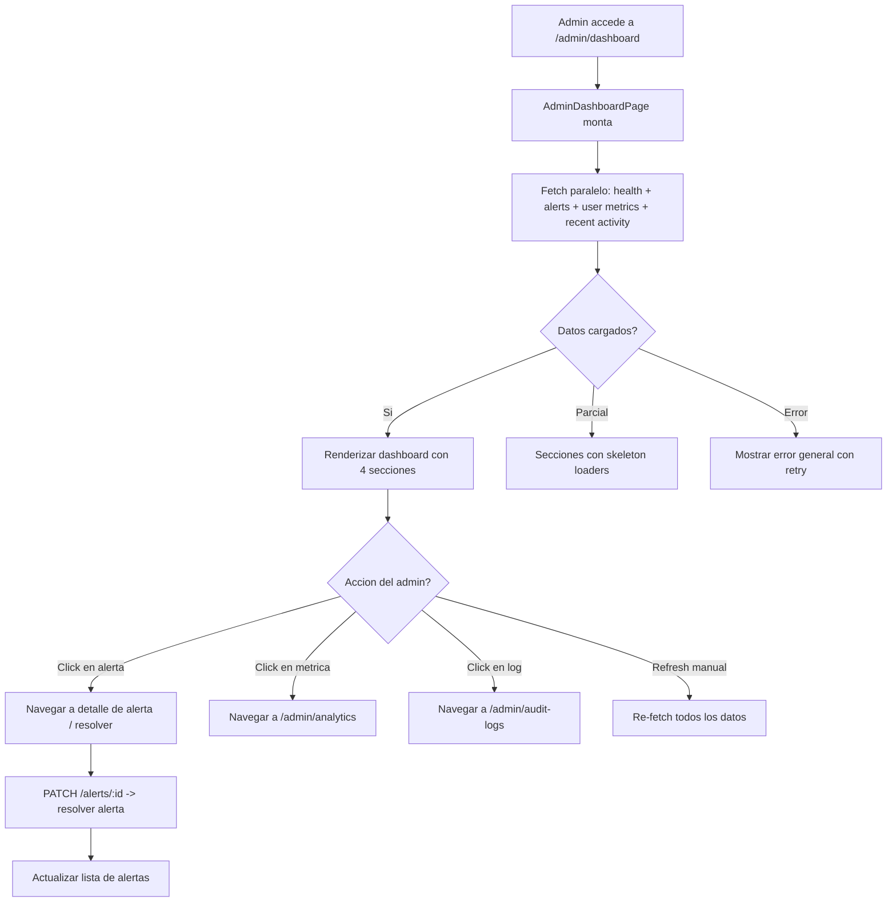

# FL-ADM-09 - Dashboard Administrador

**ID:** FL-ADM-09
**Version:** 1.1.0
**Fecha:** 2026-02-18
**Estado:** Activo
**Portal:** Admin
**Prioridad:** P1

---

## 1. Resumen

Flujo del dashboard principal del portal de administracion. El administrador visualiza al ingresar un panel consolidado con: salud del sistema (uptime, latencia, uso de recursos), alertas activas priorizadas por severidad, metricas de usuarios (activos, registros recientes, sesiones), actividad reciente del sistema (ultimas operaciones, deployments, errores). Es el centro de control desde donde el admin navega a cada seccion especializada. Los datos provienen de multiples schemas (admin_dashboard, audit_logging) con agregaciones en tiempo real.

---

## 2. Precondiciones

- Usuario autenticado con rol `admin` o `super_admin`.
- Sesion activa con JWT valido.
- Servicios de monitoreo activos (health checks, performance metrics).
- Al menos un tenant configurado en el sistema.

---

## 3. Diagrama Mermaid



---

## 4. Secuencia FE -> BE -> DB

```
=== Carga inicial - Dashboard completo ===
1. FE: AdminDashboardPage monta -> 4 fetches en paralelo
2. FE: GET /api/v1/admin/dashboard/health
3. BE: AdminDashboardController.getSystemHealth() -> checks de DB, Redis, servicios
4. DB: SELECT FROM audit_logging.performance_metrics ORDER BY recorded_at DESC LIMIT 1
5. BE: Retorna { status, uptime, dbLatency, redisLatency, memoryUsage, cpuUsage }

6. FE: GET /api/v1/admin/dashboard/alerts?status=active&limit=10
7. BE: AdminSystemController.getActiveAlerts()
8. DB: SELECT FROM audit_logging.system_alerts
       WHERE resolved_at IS NULL ORDER BY severity DESC, created_at DESC
9. BE: Retorna array de { id, type, severity, message, createdAt, affectedEntity }

10. FE: GET /api/v1/admin/dashboard/user-metrics
11. BE: AdminDashboardController.getUserMetrics()
12. DB: SELECT counts FROM auth_management.profiles + auth.users
        (total, activos hoy, registros ultimos 7 dias)
13. BE: Retorna { totalUsers, activeToday, newThisWeek, activeSessions }

14. FE: GET /api/v1/admin/dashboard/recent-activity?limit=20
15. BE: AdminSystemController.getRecentActivity()
16. DB: SELECT FROM audit_logging.system_logs ORDER BY created_at DESC LIMIT 20
17. BE: Retorna array de { id, action, actor, target, timestamp, details }

18. FE: Renderiza: Health Cards + Alerts Panel + User Metrics + Activity Feed

=== Resolver alerta ===
19. FE: Admin click en alerta -> boton "Resolver"
20. FE: PATCH /api/v1/admin/system/alerts/:id { status: 'resolved', resolution: '...' }
21. BE: AdminSystemController.resolveAlert() -> actualiza estado
22. DB: UPDATE audit_logging.system_alerts SET resolved_at = NOW(), resolution = :text
23. FE: Remueve alerta de lista activa, actualiza contador
```

---

## 5. Componentes y artefactos implicados

### Frontend

| Tipo | Archivo |
|------|---------|
| Pagina dashboard | `apps/frontend/src/apps/admin/pages/AdminDashboardPage.tsx` |
| Wrapper | `apps/frontend/src/apps/admin/components/shared/AdminPageShell.tsx` |
| Componente stats | `apps/frontend/src/apps/admin/components/dashboard/DashboardStatsGrid.tsx` |
| Componente health | `apps/frontend/src/apps/admin/components/dashboard/SystemHealthCard.tsx` |
| Componente alertas | `apps/frontend/src/apps/admin/components/dashboard/AlertsNotificationsCard.tsx` |
| Componente acciones | `apps/frontend/src/apps/admin/components/dashboard/DashboardQuickActions.tsx` |
| Hook dashboard | `apps/frontend/src/apps/admin/hooks/useAdminDashboard.ts` |
| Hook page setup | `apps/frontend/src/apps/admin/hooks/useAdminPageSetup.ts` |
| API admin | `apps/frontend/src/services/api/adminAPI.ts` |
| Rutas | `apps/frontend/src/App.tsx` (ruta: `/admin/dashboard`) |

### Backend

| Tipo | Archivo |
|------|---------|
| Controller dashboard | `apps/backend/src/modules/admin/controllers/admin-dashboard.controller.ts` |
| Controller system | `apps/backend/src/modules/admin/controllers/admin-system.controller.ts` |
| Service dashboard | `apps/backend/src/modules/admin/services/admin-dashboard.service.ts` |
| Service system | `apps/backend/src/modules/admin/services/admin-system.service.ts` |
| Guard JWT + Role | `apps/backend/src/modules/auth/guards/jwt-auth.guard.ts`, `roles.guard.ts` |

### Base de Datos

| Tipo | Archivo |
|------|---------|
| Tabla admin_reports | `apps/database/ddl/schemas/admin_dashboard/tables/admin_reports.sql` |
| Tabla system_alerts | `apps/database/ddl/schemas/audit_logging/tables/03-system_alerts.sql` |
| Tabla performance_metrics | `apps/database/ddl/schemas/audit_logging/tables/02-performance_metrics.sql` |
| Tabla system_logs | `apps/database/ddl/schemas/audit_logging/tables/01-system_logs.sql` |

---

## 6. Reglas y validaciones

| Regla | Capa | Descripcion |
|-------|------|-------------|
| Autenticacion + rol admin | BE | JwtAuthGuard + RolesGuard(@Role('admin', 'super_admin')) |
| Alertas por severidad | BE | Orden: critical > high > medium > low |
| Health checks con timeout | BE | Cada check tiene timeout de 5s para evitar bloqueos |
| Metricas cacheadas | BE | User metrics cacheados 2 minutos en Redis |
| RLS por tenant | DB | Admin ve datos de su tenant (super_admin ve todos) |
| Actividad reciente limitada | BE | Max 50 entradas, default 20 |
| Solo alertas no resueltas | BE | Dashboard muestra solo resolved_at IS NULL |

---

## 7. Manejo de errores

| Escenario | Capa | Codigo HTTP | Comportamiento |
|-----------|------|-------------|----------------|
| Token JWT expirado | BE | 401 | Redirige a login |
| Rol insuficiente | BE | 403 | ForbiddenException |
| Health check fallido (DB down) | BE | 200 | Retorna status: 'degraded' con detalle |
| Error en alertas fetch | FE | N/A | Seccion muestra retry, no afecta otras secciones |
| Sin alertas activas | FE | 200 | Panel de alertas muestra "Sistema operando normalmente" |
| Error al resolver alerta | BE | 500 | Log + mensaje de error al admin |
| Timeout en metricas | BE | 504 | FE muestra dato cached o skeleton |

---

## 8. Trazabilidad cruzada

| Capa | Archivo | Evidencia |
|------|---------|-----------|
| Frontend Pagina | `apps/frontend/src/apps/admin/pages/AdminDashboardPage.tsx` | Dashboard principal admin |
| Frontend Wrapper | `apps/frontend/src/apps/admin/components/shared/AdminPageShell.tsx` | Wrapper comun de paginas admin |
| Frontend Componente | `apps/frontend/src/apps/admin/components/dashboard/DashboardStatsGrid.tsx` | Grid de estadisticas del dashboard |
| Frontend Componente | `apps/frontend/src/apps/admin/components/dashboard/SystemHealthCard.tsx` | Card de salud del sistema |
| Frontend Componente | `apps/frontend/src/apps/admin/components/dashboard/AlertsNotificationsCard.tsx` | Card de alertas y notificaciones |
| Frontend Componente | `apps/frontend/src/apps/admin/components/dashboard/DashboardQuickActions.tsx` | Acciones rapidas del dashboard |
| Frontend Hook | `apps/frontend/src/apps/admin/hooks/useAdminDashboard.ts` | Hook de datos del dashboard |
| Frontend Hook | `apps/frontend/src/apps/admin/hooks/useAdminPageSetup.ts` | Hook de setup comun de paginas admin |
| Backend Controller | `apps/backend/src/modules/admin/controllers/admin-dashboard.controller.ts` | Health, metrics endpoints |
| Backend Controller | `apps/backend/src/modules/admin/controllers/admin-system.controller.ts` | Alerts, activity endpoints |
| DDL system_alerts | `apps/database/ddl/schemas/audit_logging/tables/03-system_alerts.sql` | Alertas del sistema |
| DDL performance_metrics | `apps/database/ddl/schemas/audit_logging/tables/02-performance_metrics.sql` | Metricas de rendimiento |
| DDL system_logs | `apps/database/ddl/schemas/audit_logging/tables/01-system_logs.sql` | Logs del sistema |

---

## 9. Referencias

- Flujo monitoreo sistema: [FL-ADM-04](./FLUJO-MONITOREO-SISTEMA.md)
- Flujo audit logs: [FL-ADM-06](./FLUJO-AUDIT-LOGS.md)
- Guia portal admin: `docs/60-portals/admin/PORTAL-ADMIN-GUIDE.md`
