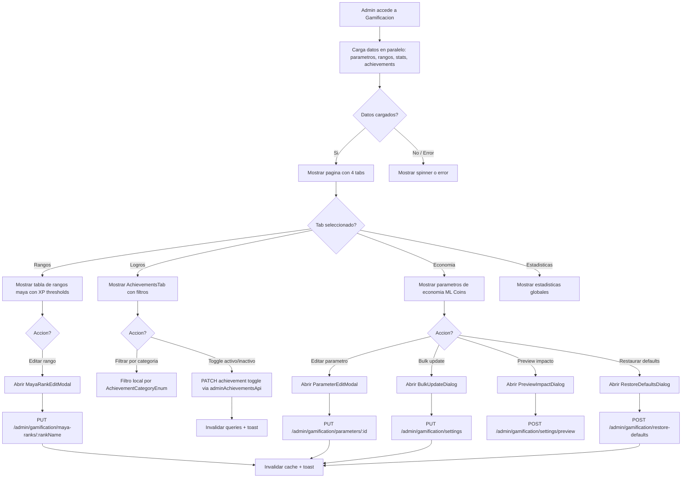

# FL-ADM-08 - Admin Gamification Management

**ID:** FL-ADM-08
**Version:** 1.1.0
**Fecha:** 2026-02-18
**Estado:** Activo
**Portal:** Admin
**Prioridad:** P2

---

## 1. Resumen

Flujo de gestion de la configuracion de gamificacion desde el portal Admin. El administrador puede visualizar y configurar los parametros globales del sistema de gamificacion: rangos maya (umbrales de XP), logros (achievements), economia virtual (ML Coins) y estadisticas generales. Incluye edicion individual de parametros, edicion de rangos maya, actualizacion masiva (bulk update), previsualizacion de impacto de cambios, restauracion de valores por defecto, y gestion de logros (activar/desactivar, filtrar por categoria). El sistema tiene 4 tabs: Rangos, Logros, Economia y Estadisticas.

---

## 2. Precondiciones

- Usuario autenticado con rol `super_admin`.
- Sesion activa con JWT valido.
- AdminGuard activo (validacion de permisos admin en backend).
- Tenant asignado (multi-tenancy RLS activo).
- Datos de gamificacion configurados en la base de datos (rangos maya, achievements, parametros).

---

## 3. Diagrama Mermaid



---

## 4. Secuencia FE -> BE -> DB

```
=== Carga inicial ===
1. FE: AdminGamificationPage monta → useGamificationConfig() invoca 3 queries en paralelo
2. FE: useParameters() → GET /admin/gamification/parameters
3. FE: useMayaRanks() → GET /admin/gamification/maya-ranks
4. FE: useStats() → GET /admin/gamification/settings (o stats endpoint)
5. BE: AdminGamificationConfigController → GamificationConfigService
6. DB: SELECT FROM gamification_system.maya_ranks, gamification_system.achievements, admin_dashboard.system_settings (RLS)
7. FE: Renderiza tabs con datos

=== Editar parametro individual ===
8. FE: ParameterEditModal.submit → updateParameter(id, data)
9. BE: PUT /admin/gamification/parameters/:id → GamificationConfigService.updateParameter()
10. DB: UPDATE gamification_system/admin_dashboard parameter table
11. FE: React Query invalidation + toast exito

=== Editar rango maya ===
12. FE: MayaRankEditModal.submit → updateMayaRank(rankName, data)
13. BE: PUT /admin/gamification/maya-ranks/:rankName → GamificationConfigService.updateMayaRank()
14. DB: UPDATE gamification_system.maya_ranks SET xp_threshold = :value WHERE name = :rankName
15. FE: React Query invalidation + toast exito

=== Toggle achievement ===
16. FE: AchievementsTab.handleToggleActive → adminAchievementsApi.toggleActive(id, isActive)
17. BE: PATCH /admin/achievements/:id/toggle → AchievementsService (o admin handler)
18. DB: UPDATE gamification_system.achievements SET is_active = :value WHERE id = :id
19. FE: React Query invalidation ['admin', 'achievements'] + toast

=== Bulk update ===
20. FE: BulkUpdateDialog.submit → bulkUpdateParameters(data)
21. BE: PUT /admin/gamification/settings → GamificationConfigService.bulkUpdate()
22. DB: Multiple UPDATEs en transaccion
23. FE: React Query invalidation + toast

=== Restaurar defaults ===
24. FE: RestoreDefaultsDialog.confirm → restoreDefaults()
25. BE: POST /admin/gamification/restore-defaults → GamificationConfigService.restoreDefaults()
26. DB: RESET parametros a valores seed originales
27. FE: React Query invalidation + toast
```

---

## 5. Componentes y artefactos implicados

### Frontend

| Tipo | Archivo |
|------|---------|
| Pagina | `apps/frontend/src/apps/admin/pages/AdminGamificationPage.tsx` |
| Wrapper | `apps/frontend/src/apps/admin/components/shared/AdminPageShell.tsx` |
| Hook | `apps/frontend/src/apps/admin/hooks/useGamificationConfig.ts` |
| Hook | `apps/frontend/src/apps/admin/hooks/useAdminPageSetup.ts` |
| Tab Rangos | `apps/frontend/src/apps/admin/components/gamification/RanksTab.tsx` |
| Tab Logros | `apps/frontend/src/apps/admin/components/gamification/AchievementsTab.tsx` |
| Tab Economia | `apps/frontend/src/apps/admin/components/gamification/EconomyTab.tsx` |
| Tab Estadisticas | `apps/frontend/src/apps/admin/components/gamification/StatsTab.tsx` |
| Modal Parametro | `apps/frontend/src/apps/admin/components/gamification/ParameterEditModal.tsx` |
| Modal Rango | `apps/frontend/src/apps/admin/components/gamification/MayaRankEditModal.tsx` |
| Dialog Bulk | `apps/frontend/src/apps/admin/components/gamification/BulkUpdateDialog.tsx` |
| Dialog Preview | `apps/frontend/src/apps/admin/components/gamification/PreviewImpactDialog.tsx` |
| Dialog Defaults | `apps/frontend/src/apps/admin/components/gamification/RestoreDefaultsDialog.tsx` |
| API Achievements | `apps/frontend/src/features/gamification/social/api/achievementsAPI.ts` |
| API Admin | `apps/frontend/src/services/api/adminAPI.ts` |
| Layout | `apps/frontend/src/apps/admin/layouts/AdminLayout.tsx` |
| Rutas | `apps/frontend/src/App.tsx` |

### Backend

| Tipo | Archivo |
|------|---------|
| Controller Config | `apps/backend/src/modules/admin/controllers/admin-gamification-config.controller.ts` |
| Service Config | `apps/backend/src/modules/admin/services/gamification-config.service.ts` |
| Controller Achievements | `apps/backend/src/modules/gamification/controllers/achievements.controller.ts` |
| Service Achievements | `apps/backend/src/modules/gamification/services/achievements.service.ts` |
| Service Ranks | `apps/backend/src/modules/gamification/services/ranks.service.ts` |
| Service ML Coins | `apps/backend/src/modules/gamification/services/ml-coins.service.ts` |
| Entity Parameter | `apps/backend/src/modules/admin/entities/gamification-parameter.entity.ts` |
| Entity Achievement | `apps/backend/src/modules/gamification/entities/achievement.entity.ts` |
| Entity Maya Rank | `apps/backend/src/modules/gamification/entities/maya-rank.entity.ts` |
| Entity User Stats | `apps/backend/src/modules/gamification/entities/user-stats.entity.ts` |
| Guard JWT | `apps/backend/src/modules/auth/guards/jwt-auth.guard.ts` |

### Base de Datos

| Tipo | Archivo |
|------|---------|
| Tabla achievements | `apps/database/ddl/schemas/gamification_system/tables/03-achievements.sql` |
| Tabla user_achievements | `apps/database/ddl/schemas/gamification_system/tables/04-user_achievements.sql` |
| Tabla maya_ranks | `apps/database/ddl/schemas/gamification_system/tables/13-maya_ranks.sql` |
| Tabla user_stats | `apps/database/ddl/schemas/gamification_system/tables/01-user_stats.sql` |
| Tabla user_ranks | `apps/database/ddl/schemas/gamification_system/tables/02-user_ranks.sql` |
| Tabla ml_coins_transactions | `apps/database/ddl/schemas/gamification_system/tables/05-ml_coins_transactions.sql` |
| Tabla achievement_categories | `apps/database/ddl/schemas/gamification_system/tables/10-achievement_categories.sql` |

---

## 6. Reglas y validaciones

| Regla | Capa | Descripcion |
|-------|------|-------------|
| Solo admin puede acceder | BE | AdminGuard verifica rol super_admin |
| XP threshold positivo | FE + BE | Los umbrales de XP deben ser numeros positivos |
| Rangos maya ordenados | BE | Los rangos deben mantener orden ascendente de XP threshold |
| Parametros con limites | BE | Cada parametro tiene min/max definidos, validacion en DTO |
| Achievements toggle idempotente | BE | Toggle activo/inactivo es idempotente |
| Bulk update transaccional | DB | Actualizaciones masivas en una sola transaccion |
| Restaurar defaults requiere confirmacion | FE | Dialog de confirmacion antes de restaurar |
| Preview no modifica datos | BE | El endpoint de preview es de solo lectura |
| RLS por tenant | DB | Datos filtrados por tenant_id automaticamente |
| React Query staleTime 5 min | FE | Cache de achievements con staleTime de 5 minutos |

---

## 7. Manejo de errores

| Escenario | Capa | Codigo HTTP | Comportamiento |
|-----------|------|-------------|----------------|
| Token JWT expirado | BE | 401 | Redirige a login |
| No es admin | BE | 403 | AdminGuard rechaza, error "Forbidden" |
| Parametro no encontrado | BE | 404 | Toast error con mensaje |
| Rango maya invalido | BE | 400 | Validacion DTO, mensaje descriptivo |
| Error al cargar achievements | FE | N/A | Muestra icono error con mensaje |
| Error al toggle achievement | FE | N/A | Toast error con response.data.message o fallback |
| Error de red en carga inicial | FE | N/A | Muestra Loader2 spinner indefinido |
| Bulk update parcial | BE | 400/500 | Rollback transaccional, error detallado |
| Datos mayaRanks invalidos | FE | N/A | console.warn + fallback array vacio (BUG-ADMIN-008) |
| Error al restaurar defaults | BE | 500 | Toast error, datos no modificados |

---

## 8. Trazabilidad cruzada

| Capa | Archivo | Evidencia |
|------|---------|-----------|
| Frontend Pagina | `apps/frontend/src/apps/admin/pages/AdminGamificationPage.tsx` | 4 tabs: ranks, achievements, economy, stats |
| Frontend Wrapper | `apps/frontend/src/apps/admin/components/shared/AdminPageShell.tsx` | Wrapper comun de paginas admin |
| Frontend Hook | `apps/frontend/src/apps/admin/hooks/useGamificationConfig.ts` | React Query hooks para parameters, maya-ranks, stats |
| Frontend RanksTab | `apps/frontend/src/apps/admin/components/gamification/RanksTab.tsx` | Tab de rangos maya extraido |
| Frontend AchievementsTab | `apps/frontend/src/apps/admin/components/gamification/AchievementsTab.tsx` | Filtros por categoria, toggle activo, lista con rewards |
| Frontend EconomyTab | `apps/frontend/src/apps/admin/components/gamification/EconomyTab.tsx` | Tab de economia ML Coins extraido |
| Frontend StatsTab | `apps/frontend/src/apps/admin/components/gamification/StatsTab.tsx` | Tab de estadisticas de gamificacion extraido |
| Frontend API | `apps/frontend/src/features/gamification/social/api/achievementsAPI.ts` | Llamadas a achievements API |
| Backend Controller | `apps/backend/src/modules/admin/controllers/admin-gamification-config.controller.ts` | Endpoints: GET/PUT parameters, maya-ranks, settings, preview, restore |
| Backend Service | `apps/backend/src/modules/admin/services/gamification-config.service.ts` | Logica de negocio gamificacion config |
| Backend Achievements | `apps/backend/src/modules/gamification/controllers/achievements.controller.ts` | CRUD achievements |
| DDL Achievements | `apps/database/ddl/schemas/gamification_system/tables/03-achievements.sql` | Tabla con is_active, is_secret, category, rewards |
| DDL Maya Ranks | `apps/database/ddl/schemas/gamification_system/tables/13-maya_ranks.sql` | Tabla con name, xp_threshold, orden |

---

## 9. Referencias

- Epic: EPIC-GAM-F1-GAMIFICATION
- User Story: US-AE-005 (Admin Gamification Config)
- Especificacion: `docs/10-requirements/epics/EPIC-GAM-F1-GAMIFICATION/specifications/ET-GAM-001-achievements.md`
- Especificacion: `docs/10-requirements/epics/EPIC-GAM-F1-GAMIFICATION/specifications/ET-GAM-003-rangos-maya.md`
- Guia admin: `docs/50-guides/frontend/impl/admin/pages/AdminGamificationPage-Specification.md`
- Portal admin: `docs/60-portals/admin/PORTAL-ADMIN-GUIDE.md`
- ADR-016: Simplificar Backend XP Acumulacion (`docs/90-adr/ADR-016-simplificar-backend-xp-acumulacion.md`)
