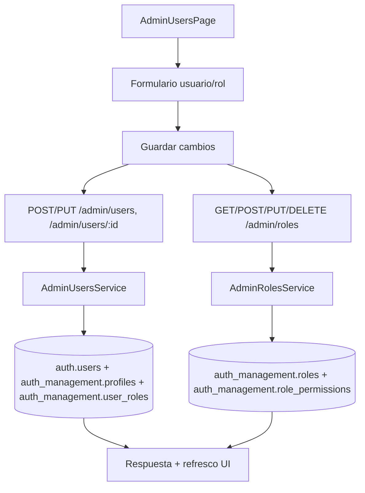

# FL-ADM-01 - Gestion de Usuarios y Roles (Admin)

**Portal:** Admin
**Prioridad:** Alta
**Estado:** Documentado

---

## Resumen

Flujo para crear/editar usuarios administrativos y academicos, y asignar roles/permisos desde el portal admin.

## Precondiciones

- **Rol requerido:** `super_admin` o `admin_teacher` con permiso `can_manage_users`.
- **Sesion activa:** JWT valido emitido por `auth/login`, con token no expirado y sesion no revocada.
- **Estado del sistema:** Al menos un tenant (organizacion) debe existir en `auth_management.tenants`. La plataforma no debe estar en modo mantenimiento.
- **Datos previos:** Para asignar roles, deben existir roles activos en `auth_management.roles`. Para asignar a organizacion, esta debe estar registrada.

## Diagrama Mermaid

## Secuencia FE -> BE -> DB

1. `AdminUsersPage.tsx` abre modal de alta/edicion (`CreateUserModal.tsx` o `UserDetailModal.tsx`).
2. Accion FE dispara request a APIs admin users/roles via `useUserManagement` hook y `adminAPI.ts`.
3. Backend valida permisos RBAC mediante `JwtAuthGuard` + `AdminGuard` y reglas de rol.
4. Persistencia en `auth.users`, `auth_management.profiles`, `auth_management.user_roles`.
5. FE refresca listado y estado local.

## Componentes y artefactos implicados

### Frontend

| Tipo | Archivo |
|------|---------|
| Pagina | `apps/frontend/src/apps/admin/pages/AdminUsersPage.tsx` |
| Pagina | `apps/frontend/src/apps/admin/pages/AdminRolesPage.tsx` |
| Componente | `apps/frontend/src/apps/admin/components/users/CreateUserModal.tsx` |
| Componente | `apps/frontend/src/apps/admin/components/users/UserDetailModal.tsx` |
| Componente | `apps/frontend/src/apps/admin/components/users/BulkActionsPanel.tsx` |
| Componente | `apps/frontend/src/apps/admin/components/users/UserAdvancedFilters.tsx` |
| Componente | `apps/frontend/src/apps/admin/components/roles/RolesTable.tsx` |
| Componente | `apps/frontend/src/apps/admin/components/roles/RoleEditor.tsx` |
| Componente | `apps/frontend/src/apps/admin/components/roles/PermissionMatrix.tsx` |
| Componente | `apps/frontend/src/apps/admin/components/roles/RoleActionsMenu.tsx` |
| Componente | `apps/frontend/src/features/admin/components/ActivateUserModal.tsx` |
| Componente | `apps/frontend/src/features/admin/components/DeactivateUserModal.tsx` |
| Hook | `apps/frontend/src/apps/admin/hooks/useUserManagement.ts` |
| Hook | `apps/frontend/src/apps/admin/hooks/useRolePermissions.ts` |
| Hook | `apps/frontend/src/apps/admin/hooks/useRoles.ts` |
| API Service | `apps/frontend/src/services/api/adminAPI.ts` (secciones USERS, ROLES) |

### Backend

| Tipo | Ruta / Archivo |
|------|----------------|
| Endpoint | `GET /admin/users` — Listar usuarios con filtros y paginacion |
| Endpoint | `POST /admin/users` — Crear nuevo usuario |
| Endpoint | `GET /admin/users/stats` — Estadisticas de usuarios |
| Endpoint | `GET /admin/users/:id` — Detalle de usuario por ID |
| Endpoint | `PUT /admin/users/:id` — Actualizar informacion de usuario |
| Endpoint | `DELETE /admin/users/:id` — Eliminar usuario |
| Endpoint | `POST /admin/users/:id/suspend` — Suspender cuenta |
| Endpoint | `POST /admin/users/:id/activate` — Activar cuenta suspendida |
| Endpoint | `POST /admin/users/:id/unsuspend` — Quitar suspension |
| Endpoint | `POST /admin/users/:id/deactivate` — Desactivar cuenta temporalmente |
| Endpoint | `POST /admin/users/:id/reset-password` — Forzar reset de contrasena |
| Endpoint | `POST /admin/users/bulk/suspend` — Suspension masiva |
| Endpoint | `POST /admin/users/bulk/delete` — Eliminacion masiva |
| Endpoint | `POST /admin/users/bulk/update-role` — Actualizacion masiva de rol |
| Endpoint | `GET /admin/roles` — Listar todos los roles |
| Endpoint | `POST /admin/roles` — Crear rol personalizado |
| Endpoint | `DELETE /admin/roles/:id` — Eliminar (desactivar) rol |
| Endpoint | `GET /admin/roles/permissions` — Permisos disponibles |
| Endpoint | `GET /admin/roles/:id/permissions` — Permisos de un rol |
| Endpoint | `PUT /admin/roles/:id/permissions` — Actualizar permisos de un rol |
| Controller | `apps/backend/src/modules/admin/controllers/admin-users.controller.ts` |
| Controller | `apps/backend/src/modules/admin/controllers/admin-roles.controller.ts` |
| Service | `apps/backend/src/modules/admin/services/admin-users.service.ts` |
| Service | `apps/backend/src/modules/admin/services/admin-roles.service.ts` |
| Service | `apps/backend/src/modules/admin/services/bulk-operations.service.ts` |
| Guard | `apps/backend/src/modules/admin/guards/admin.guard.ts` |
| DTOs | `apps/backend/src/modules/admin/dto/users/` (ListUsersDto, UpdateUserDto, SuspendUserDto, AdminCreateUserDto, ResetPasswordDto, UserStatsDto, PaginatedUsersDto) |
| DTOs | `apps/backend/src/modules/admin/dto/roles/` (RoleDto, PermissionDto, UpdatePermissionsDto, CreateRoleDto) |
| DTOs | `apps/backend/src/modules/admin/dto/bulk-operations/` (BulkSuspendUsersDto, BulkDeleteUsersDto, BulkUpdateRoleDto) |

### Datos

| Schema.Tabla | Entity |
|--------------|--------|
| `auth.users` | `apps/backend/src/modules/auth/entities/user.entity.ts` |
| `auth_management.profiles` | `apps/backend/src/modules/auth/entities/profile.entity.ts` |
| `auth_management.roles` | `apps/backend/src/modules/auth/entities/role.entity.ts` |
| `auth_management.user_roles` | `apps/backend/src/modules/auth/entities/user-role.entity.ts` |
| `auth_management.user_sessions` | `apps/backend/src/modules/auth/entities/user-session.entity.ts` |
| `auth_management.user_suspensions` | `apps/backend/src/modules/auth/entities/user-suspension.entity.ts` |
| `auth_management.tenants` | `apps/backend/src/modules/auth/entities/tenant.entity.ts` |
| `admin_dashboard.bulk_operations` | `apps/backend/src/modules/admin/entities/bulk-operation.entity.ts` |

## Reglas y validaciones

- **RBAC:** Solo `super_admin` puede crear/eliminar roles y gestionar permisos. `admin_teacher` puede crear/editar usuarios de su organizacion unicamente.
- **Aislamiento por tenant:** Usuarios solo pueden ver y gestionar usuarios pertenecientes a su mismo tenant. RLS activa en `auth.users` y `auth_management.profiles`.
- **Roles de sistema:** Los roles predefinidos (`student`, `admin_teacher`, `super_admin`) no pueden eliminarse ni renombrarse. Solo se pueden eliminar roles personalizados.
- **Unicidad de email:** El email de usuario debe ser unico a nivel global en `auth.users`.
- **Contrasena temporal:** Al crear usuario sin proveer contrasena, el sistema genera una contrasena temporal y opcionalmente envia email de bienvenida.
- **Suspension vs Desactivacion:** Suspension es una accion punitiva con motivo requerido; desactivacion es temporal y administrativa.
- **Operaciones masivas:** Las operaciones bulk (`bulk/suspend`, `bulk/delete`, `bulk/update-role`) requieren confirmacion y registran la identidad del admin ejecutor.

## Manejo de errores

| Escenario | Capa | Codigo HTTP | Comportamiento esperado |
|-----------|------|-------------|-------------------------|
| Token JWT expirado o invalido | Backend (JwtAuthGuard) | 401 | FE redirige a login, limpia sesion |
| Usuario sin permisos de admin | Backend (AdminGuard) | 403 | FE muestra toast "Acceso denegado" |
| Email duplicado al crear usuario | Backend (AdminUsersService) | 409 | FE muestra error en campo email del formulario |
| Usuario no encontrado por ID | Backend (AdminUsersService) | 404 | FE muestra toast "Usuario no encontrado" y refresca lista |
| Intento de eliminar rol de sistema | Backend (AdminRolesService) | 400 | FE muestra toast "No se puede eliminar rol de sistema" |
| Nombre de rol duplicado al crear | Backend (AdminRolesService) | 409 | FE muestra error en campo de nombre |
| Error de validacion en DTO | Backend (ValidationPipe) | 400 | FE muestra mensajes de validacion en los campos correspondientes |
| Error de conexion a base de datos | Backend (TypeORM) | 500 | FE muestra toast generico "Error del servidor" con opcion de reintentar |

## Trazabilidad cruzada

| Capa | Archivo | Evidencia |
|------|---------|-----------|
| FE Page | `apps/frontend/src/apps/admin/pages/AdminUsersPage.tsx` | Pagina principal de gestion de usuarios |
| FE Page | `apps/frontend/src/apps/admin/pages/AdminRolesPage.tsx` | Pagina de gestion de roles |
| FE Hook | `apps/frontend/src/apps/admin/hooks/useUserManagement.ts` | Hook con operaciones CRUD de usuarios |
| FE Hook | `apps/frontend/src/apps/admin/hooks/useRolePermissions.ts` | Hook de gestion de permisos por rol |
| FE API | `apps/frontend/src/services/api/adminAPI.ts` | Cliente API con funciones de users y roles |
| BE Controller | `apps/backend/src/modules/admin/controllers/admin-users.controller.ts` | Controlador con 14 endpoints de usuarios |
| BE Controller | `apps/backend/src/modules/admin/controllers/admin-roles.controller.ts` | Controlador con 6 endpoints de roles |
| BE Service | `apps/backend/src/modules/admin/services/admin-users.service.ts` | Logica de negocio de usuarios |
| BE Service | `apps/backend/src/modules/admin/services/admin-roles.service.ts` | Logica de negocio de roles |
| DB Schema | `apps/database/ddl/schemas/auth_management/` | DDL de tablas de autenticacion y roles |

## Referencias

- Requerimiento: `EPIC-GAM-F1-ADMIN`
- Matriz: `../TRACEABILITY-MATRIX.md`
- Cobertura total: `../COBERTURA-TOTAL-PROCESOS.md`
