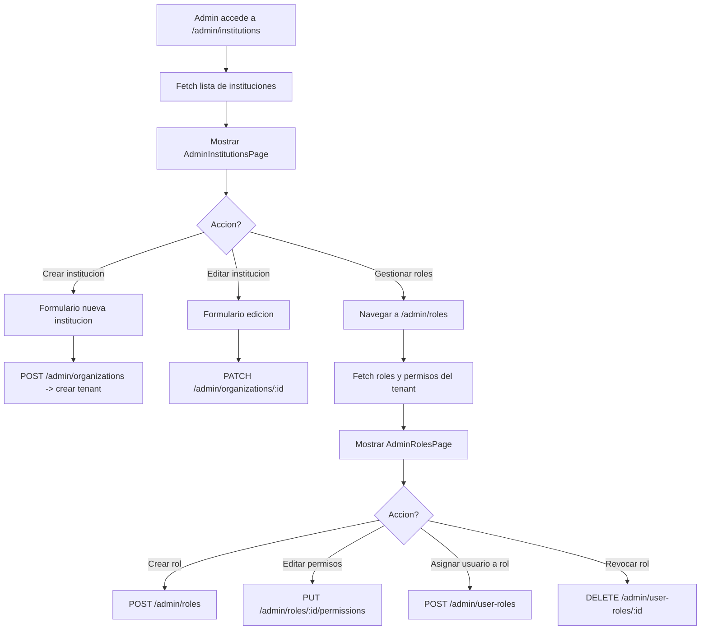

# FL-ADM-10 - Instituciones y Roles

**ID:** FL-ADM-10
**Version:** 1.1.0
**Fecha:** 2026-02-18
**Estado:** Activo
**Portal:** Admin
**Prioridad:** P1

---

## 1. Resumen

Flujo de gestion de instituciones (tenants) y configuracion de roles y permisos desde el portal de administracion. El administrador puede crear, editar y desactivar instituciones educativas, configurar los roles disponibles por institucion (admin, teacher, student, parent), definir permisos granulares por rol, y asignar usuarios a roles especificos. Este flujo es fundamental para el modelo multi-tenant del sistema donde cada institucion opera de forma aislada con su propia configuracion de roles y permisos basada en RBAC.

---

## 2. Precondiciones

- Usuario autenticado con rol `admin` o `super_admin`.
- Sesion activa con JWT valido.
- Para gestion de instituciones: rol `super_admin` requerido.
- Para gestion de roles dentro de una institucion: rol `admin` del tenant.
- Al menos un tenant (institucion) existente en el sistema.

---

## 3. Diagrama Mermaid



---

## 4. Secuencia FE -> BE -> DB

```
=== Gestion de instituciones ===
1. FE: AdminInstitutionsPage monta -> solicita instituciones
2. FE: GET /api/v1/admin/organizations
3. BE: AdminOrganizationsController.findAll() -> AdminOrganizationsService.findAll()
4. DB: SELECT FROM auth_management.tenants (super_admin: todos; admin: solo su tenant)
5. BE: Retorna array de { id, name, slug, status, userCount, createdAt }
6. FE: Renderiza tabla de instituciones con acciones

=== Crear institucion ===
7. FE: Admin llena formulario -> POST /api/v1/admin/organizations
8. BE: AdminOrganizationsController.create() -> valida + crea tenant
9. DB: INSERT INTO auth_management.tenants { name, slug, config, status }
10. BE: Inicializa roles default (admin, teacher, student, parent) para el nuevo tenant
11. DB: INSERT INTO auth_management.roles (4 roles por defecto)
12. FE: Redirige a detalle de la institucion creada

=== Gestion de roles ===
13. FE: Navegar a /admin/roles -> AdminRolesPage monta
14. FE: GET /api/v1/admin/roles?tenantId=:tenantId
15. BE: AdminRolesController.findByTenant() -> lista roles del tenant
16. DB: SELECT FROM auth_management.roles WHERE tenant_id = :tenantId
17. BE: Retorna array de { id, name, description, permissions[], userCount }
18. FE: Renderiza tabla de roles con permisos expandibles

=== Editar permisos de un rol ===
19. FE: Admin selecciona rol -> expande panel de permisos
20. FE: GET /api/v1/admin/roles/:roleId/permissions
21. BE: Retorna lista de permisos actuales
22. DB: SELECT FROM auth_management.role_permissions WHERE role_id = :roleId
23. FE: Toggle de permisos (checkbox matrix)
24. FE: PUT /api/v1/admin/roles/:roleId/permissions { permissions: [...] }
25. BE: Actualiza permisos del rol (delete + insert batch)
26. DB: DELETE + INSERT INTO auth_management.role_permissions

=== Asignar usuario a rol ===
27. FE: Buscar usuario -> seleccionar -> asignar rol
28. FE: POST /api/v1/admin/user-roles { userId, roleId }
29. BE: AdminRolesController.assignRole() -> valida + asigna
30. DB: INSERT INTO auth_management.user_roles { user_id, role_id, tenant_id }
31. FE: Actualiza lista de usuarios del rol
```

---

## 5. Componentes y artefactos implicados

### Frontend

| Tipo | Archivo |
|------|---------|
| Pagina instituciones | `apps/frontend/src/apps/admin/pages/AdminInstitutionsPage.tsx` |
| Pagina roles | `apps/frontend/src/apps/admin/pages/AdminRolesPage.tsx` |
| Wrapper | `apps/frontend/src/apps/admin/components/shared/AdminPageShell.tsx` |
| Componente modals | `apps/frontend/src/apps/admin/components/institutions/InstitutionFormModals.tsx` |
| Hook acciones | `apps/frontend/src/apps/admin/hooks/useInstitutionActions.ts` |
| Hook page setup | `apps/frontend/src/apps/admin/hooks/useAdminPageSetup.ts` |
| API admin | `apps/frontend/src/services/api/adminAPI.ts` |
| Rutas | `apps/frontend/src/App.tsx` (rutas: `/admin/institutions`, `/admin/roles`) |

### Backend

| Tipo | Archivo |
|------|---------|
| Controller organizaciones | `apps/backend/src/modules/admin/controllers/admin-organizations.controller.ts` |
| Controller roles | `apps/backend/src/modules/admin/controllers/admin-roles.controller.ts` |
| Service organizaciones | `apps/backend/src/modules/admin/services/admin-organizations.service.ts` |
| Service roles | `apps/backend/src/modules/admin/services/admin-roles.service.ts` |
| Guard JWT + Role | `apps/backend/src/modules/auth/guards/jwt-auth.guard.ts`, `roles.guard.ts` |

### Base de Datos

| Tipo | Archivo |
|------|---------|
| Tabla tenants | `apps/database/ddl/schemas/auth_management/tables/01-tenants.sql` |
| Tabla roles | `apps/database/ddl/schemas/auth_management/tables/04-roles.sql` |
| Tabla user_roles | `apps/database/ddl/schemas/auth_management/tables/05-user_roles.sql` |
| Tabla role_permissions | `apps/database/ddl/schemas/auth_management/tables/06-role_permissions.sql` |

---

## 6. Reglas y validaciones

| Regla | Capa | Descripcion |
|-------|------|-------------|
| super_admin para instituciones | BE | Solo super_admin puede crear/editar tenants |
| admin para roles de su tenant | BE | Admin solo gestiona roles de su propia institucion |
| Slug unico | BE + DB | Cada institucion tiene slug unico (UNIQUE constraint) |
| Roles default no eliminables | BE | Los 4 roles base no pueden ser eliminados |
| Permisos validos | BE | Solo permisos definidos en el catalogo son asignables |
| Un usuario - un rol por tenant | DB | UNIQUE(user_id, tenant_id) en user_roles |
| RLS por tenant | DB | Aislamiento completo entre instituciones |
| Nombre institucion requerido | BE | Validacion: minimo 3 caracteres, maximo 100 |

---

## 7. Manejo de errores

| Escenario | Capa | Codigo HTTP | Comportamiento |
|-----------|------|-------------|----------------|
| Token JWT expirado | BE | 401 | Redirige a login |
| Rol insuficiente | BE | 403 | ForbiddenException |
| Slug duplicado | BE | 409 | ConflictException "Ya existe una institucion con ese identificador" |
| Rol no encontrado | BE | 404 | NotFoundException |
| Intentar eliminar rol base | BE | 400 | BadRequestException "Rol del sistema no eliminable" |
| Usuario ya tiene rol en tenant | BE | 409 | ConflictException "Usuario ya asignado a este tenant" |
| Error al crear tenant | BE | 500 | Rollback + log, FE muestra error |
| Permiso invalido | BE | 400 | BadRequestException con lista de permisos validos |

---

## 8. Trazabilidad cruzada

| Capa | Archivo | Evidencia |
|------|---------|-----------|
| Frontend Pagina | `apps/frontend/src/apps/admin/pages/AdminInstitutionsPage.tsx` | Gestion de instituciones |
| Frontend Pagina | `apps/frontend/src/apps/admin/pages/AdminRolesPage.tsx` | Gestion de roles |
| Frontend Wrapper | `apps/frontend/src/apps/admin/components/shared/AdminPageShell.tsx` | Wrapper comun de paginas admin |
| Frontend Componente | `apps/frontend/src/apps/admin/components/institutions/InstitutionFormModals.tsx` | Modals de creacion/edicion de instituciones |
| Frontend Hook | `apps/frontend/src/apps/admin/hooks/useInstitutionActions.ts` | Hook de acciones de instituciones |
| Backend Controller | `apps/backend/src/modules/admin/controllers/admin-organizations.controller.ts` | CRUD instituciones |
| Backend Controller | `apps/backend/src/modules/admin/controllers/admin-roles.controller.ts` | CRUD roles y permisos |
| DDL tenants | `apps/database/ddl/schemas/auth_management/tables/01-tenants.sql` | Tabla de instituciones |
| DDL roles | `apps/database/ddl/schemas/auth_management/tables/04-roles.sql` | Tabla de roles |
| DDL user_roles | `apps/database/ddl/schemas/auth_management/tables/05-user_roles.sql` | Asignacion usuario-rol |
| DDL role_permissions | `apps/database/ddl/schemas/auth_management/tables/06-role_permissions.sql` | Permisos por rol |

---

## 9. Referencias

- Flujo gestion usuarios: [FL-ADM-01](./FLUJO-GESTION-USUARIOS-ROLES.md)
- ADR-006: Multi-tenancy con RLS (`docs/90-adr/ADR-006-multi-tenancy-rls.md`)
- Guia portal admin: `docs/60-portals/admin/PORTAL-ADMIN-GUIDE.md`
