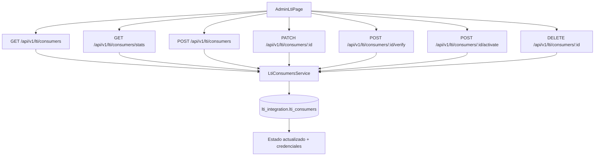

# FL-ADM-05 - Integraciones LTI

**Portal:** Admin
**Prioridad:** Media-Alta
**Estado:** Documentado

---

## Resumen

Flujo para gestionar integraciones LTI: listar consumers, crear, editar, activar, verificar y probar conexion.

## Precondiciones

- **Rol requerido:** `super_admin` o `admin_teacher` con permisos de gestion de integraciones. El controlador LTI usa `JwtAuthGuard` (sin `AdminGuard` explicito, pero la logica de servicio valida permisos).
- **Sesion activa:** JWT valido emitido por `auth/login`, con token no expirado y sesion no revocada.
- **Estado del sistema:** La plataforma debe estar operativa y el modulo LTI cargado en `app.module.ts`. La plataforma no debe estar en modo mantenimiento.
- **Datos previos:** Al menos un tenant debe existir. Para crear consumers por tenant, el tenant debe estar registrado en `auth_management.tenants`.

## Diagrama Mermaid

## Secuencia FE -> BE -> DB

1. Admin abre `AdminLtiPage.tsx` que renderiza `LtiConsumerList.tsx` con la lista de consumers.
2. FE consulta catalogo de consumers via `GET /api/v1/lti/consumers` y estadisticas via `GET /api/v1/lti/consumers/stats` usando `useLtiConsumers` hook.
3. Admin crea consumer con `LtiConsumerForm.tsx`, edita configuracion existente, o ejecuta verificacion/activacion.
4. Backend valida DTOs (`CreateLtiConsumerDto`, `UpdateLtiConsumerDto`) y persiste cambios en `lti_integration.lti_consumers`.
5. FE refleja estado de conexion y muestra credenciales via `LtiCredentialsDisplay.tsx`. Tests de conexion se ejecutan via `ConnectionTestModal.tsx`.

## Componentes y artefactos implicados

### Frontend

| Tipo | Archivo |
|------|---------|
| Pagina | `apps/frontend/src/features/admin/lti/AdminLtiPage.tsx` |
| Componente | `apps/frontend/src/features/admin/lti/components/LtiConsumerList.tsx` |
| Componente | `apps/frontend/src/features/admin/lti/components/LtiConsumerForm.tsx` |
| Componente | `apps/frontend/src/features/admin/lti/components/LtiCredentialsDisplay.tsx` |
| Componente | `apps/frontend/src/features/admin/lti/components/ConnectionTestModal.tsx` |
| Hook | `apps/frontend/src/apps/admin/hooks/useLtiConsumers.ts` |
| API Service | `apps/frontend/src/services/api/admin/ltiAPI.ts` |

### Backend

| Tipo | Ruta / Archivo |
|------|----------------|
| Endpoint | `GET /api/v1/lti/consumers` — Listar todos los consumers activos |
| Endpoint | `GET /api/v1/lti/consumers/stats` — Estadisticas de consumers (total, activos, verificados) |
| Endpoint | `GET /api/v1/lti/consumers/:id` — Obtener consumer por ID |
| Endpoint | `GET /api/v1/lti/consumers/tenant/:tenantId` — Obtener consumers por tenant |
| Endpoint | `POST /api/v1/lti/consumers` — Registrar nuevo LTI consumer (LMS) |
| Endpoint | `PATCH /api/v1/lti/consumers/:id` — Actualizar configuracion de consumer |
| Endpoint | `POST /api/v1/lti/consumers/:id/verify` — Marcar consumer como verificado |
| Endpoint | `POST /api/v1/lti/consumers/:id/activate` — Reactivar consumer desactivado |
| Endpoint | `DELETE /api/v1/lti/consumers/:id` — Desactivar consumer (soft delete) |
| Controller | `apps/backend/src/modules/lti/controllers/lti-consumers.controller.ts` |
| Service | `apps/backend/src/modules/lti/services/lti-consumers.service.ts` |
| DTOs | `apps/backend/src/modules/lti/dto/create-lti-consumer.dto.ts` |
| DTOs | `apps/backend/src/modules/lti/dto/update-lti-consumer.dto.ts` |
| DTOs | `apps/backend/src/modules/lti/dto/lti-consumer-response.dto.ts` |

### Datos

| Schema.Tabla | Entity |
|--------------|--------|
| `lti_integration.lti_consumers` | `apps/backend/src/modules/lti/entities/lti-consumer.entity.ts` |
| `lti_integration.lti_sessions` | `apps/backend/src/modules/lti/entities/lti-session.entity.ts` |
| `lti_integration.lti_grade_passbacks` | `apps/backend/src/modules/lti/entities/lti-grade-passback.entity.ts` |
| `auth_management.tenants` | `apps/backend/src/modules/auth/entities/tenant.entity.ts` |
| `auth_management.profiles` | `apps/backend/src/modules/auth/entities/profile.entity.ts` |

## Reglas y validaciones

- **RBAC:** Requiere JWT valido. Solo usuarios con rol administrativo pueden gestionar LTI consumers. El controlador usa `JwtAuthGuard`.
- **Aislamiento por tenant:** Consumers pueden filtrarse por `tenantId` via `GET /api/v1/lti/consumers/tenant/:tenantId`. Cada consumer esta asociado a un tenant especifico.
- **Unicidad de consumer:** No pueden existir dos consumers con la misma combinacion de `client_id` y `platform_url`. El backend retorna 409 en caso de duplicado.
- **Verificacion:** Un consumer debe ser verificado (`POST /:id/verify`) antes de poder procesar lanzamientos LTI. La verificacion confirma que las credenciales son correctas.
- **Soft delete:** `DELETE /api/v1/lti/consumers/:id` no elimina fisicamente el registro; marca `is_active = false`. Se puede reactivar con `POST /:id/activate`.
- **LTI 1.3:** La integracion sigue el estandar LTI 1.3 con OIDC login flow. Los campos `issuer`, `jwks_uri`, `auth_endpoint`, `token_endpoint` son requeridos en la creacion.
- **Cross-datasource entities:** El datasource `lti` registra explicitamente `Profile` y `Tenant` entities ya que `LtiConsumer` tiene `@ManyToOne` a estas entidades.

## Manejo de errores

| Escenario | Capa | Codigo HTTP | Comportamiento esperado |
|-----------|------|-------------|-------------------------|
| Token JWT expirado o invalido | Backend (JwtAuthGuard) | 401 | FE redirige a login |
| Consumer no encontrado por ID | Backend (LtiConsumersService) | 404 | FE muestra toast "Consumer no encontrado" |
| Consumer duplicado (misma client_id + platform_url) | Backend (LtiConsumersService) | 409 | FE muestra error en formulario de creacion |
| Campos requeridos faltantes en creacion | Backend (ValidationPipe) | 400 | FE muestra errores de validacion en campos del formulario |
| Tenant no encontrado al filtrar por tenant | Backend (LtiConsumersService) | 404 | FE muestra toast "Tenant no encontrado" |
| Error de conexion al verificar consumer | Backend (LtiConsumersService) | 502 | FE muestra en ConnectionTestModal "Error de conexion con el LMS" |
| Error interno al guardar consumer | Backend (TypeORM) | 500 | FE muestra toast generico "Error del servidor" con opcion de reintentar |

## Trazabilidad cruzada

| Capa | Archivo | Evidencia |
|------|---------|-----------|
| FE Page | `apps/frontend/src/features/admin/lti/AdminLtiPage.tsx` | Pagina principal de gestion LTI |
| FE Component | `apps/frontend/src/features/admin/lti/components/LtiConsumerList.tsx` | Lista de consumers con acciones |
| FE Component | `apps/frontend/src/features/admin/lti/components/LtiConsumerForm.tsx` | Formulario de creacion/edicion |
| FE Component | `apps/frontend/src/features/admin/lti/components/LtiCredentialsDisplay.tsx` | Visualizacion de credenciales |
| FE Component | `apps/frontend/src/features/admin/lti/components/ConnectionTestModal.tsx` | Modal de prueba de conexion |
| FE Hook | `apps/frontend/src/apps/admin/hooks/useLtiConsumers.ts` | Hook con operaciones CRUD y test |
| FE API | `apps/frontend/src/services/api/admin/ltiAPI.ts` | Cliente API para LTI |
| BE Controller | `apps/backend/src/modules/lti/controllers/lti-consumers.controller.ts` | Controlador con 9 endpoints de consumers |
| BE Service | `apps/backend/src/modules/lti/services/lti-consumers.service.ts` | Logica de negocio de consumers |
| DB Entity | `apps/backend/src/modules/lti/entities/lti-consumer.entity.ts` | Entity de LTI consumer |
| DB Schema | `apps/database/ddl/schemas/lti_integration/` | DDL de tablas de integracion LTI |

## Referencias

- Requerimiento: `EPIC-GAM-F3-LTI`
- Matriz: `../TRACEABILITY-MATRIX.md`
- Cobertura total: `../COBERTURA-TOTAL-PROCESOS.md`
