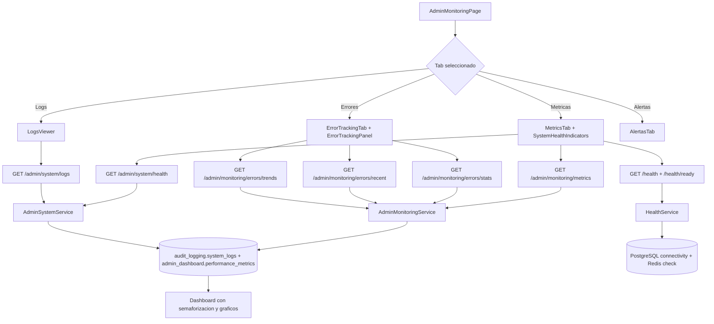

# FL-ADM-04 - Monitoreo y Salud del Sistema

**Portal:** Admin
**Prioridad:** Media
**Estado:** Documentado

---

## Resumen

Flujo para consultar estado operativo de plataforma, indicadores de salud y alertas de sistema.

## Precondiciones

- **Rol requerido:** `super_admin`. El acceso a metricas del sistema y error tracking esta restringido a administradores de nivel superior.
- **Sesion activa:** JWT valido emitido por `auth/login`, con token no expirado y sesion no revocada.
- **Estado del sistema:** El backend debe estar operativo para reportar metricas. El endpoint `/health` es publico y no requiere autenticacion (usado por load balancers). Los endpoints de `/admin/monitoring/*` y `/admin/system/*` requieren autenticacion.
- **Dependencias:** PostgreSQL y Redis deben estar accesibles para que los health checks reporten estado completo.

## Diagrama Mermaid

## Secuencia FE -> BE -> DB

1. Admin accede a `AdminMonitoringPage.tsx` con multiples tabs de monitoreo.
2. FE consulta endpoints de health, monitoring y system via hooks `useMonitoring`, `useSystemMonitoring`, `useSystemMetrics`.
3. Backend agrega metricas en tiempo real (CPU, memoria, procesos) desde Node.js y OS modules, y consulta logs/errores de la BD.
4. `HealthService` verifica conectividad con PostgreSQL y Redis, validacion de tablas criticas.
5. FE muestra semaforizacion de estado (healthy/degraded/unhealthy), graficos de tendencias y tabla de errores recientes.

## Componentes y artefactos implicados

### Frontend

| Tipo | Archivo |
|------|---------|
| Pagina | `apps/frontend/src/apps/admin/pages/AdminMonitoringPage.tsx` |
| Componente | `apps/frontend/src/apps/admin/components/monitoring/SystemHealthIndicators.tsx` |
| Componente | `apps/frontend/src/apps/admin/components/monitoring/MetricsTab.tsx` |
| Componente | `apps/frontend/src/apps/admin/components/monitoring/MetricsChart.tsx` |
| Componente | `apps/frontend/src/apps/admin/components/monitoring/ErrorTrackingTab.tsx` |
| Componente | `apps/frontend/src/apps/admin/components/monitoring/ErrorTrackingPanel.tsx` |
| Componente | `apps/frontend/src/apps/admin/components/monitoring/LogsViewer.tsx` |
| Componente | `apps/frontend/src/apps/admin/components/monitoring/AlertasTab.tsx` |
| Componente | `apps/frontend/src/apps/admin/components/monitoring/SystemPerformanceDashboard.tsx` |
| Componente | `apps/frontend/src/apps/admin/components/monitoring/UserActivityMonitor.tsx` |
| Componente | `apps/frontend/src/apps/admin/components/dashboard/SystemMetricsGrid.tsx` |
| Hook | `apps/frontend/src/apps/admin/hooks/useMonitoring.ts` |
| Hook | `apps/frontend/src/apps/admin/hooks/useSystemMonitoring.ts` |
| Hook | `apps/frontend/src/apps/admin/hooks/useSystemMetrics.ts` |
| Hook | `apps/frontend/src/apps/admin/hooks/useSystemLogs.ts` |
| API Service | `apps/frontend/src/services/api/adminAPI.ts` (seccion MONITORING) |

### Backend

| Tipo | Ruta / Archivo |
|------|----------------|
| Endpoint | `GET /health` — Health check publico (DB, tablas criticas, uptime) |
| Endpoint | `GET /health/live` — Liveness probe (proceso vivo, sin chequeo de deps) |
| Endpoint | `GET /health/ready` — Readiness probe (DB + Redis check) |
| Endpoint | `GET /health/metrics` — Metricas Prometheus en texto plano |
| Endpoint | `GET /admin/system/health` — Estado detallado del sistema (requiere auth) |
| Endpoint | `GET /admin/system/metrics` — Metricas de rendimiento de la aplicacion |
| Endpoint | `GET /admin/system/logs` — Logs del sistema paginados con filtros |
| Endpoint | `GET /admin/system/cron/status` — Estado de CRON jobs de misiones |
| Endpoint | `GET /admin/monitoring/metrics` — Metricas del sistema en tiempo real (CPU, RAM, procesos) |
| Endpoint | `GET /admin/monitoring/metrics/history` — Historial de metricas por periodo |
| Endpoint | `GET /admin/monitoring/errors/stats` — Estadisticas de errores agregadas por periodo |
| Endpoint | `GET /admin/monitoring/errors/recent` — Errores recientes con detalles completos |
| Endpoint | `GET /admin/monitoring/errors/trends` — Tendencias de errores por hora o dia |
| Controller | `apps/backend/src/modules/health/health.controller.ts` |
| Controller | `apps/backend/src/modules/admin/controllers/admin-system.controller.ts` |
| Controller | `apps/backend/src/modules/admin/controllers/admin-monitoring.controller.ts` |
| Service | `apps/backend/src/modules/health/health.service.ts` |
| Service | `apps/backend/src/modules/health/metrics.service.ts` |
| Service | `apps/backend/src/modules/admin/services/admin-system.service.ts` |
| Service | `apps/backend/src/modules/admin/services/admin-monitoring.service.ts` |
| Guard | `apps/backend/src/modules/admin/guards/admin.guard.ts` |
| DTOs | `apps/backend/src/modules/health/dto/health-check.dto.ts` |
| DTOs | `apps/backend/src/modules/admin/dto/system/` (SystemHealthDto, ApplicationMetricsDto, SystemLogsQueryDto, PaginatedSystemLogsDto) |
| DTOs | `apps/backend/src/modules/admin/dto/monitoring/` (SystemMetricsDto, MetricsHistoryDto, MetricsHistoryQueryDto, ErrorStatsDto, ErrorStatsQueryDto, RecentErrorsDto, RecentErrorsQueryDto, ErrorTrendsDto, ErrorTrendsQueryDto) |

### Datos

| Schema.Tabla | Entity |
|--------------|--------|
| `audit_logging.system_logs` | `apps/backend/src/modules/admin/entities/system-log.entity.ts` |
| `admin_dashboard.performance_metrics` | `apps/backend/src/modules/admin/entities/performance-metric.entity.ts` |
| `admin_dashboard.metrics_history` | `apps/backend/src/modules/admin/entities/metrics-history.entity.ts` |
| `admin_dashboard.system_alerts` | `apps/backend/src/modules/admin/entities/system-alert.entity.ts` |
| `admin_dashboard.activity_logs` | `apps/backend/src/modules/admin/entities/activity-log.entity.ts` |

## Reglas y validaciones

- **RBAC:** Los endpoints `/health`, `/health/live`, `/health/ready` y `/health/metrics` son publicos (usados por load balancers y Prometheus). Los endpoints bajo `/admin/system/*` y `/admin/monitoring/*` requieren `JwtAuthGuard` + `AdminGuard` (solo `super_admin`).
- **Codigos de estado de health:** `/health` retorna 200 si `healthy`, 503 si `unhealthy` o `degraded`. `/health/ready` retorna 503 si DB o Redis estan caidos.
- **Historial de metricas:** `GET /admin/monitoring/metrics/history` actualmente retorna solo metricas actuales con nota (historical tracking no habilitado aun).
- **Filtros de errores:** Se puede filtrar por nivel de error (`error`, `fatal`), rango temporal, y fuente del error.
- **Tendencias de errores:** Acepta agrupacion por `hour` o `day` via parametro de query.
- **CRON status:** Solo disponible si `MissionsCronService` esta inyectado (modulo de tareas cargado).
- **Rate limiting:** Los endpoints de health estan excluidos del throttle global (`@SkipThrottle()`).

## Manejo de errores

| Escenario | Capa | Codigo HTTP | Comportamiento esperado |
|-----------|------|-------------|-------------------------|
| Token JWT expirado (endpoints admin) | Backend (JwtAuthGuard) | 401 | FE redirige a login |
| Usuario no es super_admin | Backend (AdminGuard) | 403 | FE muestra toast "Acceso denegado" |
| Base de datos no accesible | Backend (HealthService) | 503 | `/health` retorna status `unhealthy`; FE muestra indicador rojo en DB |
| Redis no accesible | Backend (HealthService) | 503 | `/health/ready` retorna status `unhealthy`; FE muestra indicador rojo en Redis |
| Tablas criticas faltantes | Backend (HealthService) | 503 | `/health` retorna status `degraded` con lista de tablas faltantes |
| Parametros de query invalidos en errores | Backend (ValidationPipe) | 400 | FE muestra toast "Parametros de filtro invalidos" |
| Error interno al agregar metricas | Backend (AdminMonitoringService) | 500 | FE muestra toast "Error al obtener metricas" con opcion de reintentar |

## Trazabilidad cruzada

| Capa | Archivo | Evidencia |
|------|---------|-----------|
| FE Page | `apps/frontend/src/apps/admin/pages/AdminMonitoringPage.tsx` | Pagina de monitoreo con tabs |
| FE Component | `apps/frontend/src/apps/admin/components/monitoring/SystemHealthIndicators.tsx` | Indicadores de salud del sistema |
| FE Component | `apps/frontend/src/apps/admin/components/monitoring/ErrorTrackingTab.tsx` | Tab de tracking de errores |
| FE Hook | `apps/frontend/src/apps/admin/hooks/useMonitoring.ts` | Hook principal de monitoreo |
| FE Hook | `apps/frontend/src/apps/admin/hooks/useSystemMetrics.ts` | Hook de metricas del sistema |
| FE API | `apps/frontend/src/services/api/adminAPI.ts` | Cliente API seccion MONITORING |
| BE Controller | `apps/backend/src/modules/health/health.controller.ts` | Controlador de health con 4 endpoints publicos |
| BE Controller | `apps/backend/src/modules/admin/controllers/admin-monitoring.controller.ts` | Controlador de monitoring con 5 endpoints |
| BE Controller | `apps/backend/src/modules/admin/controllers/admin-system.controller.ts` | Controlador de system con endpoints health y logs |
| BE Service | `apps/backend/src/modules/health/health.service.ts` | Servicio de health checks |
| BE Service | `apps/backend/src/modules/admin/services/admin-monitoring.service.ts` | Servicio de monitoring |
| DB Schema | `apps/database/ddl/schemas/audit_logging/` | DDL de tablas de logs del sistema |

## Referencias

- Requerimiento: `EPIC-GAM-F3-ADMIN-EXTENDED`
- Matriz: `../TRACEABILITY-MATRIX.md`
- Cobertura total: `../COBERTURA-TOTAL-PROCESOS.md`
