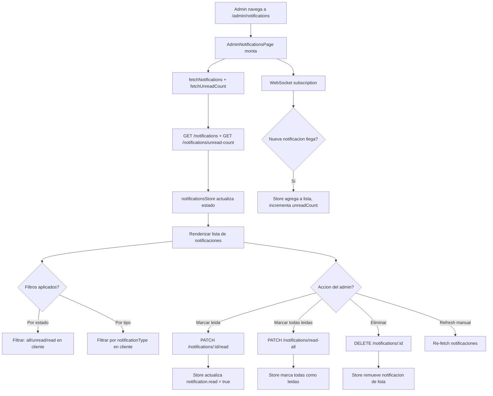

# FL-ADM-13 - Centro de Notificaciones Admin

**ID:** FL-ADM-13
**Version:** 1.0.0
**Fecha:** 2026-02-27
**Estado:** Activo
**Portal:** Admin
**Prioridad:** P2

---

## 1. Resumen

Flujo de la pagina `/admin/notifications` donde el super_admin visualiza y gestiona todas las notificaciones del sistema destinadas al administrador. La pagina consume el `notificationsStore` de Zustand que se conecta a los endpoints del modulo de notificaciones. Permite filtrar por estado (todas/leidas/no leidas) y por tipo de notificacion, marcar como leida de forma individual o masiva, y eliminar notificaciones. Hay actualizacion en tiempo real via WebSocket.

---

## 2. Precondiciones

- Usuario autenticado con rol `super_admin`.
- Sesion activa con JWT valido.
- Servicio de notificaciones activo (modulo `notifications`).
- Conexion WebSocket establecida para notificaciones en tiempo real.

---

## 3. Diagrama Mermaid



---

## 4. Secuencia FE -> BE -> DB

```
=== Carga inicial ===
1. FE: AdminNotificationsPage monta -> useEffect ejecuta
2. FE: notificationsStore.fetchNotifications()
3. FE: GET /api/v1/notifications (con headers Bearer token)
4. BE: NotificationsController -> NotificationsService.findAll(userId)
5. DB: SELECT FROM notifications.user_notifications
       WHERE user_id = :adminId ORDER BY created_at DESC
6. BE: Retorna array de { id, type, title, body, read, created_at, metadata }
7. FE: notificationsStore.notifications actualizado

8. FE: notificationsStore.fetchUnreadCount()
9. FE: GET /api/v1/notifications/unread-count
10. BE: Retorna { count: N }
11. FE: notificationsStore.unreadCount actualizado

=== Marcar notificacion como leida ===
12. FE: Admin click "Marcar como leida" -> notificationsStore.markAsRead(id)
13. FE: PATCH /api/v1/notifications/:id/read
14. BE: NotificationsController.markAsRead() -> UPDATE
15. DB: UPDATE notifications.user_notifications SET read_at = NOW() WHERE id = :id
16. BE: Retorna notificacion actualizada
17. FE: Store actualiza notification.read = true, decrementa unreadCount

=== Marcar todas como leidas ===
18. FE: Admin click "Marcar todas leidas" -> notificationsStore.markAllAsRead()
19. FE: PATCH /api/v1/notifications/read-all
20. BE: Actualiza todas las notificaciones del usuario
21. DB: UPDATE notifications.user_notifications SET read_at = NOW() WHERE user_id = :adminId
22. FE: Store actualiza todas, unreadCount = 0

=== Eliminar notificacion ===
23. FE: Admin click eliminar -> notificationsStore.deleteNotification(id)
24. FE: DELETE /api/v1/notifications/:id
25. BE: DELETE de la notificacion
26. FE: Store remueve de la lista

=== WebSocket tiempo real ===
27. WS: Socket.IO evento 'notification:new' recibido
28. FE: Store agrega nueva notificacion al inicio de la lista
29. FE: unreadCount++ si la notificacion es no leida
```

---

## 5. Componentes y artefactos implicados

### Frontend

| Tipo | Archivo |
|------|---------|
| Pagina | `apps/frontend/src/apps/admin/pages/AdminNotificationsPage.tsx` |
| Componente header | `apps/frontend/src/apps/admin/components/notifications/NotificationHeader.tsx` |
| Componente filtros | `apps/frontend/src/apps/admin/components/notifications/NotificationFilters.tsx` |
| Componente item | `apps/frontend/src/apps/admin/components/notifications/NotificationItem.tsx` |
| Store | `apps/frontend/src/features/notifications/store/notificationsStore.ts` |
| Layout | `apps/frontend/src/apps/admin/components/shared/AdminPageShell.tsx` |

### Backend

| Tipo | Archivo |
|------|---------|
| Controller | `apps/backend/src/modules/notifications/notifications.controller.ts` |
| Service | `apps/backend/src/modules/notifications/notifications.service.ts` |
| WebSocket Gateway | `apps/backend/src/modules/websocket/` |

### Base de Datos

| Tipo | Archivo |
|------|---------|
| Tabla notificaciones | `apps/database/ddl/schemas/notifications/tables/` |

---

## 6. Reglas y validaciones

| Regla | Capa | Descripcion |
|-------|------|-------------|
| Solo super_admin | BE | JwtAuthGuard + RolesGuard |
| Filtrado en cliente | FE | Filtros de estado/tipo se aplican en memoria para mejor UX |
| Tiempo real via WS | FE/BE | Socket.IO conectado en AdminPageShell |
| Ordenado por fecha desc | BE | Mas recientes primero |
| Paginacion | BE | Limite default configurable |

---

## 7. Manejo de errores

| Escenario | Capa | Codigo HTTP | Comportamiento |
|-----------|------|-------------|----------------|
| Token JWT expirado | BE | 401 | Redirige a login |
| Error al cargar | FE | N/A | Muestra boton de retry |
| Error al marcar leida | BE | 500 | Toast error, estado no cambia |
| WebSocket desconectado | FE | N/A | Polling fallback o indicador de estado |
| Sin notificaciones | FE | 200 | Empty state "Sin notificaciones" |

---

## 8. Trazabilidad cruzada

| Capa | Archivo | Evidencia |
|------|---------|-----------|
| Frontend Pagina | `apps/frontend/src/apps/admin/pages/AdminNotificationsPage.tsx` | Gestion de notificaciones admin |
| Frontend Store | `apps/frontend/src/features/notifications/store/notificationsStore.ts` | Estado global de notificaciones |
| Backend Controller | `apps/backend/src/modules/notifications/notifications.controller.ts` | Endpoints CRUD notificaciones |

---

## 9. Referencias

- Flujo preferencias notificaciones: [FL-ADM-14](./FLUJO-PREFERENCIAS-NOTIFICACIONES.md)
- Flujo alertas sistema: [FL-ADM-15](./FLUJO-ALERTAS-SISTEMA.md)
- Flujo dashboard admin: [FL-ADM-09](./FLUJO-DASHBOARD-ADMIN.md)
