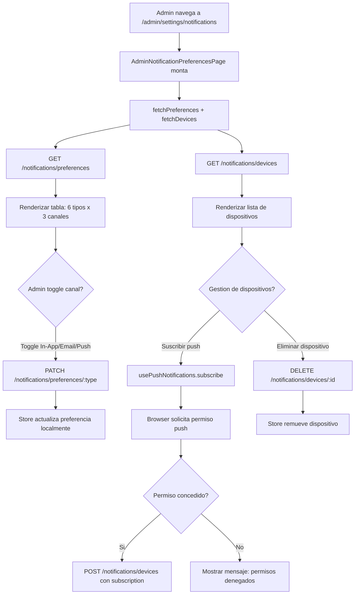

# FL-ADM-14 - Preferencias de Notificaciones Admin

**ID:** FL-ADM-14
**Version:** 1.0.0
**Fecha:** 2026-02-27
**Estado:** Activo
**Portal:** Admin
**Prioridad:** P2

---

## 1. Resumen

Flujo de la pagina `/admin/settings/notifications` donde el super_admin configura sus preferencias de notificacion. Cubre 6 tipos de notificacion admin (anuncios del sistema, alertas de seguridad, actividad de usuarios, instituciones, estado del sistema, base de datos). Para cada tipo, el admin puede activar/desactivar los canales: In-App, Email, Push. Adicionalmente gestiona los dispositivos registrados para push notifications. Usa `notificationsStore` y el hook `usePushNotifications`.

---

## 2. Precondiciones

- Usuario autenticado con rol `super_admin`.
- Sesion activa con JWT valido.
- Servicio de notificaciones activo.
- Para push notifications: navegador compatible con Web Push API.

---

## 3. Diagrama Mermaid



---

## 4. Secuencia FE -> BE -> DB

```
=== Carga de preferencias ===
1. FE: AdminNotificationPreferencesPage monta -> useEffect
2. FE: notificationsStore.fetchPreferences()
3. FE: GET /api/v1/notifications/preferences
4. BE: NotificationsService.getPreferences(userId)
5. DB: SELECT FROM notifications.notification_preferences WHERE user_id = :adminId
6. BE: Retorna array de { type, in_app_enabled, email_enabled, push_enabled }
7. FE: Store actualiza preferences[]

=== Carga de dispositivos push ===
8. FE: notificationsStore.fetchDevices()
9. FE: GET /api/v1/notifications/devices
10. BE: Retorna array de { id, device_name, platform, last_seen, created_at }
11. FE: Store actualiza devices[]

=== Actualizar preferencia de canal ===
12. FE: Admin toggle -> notificationsStore.updatePreference(type, channel, value)
13. FE: PATCH /api/v1/notifications/preferences/:type { in_app_enabled: bool, email_enabled: bool, push_enabled: bool }
14. BE: NotificationsService.updatePreference(userId, type, dto)
15. DB: UPDATE notifications.notification_preferences
        SET [channel]_enabled = :value
        WHERE user_id = :adminId AND notification_type = :type
16. BE: Retorna preferencia actualizada
17. FE: Store actualiza preferencia en lista

=== Suscribir a push notifications ===
18. FE: usePushNotifications.subscribe() -> Notification.requestPermission()
19. Browser: Dialog de permiso al usuario
20. FE: navigator.serviceWorker -> PushManager.subscribe()
21. FE: POST /api/v1/notifications/devices { endpoint, keys, device_name }
22. BE: Registra dispositivo push del admin
23. DB: INSERT INTO notifications.push_devices
24. FE: Store agrega nuevo dispositivo

=== Eliminar dispositivo push ===
25. FE: Admin click icono trash -> notificationsStore.deleteDevice(id)
26. FE: DELETE /api/v1/notifications/devices/:id
27. BE: Elimina registro de dispositivo
28. DB: DELETE FROM notifications.push_devices WHERE id = :id
29. FE: Store remueve dispositivo de la lista
```

---

## 5. Componentes y artefactos implicados

### Frontend

| Tipo | Archivo |
|------|---------|
| Pagina | `apps/frontend/src/apps/admin/pages/AdminNotificationPreferencesPage.tsx` |
| Hook push | `apps/frontend/src/features/notifications/hooks/usePushNotifications.ts` |
| Store | `apps/frontend/src/features/notifications/store/notificationsStore.ts` |
| Layout | `apps/frontend/src/apps/admin/components/shared/AdminPageShell.tsx` |

### Backend

| Tipo | Archivo |
|------|---------|
| Controller notificaciones | `apps/backend/src/modules/notifications/notifications.controller.ts` |
| Service notificaciones | `apps/backend/src/modules/notifications/notifications.service.ts` |

### Base de Datos

| Tipo | Archivo |
|------|---------|
| Tabla preferencias | `apps/database/ddl/schemas/notifications/tables/` |
| Tabla dispositivos | `apps/database/ddl/schemas/notifications/tables/` |

---

## 6. Reglas y validaciones

| Regla | Capa | Descripcion |
|-------|------|-------------|
| Solo super_admin | BE | JwtAuthGuard + RolesGuard |
| Tipos admin | FE | 6 tipos especificos para rol admin |
| Push requiere permiso browser | FE | usePushNotifications verifica Notification.permission |
| Un dispositivo por suscripcion | BE | Endpoint unico por dispositivo/browser |
| Dispositivos ordenados por last_seen | BE | Mas recientes primero |

---

## 7. Manejo de errores

| Escenario | Capa | Codigo HTTP | Comportamiento |
|-----------|------|-------------|----------------|
| Token JWT expirado | BE | 401 | Redirige a login |
| Push no soportado | FE | N/A | Oculta seccion push, muestra mensaje |
| Permiso push denegado | FE | N/A | Mensaje instructivo para habilitar en browser |
| Error al actualizar preferencia | BE | 500 | Revierte toggle, toast error |
| Error al registrar dispositivo | BE | 400 | Mensaje de error, no registra |

---

## 8. Trazabilidad cruzada

| Capa | Archivo | Evidencia |
|------|---------|-----------|
| Frontend Pagina | `apps/frontend/src/apps/admin/pages/AdminNotificationPreferencesPage.tsx` | Preferencias y dispositivos |
| Frontend Hook | `apps/frontend/src/features/notifications/hooks/usePushNotifications.ts` | Gestion push |
| Frontend Store | `apps/frontend/src/features/notifications/store/notificationsStore.ts` | Estado preferencias/devices |

---

## 9. Referencias

- Flujo centro notificaciones: [FL-ADM-13](./FLUJO-NOTIFICACIONES-ADMIN.md)
- Flujo configuracion sistema: [FL-ADM-12](./FLUJO-CONFIGURACION-AJUSTES.md)
