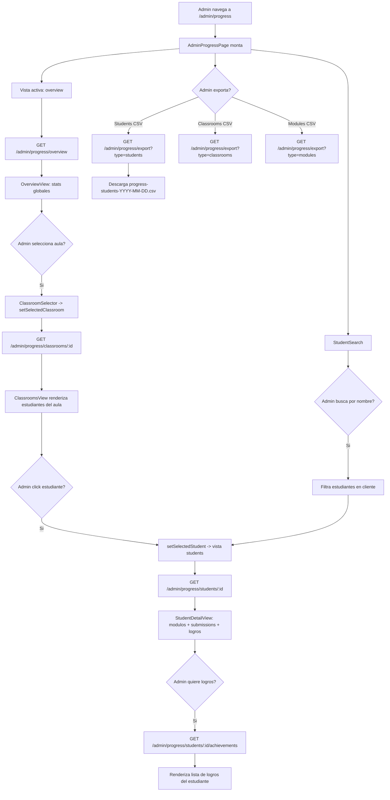

# FL-ADM-17 - Seguimiento de Progreso de Estudiantes

**ID:** FL-ADM-17
**Version:** 1.0.0
**Fecha:** 2026-02-27
**Estado:** Activo
**Portal:** Admin
**Prioridad:** P1

---

## 1. Resumen

Flujo de la pagina `/admin/progress` donde el super_admin monitorea el progreso academico a nivel global. La pagina presenta tres vistas: Overview (estadisticas globales del sistema), Classrooms (progreso por aula con detalle de estudiantes) y Students (progreso individual detallado con logros). El admin puede navegar desde la vista general hacia el detalle de un aula y luego hacia el perfil de un estudiante especifico. Incluye busqueda de estudiantes, selector de aulas y exportacion a CSV. Todos los datos provienen de `AdminProgressController` que agrega datos de multiples schemas (progress, gamification, educational).

---

## 2. Precondiciones

- Usuario autenticado con rol `super_admin`.
- Sesion activa con JWT valido.
- Existencia de aulas, estudiantes y ejercicios completados en el sistema.

---

## 3. Diagrama Mermaid



---

## 4. Secuencia FE -> BE -> DB

```
=== Carga Vista Overview ===
1. FE: AdminProgressPage monta -> useProgress hook, activeView='overview'
2. FE: useEffect -> fetchOverview()
3. FE: GET /api/v1/admin/progress/overview
4. BE: AdminProgressController.getProgressOverview()
5. BE: AdminProgressService -> agrega stats globales
6. DB: SELECT COUNT(DISTINCT user_id), SUM(submissions), AVG(score)
       FROM educational_content y progress schemas
7. BE: Retorna ProgressOverviewDto { totalUsers, totalSubmissions, totalModulesStarted,
        avgCompletionRate, avgScore, totalTimeSpentHours, ... }
8. FE: OverviewView renderiza KPIs y graficos

=== Vista Classrooms - Progreso por Aula ===
9. FE: Admin selecciona aula -> fetchClassroomProgress(classroomId)
10. FE: GET /api/v1/admin/progress/classrooms/:id
11. BE: AdminProgressController.getClassroomProgress(classroomId)
12. BE: Busca aula por ID, luego obtiene progreso de cada estudiante en el aula
13. DB: SELECT s.*, up.* FROM students JOIN user_progress
        WHERE classroom_id = :classroomId
14. BE: Retorna ClassroomProgressDto { classroom: {...}, students: [StudentProgressSummary] }
15. FE: ClassroomsView renderiza tabla de estudiantes con progreso

=== Vista Students - Progreso Individual ===
16. FE: Admin click estudiante -> fetchStudentProgress(studentId)
17. FE: GET /api/v1/admin/progress/students/:id
18. BE: AdminProgressController.getStudentProgress(studentId, query)
19. BE: Agrega: user stats, module_progress array, recent_submissions
20. DB: SELECT * FROM progress.user_module_progress + recent submissions
21. BE: Retorna StudentProgressDto { user: {...}, stats: {...}, moduleProgress: [...], recentSubmissions: [...] }
22. FE: StudentDetailView renderiza modulos + grafico de progreso

=== Logros del Estudiante ===
23. FE: GET /api/v1/admin/progress/students/:id/achievements
24. BE: AdminProgressController.getStudentAchievements(studentId)
25. DB: SELECT FROM gamification.user_achievements JOIN achievements
26. BE: Retorna StudentAchievementsResponseDto { achievements: [...], summary: { byCategory, byTier } }
27. FE: Renderiza badges y estadisticas de logros

=== Estadisticas de Modulo ===
28. FE: GET /api/v1/admin/progress/modules/:id
29. BE: AdminProgressController.getModuleProgress(moduleId, query)
30. DB: SELECT AVG(score), COUNT(submissions), AVG(time_spent) FROM progress WHERE module_id = :id
31. BE: Retorna ModuleProgressStatsDto { module: {...}, stats: {...} }

=== Exportar a CSV ===
32. FE: Admin click boton export -> exportToCSV(type)
33. FE: GET /api/v1/admin/progress/export?type=students
34. BE: AdminProgressService.exportProgressData('students', classroomId?)
35. BE: Genera CSV con datos de progreso
36. BE: Response con Content-Type: text/csv
37. FE: Browser descarga archivo
```

---

## 5. Componentes y artefactos implicados

### Frontend

| Tipo | Archivo |
|------|---------|
| Pagina | `apps/frontend/src/apps/admin/pages/AdminProgressPage.tsx` |
| Hook progreso | `apps/frontend/src/apps/admin/hooks/useProgress.ts` |
| Hook aulas | `apps/frontend/src/apps/admin/hooks/useClassroomsList.ts` |
| Vista overview | `apps/frontend/src/apps/admin/components/progress/OverviewView.tsx` |
| Vista classrooms | `apps/frontend/src/apps/admin/components/progress/ClassroomsView.tsx` |
| Vista student detail | `apps/frontend/src/apps/admin/components/progress/StudentDetailView.tsx` |
| Selector aulas | `apps/frontend/src/apps/admin/components/progress/ClassroomSelector.tsx` |
| Busqueda estudiante | `apps/frontend/src/apps/admin/components/progress/StudentSearch.tsx` |
| Layout | `apps/frontend/src/apps/admin/components/shared/AdminPageShell.tsx` |

### Backend

| Tipo | Archivo |
|------|---------|
| Controller | `apps/backend/src/modules/admin/controllers/admin-progress.controller.ts` |
| Service | `apps/backend/src/modules/admin/services/admin-progress.service.ts` |
| DTOs progress | `apps/backend/src/modules/admin/dto/progress/` |

---

## 6. Reglas y validaciones

| Regla | Capa | Descripcion |
|-------|------|-------------|
| Solo super_admin | BE | JwtAuthGuard + AdminGuard |
| UUID validos | BE | ParseUUIDPipe en params de classroomId, studentId, moduleId |
| Exportacion filtrada | BE | Export de students puede filtrarse por classroom_id |
| Tipos de export | BE | Enum: students, classrooms, modules |
| Calculo de stats | BE | Rates y promedios calculados en backend |

---

## 7. Manejo de errores

| Escenario | Capa | Codigo HTTP | Comportamiento |
|-----------|------|-------------|----------------|
| Token JWT expirado | BE | 401 | Redirige a login |
| Aula no encontrada | BE | 404 | NotFoundException |
| Estudiante no encontrado | BE | 404 | NotFoundException |
| UUID invalido | BE | 400 | BadRequestException |
| Error de exportacion | FE | N/A | Toast error |
| Sin datos | FE | 200 | Empty state por seccion |

---

## 8. Trazabilidad cruzada

| Capa | Archivo | Evidencia |
|------|---------|-----------|
| Frontend Pagina | `apps/frontend/src/apps/admin/pages/AdminProgressPage.tsx` | 3 vistas de progreso |
| Frontend Hook | `apps/frontend/src/apps/admin/hooks/useProgress.ts` | Estado y fetchers de progreso |
| Backend Controller | `apps/backend/src/modules/admin/controllers/admin-progress.controller.ts` | 7 endpoints progreso |
| Backend Service | `apps/backend/src/modules/admin/services/admin-progress.service.ts` | Logica de agregacion |

---

## 9. Referencias

- Flujo analytics avanzado: [FL-ADM-16](./FLUJO-ANALYTICS-AVANZADO.md)
- Flujo reportes: [FL-ADM-11](./FLUJO-REPORTES-ANALYTICS-ADMIN.md)
- Flujo asignaciones admin: [FL-ADM-19](./FLUJO-ASIGNACIONES-ADMIN.md)
