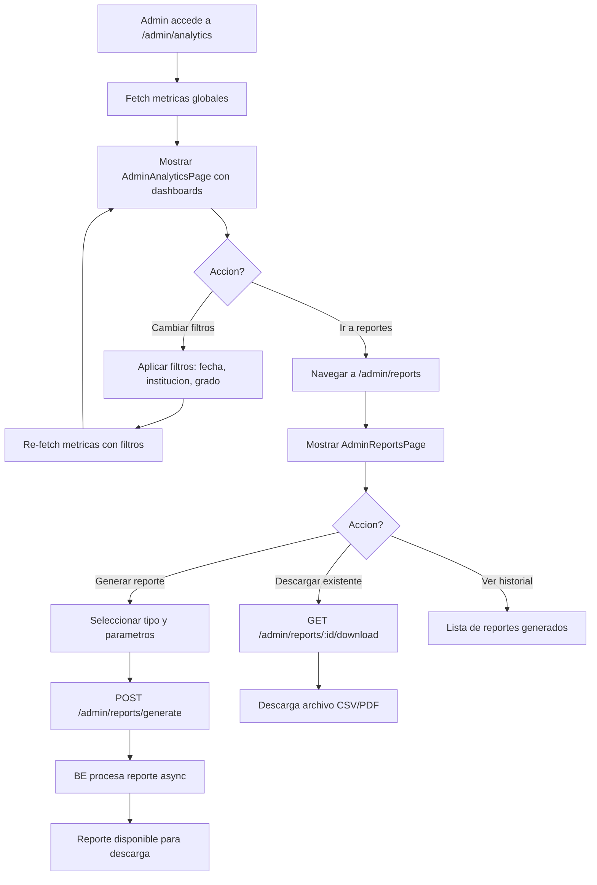

# FL-ADM-11 - Reportes y Analytics Administrador

**ID:** FL-ADM-11
**Version:** 1.1.0
**Fecha:** 2026-02-18
**Estado:** Activo
**Portal:** Admin
**Prioridad:** P2

---

## 1. Resumen

Flujo de visualizacion de analytics y generacion de reportes desde el portal de administracion. El administrador accede a dashboards analiticos con metricas globales de la plataforma (progreso academico agregado, uso del sistema, engagement de gamificacion, rendimiento por modulo) y puede generar reportes exportables en formatos CSV/PDF. Los datos provienen del schema admin_dashboard para reportes precalculados y del data_warehouse para agregaciones historicas. Incluye filtros por fecha, institucion, grado y modulo.

---

## 2. Precondiciones

- Usuario autenticado con rol `admin` o `super_admin`.
- Sesion activa con JWT valido.
- Datos historicos existentes (al menos 7 dias de actividad para graficas significativas).
- Data warehouse actualizado (fact tables con datos de progreso y ejercicios).

---

## 3. Diagrama Mermaid



---

## 4. Secuencia FE -> BE -> DB

```
=== Analytics Dashboard ===
1. FE: AdminAnalyticsPage monta -> solicita metricas
2. FE: GET /api/v1/admin/progress/analytics?from=:date&to=:date
3. BE: AdminProgressController.getAnalytics() -> AdminProgressService.getGlobalAnalytics()
4. DB: SELECT aggregations FROM data_warehouse.fact_daily_progress
       + data_warehouse.fact_exercise_completions
       WHERE date BETWEEN :from AND :to (GROUP BY module, grade, etc.)
5. BE: Retorna { moduleProgress[], exerciseStats[], engagementMetrics, userActivity[] }
6. FE: Renderiza graficas: barras de progreso por modulo, linea temporal, engagement

=== Aplicar filtros ===
7. FE: Admin selecciona filtros (fecha, institucion, grado, modulo)
8. FE: GET /api/v1/admin/progress/analytics?from=&to=&tenantId=&grade=&moduleId=
9. BE: Misma query con WHERE adicionales
10. FE: Actualiza graficas con datos filtrados

=== Generar reporte ===
11. FE: Navegar a /admin/reports -> AdminReportsPage monta
12. FE: GET /api/v1/admin/reports (historial de reportes generados)
13. BE: AdminReportsController.findAll()
14. DB: SELECT FROM admin_dashboard.admin_reports WHERE tenant_id = :tenantId ORDER BY created_at DESC
15. BE: Retorna array de { id, type, status, fileName, createdAt, parameters }
16. FE: Renderiza tabla de reportes con estado y acciones

17. FE: Admin click "Generar reporte" -> selecciona tipo y parametros
18. FE: POST /api/v1/admin/reports/generate { type, dateRange, filters }
19. BE: AdminReportsController.generate() -> crea registro + encola procesamiento
20. DB: INSERT INTO admin_dashboard.admin_reports { type, status: 'processing', parameters }
21. BE: Job async procesa reporte (query + formato)
22. DB: UPDATE admin_dashboard.admin_reports SET status = 'completed', file_path = '...'
23. FE: Polling o WebSocket notifica cuando el reporte esta listo

=== Descargar reporte ===
24. FE: Click en "Descargar" -> GET /api/v1/admin/reports/:id/download
25. BE: AdminReportsController.download() -> StreamableFile
26. FE: Descarga archivo CSV o PDF
```

---

## 5. Componentes y artefactos implicados

### Frontend

| Tipo | Archivo |
|------|---------|
| Pagina analytics | `apps/frontend/src/apps/admin/pages/AdminAnalyticsPage.tsx` |
| Pagina reportes | `apps/frontend/src/apps/admin/pages/AdminReportsPage.tsx` |
| Wrapper | `apps/frontend/src/apps/admin/components/shared/AdminPageShell.tsx` |
| Hook page setup | `apps/frontend/src/apps/admin/hooks/useAdminPageSetup.ts` |
| API admin | `apps/frontend/src/services/api/adminAPI.ts` |
| Rutas | `apps/frontend/src/App.tsx` (rutas: `/admin/reports`, `/admin/analytics`) |

### Backend

| Tipo | Archivo |
|------|---------|
| Controller reportes | `apps/backend/src/modules/admin/controllers/admin-reports.controller.ts` |
| Controller progreso | `apps/backend/src/modules/admin/controllers/admin-progress.controller.ts` |
| Service reportes | `apps/backend/src/modules/admin/services/admin-reports.service.ts` |
| Service progreso | `apps/backend/src/modules/admin/services/admin-progress.service.ts` |
| Guard JWT + Role | `apps/backend/src/modules/auth/guards/jwt-auth.guard.ts`, `roles.guard.ts` |

### Base de Datos

| Tipo | Archivo |
|------|---------|
| Tabla admin_reports | `apps/database/ddl/schemas/admin_dashboard/tables/admin_reports.sql` |
> **Nota:** Las tablas `data_warehouse.fact_*` son aspiracionales (modulo ETL no importado). Los reportes actuales usan `progress_tracking.*` directamente a traves de `admin-reports.controller.ts` y `admin-progress.controller.ts`.

| Tabla fact_daily_progress | `apps/database/ddl/schemas/data_warehouse/tables/fact_daily_progress.sql` |
| Tabla fact_exercise_completions | `apps/database/ddl/schemas/data_warehouse/tables/fact_exercise_completions.sql` |

---

## 6. Reglas y validaciones

| Regla | Capa | Descripcion |
|-------|------|-------------|
| Autenticacion + rol admin | BE | JwtAuthGuard + RolesGuard(@Role('admin', 'super_admin')) |
| Rango de fechas max 1 ano | BE | Validacion: dateRange no mayor a 365 dias |
| Tipos de reporte validos | BE | ENUM: progress_summary, exercise_detail, user_activity, gamification |
| Formato de export | BE | CSV (default) o PDF |
| RLS por tenant | DB | Admin ve solo datos de su tenant |
| Super_admin cross-tenant | BE | super_admin puede filtrar por cualquier tenant |
| Reportes async para >10K rows | BE | Procesamiento en background con Bull queue |
| Retencion de reportes | BE | Reportes generados se eliminan despues de 30 dias |

---

## 7. Manejo de errores

| Escenario | Capa | Codigo HTTP | Comportamiento |
|-----------|------|-------------|----------------|
| Token JWT expirado | BE | 401 | Redirige a login |
| Rol insuficiente | BE | 403 | ForbiddenException |
| Rango de fechas invalido | BE | 400 | BadRequestException "Rango maximo: 365 dias" |
| Sin datos para el periodo | FE | 200 | Graficas vacias con mensaje "Sin datos para este periodo" |
| Error en generacion de reporte | BE | 500 | Marca reporte como 'failed', FE muestra error con retry |
| Reporte no encontrado | BE | 404 | NotFoundException |
| Timeout en query de data_warehouse | BE | 504 | FE muestra error con sugerencia de reducir rango |
| Descarga de reporte en proceso | BE | 409 | ConflictException "Reporte aun en procesamiento" |

---

## 8. Trazabilidad cruzada

| Capa | Archivo | Evidencia |
|------|---------|-----------|
| Frontend Pagina | `apps/frontend/src/apps/admin/pages/AdminAnalyticsPage.tsx` | Dashboards analiticos |
| Frontend Pagina | `apps/frontend/src/apps/admin/pages/AdminReportsPage.tsx` | Generacion y descarga de reportes |
| Frontend Wrapper | `apps/frontend/src/apps/admin/components/shared/AdminPageShell.tsx` | Wrapper comun de paginas admin |
| Backend Controller | `apps/backend/src/modules/admin/controllers/admin-reports.controller.ts` | CRUD + generacion de reportes |
| Backend Controller | `apps/backend/src/modules/admin/controllers/admin-progress.controller.ts` | Analytics endpoints |
| DDL admin_reports | `apps/database/ddl/schemas/admin_dashboard/tables/admin_reports.sql` | Tabla de reportes |
| DDL fact_daily_progress | `apps/database/ddl/schemas/data_warehouse/tables/fact_daily_progress.sql` | Fact table progreso |
| DDL fact_exercise_completions | `apps/database/ddl/schemas/data_warehouse/tables/fact_exercise_completions.sql` | Fact table ejercicios |

---

## 9. Referencias

- Flujo dashboard admin: [FL-ADM-09](./FLUJO-DASHBOARD-ADMIN.md)
- Flujo analytics docente: [FL-TCH-04](../teacher/FLUJO-ANALYTICS-REPORTES.md)
- Guia portal admin: `docs/60-portals/admin/PORTAL-ADMIN-GUIDE.md`
- Modelo datos data_warehouse: `docs/20-architecture/schema-reference/`
