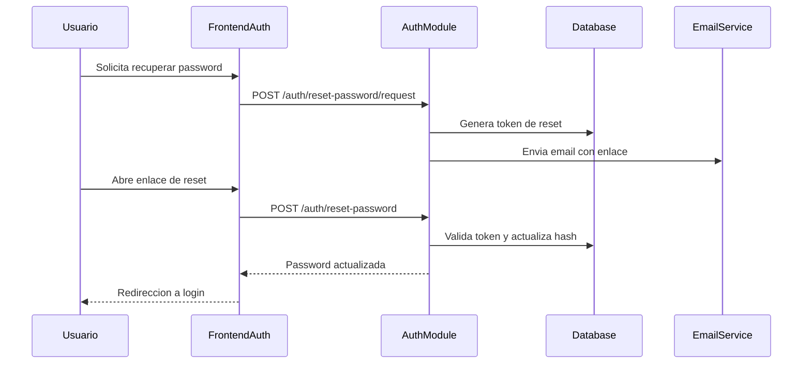

# Flujo Auth - Recuperacion de Password

**Version:** 1.0.0  
**Fecha:** 2026-02-17  
**Estado:** Activo

---

## Resumen

Flujo para solicitud de recuperacion, emision de token temporal y restablecimiento de contrasena desde pantalla de reset.

## Diagrama Mermaid

## Componentes implicados

### Frontend
- `apps/frontend/src/pages/auth/ForgotPasswordPage.tsx`
- `apps/frontend/src/apps/student/pages/PasswordResetPage.tsx`

### Backend
- `apps/backend/src/modules/auth/services/password-recovery.service.ts`
- Endpoints: `/auth/reset-password/request`, `/auth/reset-password`

### Datos
- `auth_management.password_reset_tokens`
- `auth.users`

## Reglas

- Token de reset con expiracion y un solo uso.
- No exponer si un correo existe o no en respuestas publicas.
- Invalidar tokens previos al completar reset.
