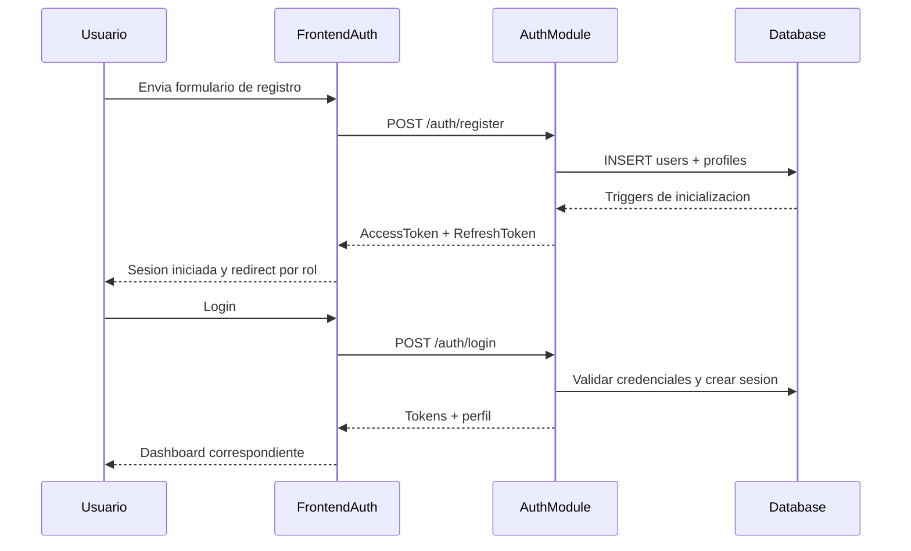

# Flujo Auth - Registro y Login

**Version:** 1.0.0  
**Fecha:** 2026-02-17  
**Estado:** Activo

---

## Resumen

Este flujo cubre el registro de usuario, inicializacion automatica de datos base y autenticacion por login con redireccion por rol.

## Diagrama Mermaid

## Secuencia FE -> BE -> DB

1. FE: `RegisterForm` o `LoginForm` ejecuta submit.
2. BE: `auth.controller.ts` delega a `auth.service.ts`.
3. DB: `auth.users`, `auth_management.profiles`, `auth_management.user_sessions`.
4. FE: `AuthContext` y `authStore` actualizan estado y redireccionan.

## Artefactos implicados

### Frontend
- `apps/frontend/src/features/auth/components/RegisterForm.tsx`
- `apps/frontend/src/features/auth/components/LoginForm.tsx`
- `apps/frontend/src/app/providers/AuthContext.tsx`
- `apps/frontend/src/features/auth/store/authStore.ts`

### Backend
- `apps/backend/src/modules/auth/controllers/auth.controller.ts`
- `apps/backend/src/modules/auth/services/auth.service.ts`

### Datos
- `auth.users`
- `auth_management.profiles`
- `auth_management.user_sessions`
- `gamification_system.user_stats`

## Reglas y validaciones clave

- Registro crea perfil academico del usuario con rol y tenant.
- Login aplica controles de intentos/sesiones y emite JWT.
- Redireccion final depende del rol autenticado.

## Referencias

- Documento detallado de inicializacion: [FLUJO-INICIALIZACION-USUARIO.md](../../../80-references/transversal/arquitectura/FLUJO-INICIALIZACION-USUARIO.md)
- Matriz: [TRACEABILITY-MATRIX.md](../TRACEABILITY-MATRIX.md)
