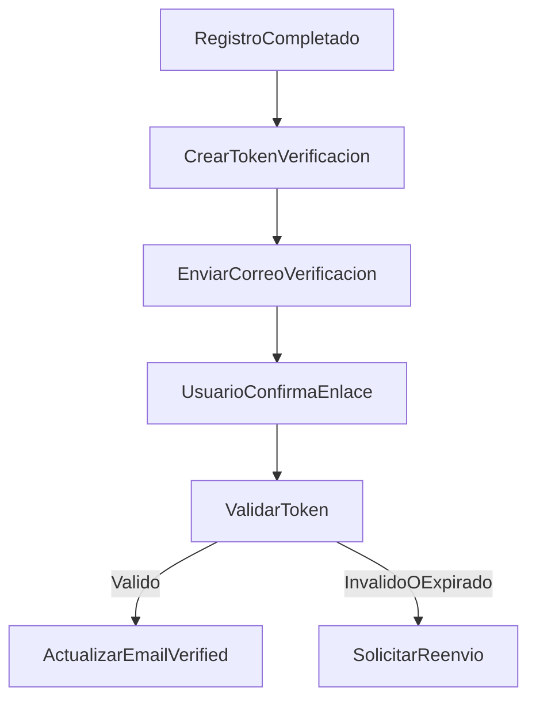

# Flujo Auth - Verificacion de Email

**Version:** 1.0.0  
**Fecha:** 2026-02-17  
**Estado:** Activo

---

## Resumen

Flujo de validacion de correo para activar estado verificado del usuario y habilitar operaciones sensibles.

## Diagrama Mermaid

## Componentes implicados

### Frontend
- `apps/frontend/src/features/auth/store/authStore.ts` (estado de usuario/verificacion)
- Pantallas de auth que muestran estado de verificacion.

### Backend
- `apps/backend/src/modules/auth/services/email-verification.service.ts`
- Endpoints de verificacion en modulo auth.

### Datos
- `auth_management.email_verification_tokens`
- `auth.users` (bandera de verificacion)

## Reglas

- Token firmado/aleatorio con expiracion.
- Reenvio limitado por rate-limit.
- Cambio de estado de verificacion debe quedar auditado.
