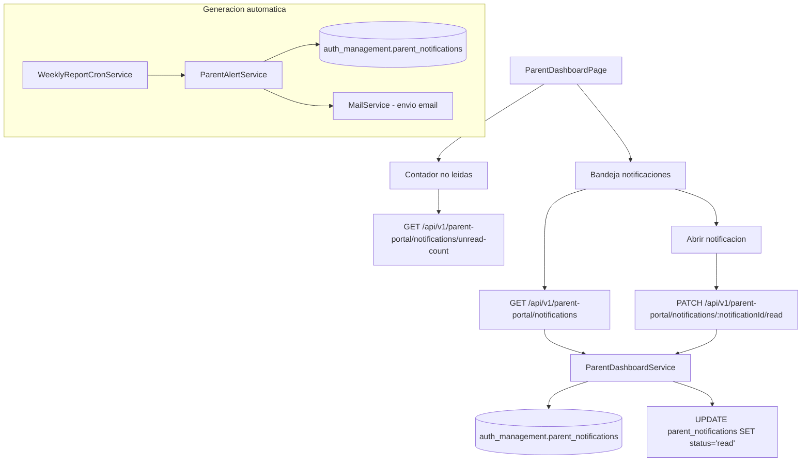

# FL-PRN-03 - Notificaciones Escuela-Familia

**Portal:** Parents
**Prioridad:** Media-Alta
**Estado:** Documentado (planificado)

---

## 1. Resumen

Flujo para recepcion, lectura y confirmacion de notificaciones dirigidas a padres. Incluye alertas automaticas (bajo rendimiento, logros, perdida de racha, inactividad, promocion de rango) y conteo de notificaciones no leidas. Las notificaciones se envian tambien por email via `MailService`.

## 2. Precondiciones

| Condicion | Detalle |
|-----------|---------|
| Rol requerido | Cuenta de tipo `parent` (autenticacion via `ParentAuthGuard`) |
| Sesion activa | JWT de padre valido |
| Vinculo activo | El padre debe tener al menos un vinculo `active` en `auth_management.parent_student_links` |
| Notificaciones generadas | `ParentAlertService` debe haber generado notificaciones en `auth_management.parent_notifications` |

## 3. Diagrama Mermaid

## 4. Secuencia FE -> BE -> DB

1. Padre accede a `ParentDashboardPage`, store `useParentStore` ejecuta `loadNotifications()`.
2. FE ejecuta en paralelo:
   - `GET /api/v1/parent-portal/notifications` con filtros opcionales (studentId, status, limit, offset).
   - `GET /api/v1/parent-portal/notifications/unread-count` para badge de contador.
3. Backend (`ParentPortalController`) delega a `ParentDashboardService.getNotifications(parentId, filters)`.
4. Service consulta `auth_management.parent_notifications` filtrado por `parent_account_id`.
5. FE renderiza lista de notificaciones con badge de no leidas.
6. Padre abre una notificacion, FE ejecuta `PATCH /api/v1/parent-portal/notifications/:notificationId/read`.
7. Backend actualiza status a `read` y registra `read_at` timestamp.
8. FE actualiza estado local optimisticamente via `useParentStore.markNotificationRead()`.
9. Contador de no leidas se decrementa en el store.

**Flujo de generacion (backend):**
1. `ParentAlertService` detecta eventos (bajo rendimiento, logro, racha perdida, inactividad, promocion de rango).
2. Crea registro en `auth_management.parent_notifications` con tipo, prioridad y datos del evento.
3. Envia email al padre via `MailService` usando templates especificos (`achievement-alert.template.ts`, `low-performance-alert.template.ts`).
4. `WeeklyReportCronService` genera reportes semanales automaticos.

## 5. Componentes y artefactos implicados

| Capa | Archivo | Descripcion |
|------|---------|-------------|
| FE Page | `apps/frontend/src/apps/parent/pages/ParentDashboardPage.tsx` | Dashboard con bandeja de notificaciones |
| FE API | `apps/frontend/src/features/parent/api/parentAPI.ts` | Cliente API (getNotifications, markNotificationRead, getUnreadNotificationCount) |
| FE Store | `apps/frontend/src/features/parent/store/parentStore.ts` | Zustand store (loadNotifications, markNotificationRead) |
| FE Types | `apps/frontend/src/features/parent/types/parent.types.ts` | Tipo ParentNotification |
| BE Controller | `apps/backend/src/modules/parents/controllers/parent-portal.controller.ts` | Endpoints: GET notifications, PATCH read, GET unread-count |
| BE Service | `apps/backend/src/modules/parents/services/parent-dashboard.service.ts` | getNotifications, markNotificationRead, getUnreadNotificationCount |
| BE Service | `apps/backend/src/modules/parents/services/parent-alert.service.ts` | Generacion automatica de alertas |
| BE Service | `apps/backend/src/modules/parents/services/parent-preferences.service.ts` | Preferencias de notificacion |
| BE Service | `apps/backend/src/modules/parents/services/weekly-report.service.ts` | Reportes semanales |
| BE Service | `apps/backend/src/modules/parents/services/weekly-report-cron.service.ts` | Cron generacion reportes |
| BE Service | `apps/backend/src/modules/parents/services/report-content-aggregator.service.ts` | Agregacion datos reportes |
| BE Template | `apps/backend/src/modules/parents/templates/achievement-alert.template.ts` | Template email logro |
| BE Template | `apps/backend/src/modules/parents/templates/low-performance-alert.template.ts` | Template email bajo rendimiento |
| BE Template | `apps/backend/src/modules/parents/templates/weekly-report.template.ts` | Template email reporte semanal |
| BE Entity | `apps/backend/src/modules/auth/entities/parent-notification.entity.ts` | Entity ParentNotification |
| BE Entity | `apps/backend/src/modules/auth/entities/parent-account.entity.ts` | Entity ParentAccount |
| BE Entity | `apps/backend/src/modules/auth/entities/parent-student-link.entity.ts` | Entity ParentStudentLink |
| DB Table | `apps/database/ddl/schemas/auth_management/tables/16-parent_notifications.sql` | Notificaciones de padres |
| DB Table | `apps/database/ddl/schemas/auth_management/tables/14-parent_accounts.sql` | Cuentas de padres |
| DB Table | `apps/database/ddl/schemas/auth_management/tables/15-parent_student_links.sql` | Vinculos padre-estudiante |

## 6. Reglas y validaciones

| Regla | Detalle |
|-------|---------|
| Guard dedicado | Todos los endpoints usan `ParentAuthGuard` (sistema auth independiente) |
| Vinculo activo requerido | Solo se muestran notificaciones de estudiantes con vinculo `active` |
| Filtrado por padre | Las notificaciones se filtran por `parent_account_id` del token JWT |
| Paginacion | Parametros `limit` y `offset` para consulta paginada de notificaciones |
| Filtro por estudiante | Parametro opcional `studentId` para filtrar notificaciones de un hijo especifico |
| Filtro por estado | Parametro opcional `status` para filtrar por `unread`, `read`, `archived` |
| Tipos de notificacion | `low_performance`, `achievement`, `streak_loss`, `inactivity`, `rank_promotion`, `assignment_due`, `weekly_report` |
| Prioridades | `low`, `medium`, `high`, `critical` -- afectan orden de visualizacion y urgencia del email |
| Email automatico | Alertas de tipo `low_performance` y `achievement` generan email automatico via `MailService` |
| Idempotencia de lectura | Marcar como leida una notificacion ya leida retorna exito sin error |

## 7. Manejo de errores

| Escenario | Capa | Codigo HTTP | Comportamiento |
|-----------|------|-------------|----------------|
| Token de padre expirado | BE Guard | 401 Unauthorized | FE ejecuta `refreshSession()` o redirige a login |
| Notificacion no encontrada | BE Service | 404 Not Found | FE muestra toast "Notificacion no encontrada" |
| Sin vinculo activo con estudiante | BE Service | 403 Forbidden | FE muestra mensaje "Sin acceso a este estudiante" |
| Error al enviar email (servicio mail caido) | BE Service | - (async, no bloquea) | Se registra error en logs, notificacion se crea igual en DB |
| Error de red / timeout | FE Store | - | `useParentStore` establece `error` state, UI muestra banner de reintento |

## 8. Trazabilidad cruzada

| Capa | Archivo | Evidencia |
|------|---------|-----------|
| Requerimiento | `docs/10-requirements/epics/EPIC-GAM-F3-PARENT-NOTIFICATIONS/` | Epic notificaciones padres |
| Especificacion | `docs/10-requirements/epics/EPIC-GAM-F3-PARENT-NOTIFICATIONS/specifications/ET-PAR-001-weekly-reports.md` | Reportes semanales |
| Especificacion | `docs/10-requirements/epics/EPIC-GAM-F3-PARENT-NOTIFICATIONS/specifications/ET-PAR-002-alert-templates.md` | Templates de alertas |
| Especificacion | `docs/10-requirements/epics/EPIC-GAM-F3-PARENT-NOTIFICATIONS/specifications/ET-PAR-003-notification-preferences.md` | Preferencias notificacion |
| DDL | `apps/database/ddl/schemas/auth_management/tables/16-parent_notifications.sql` | CREATE TABLE auth_management.parent_notifications |
| Controller | `apps/backend/src/modules/parents/controllers/parent-portal.controller.ts` | @Controller('parent-portal') -- endpoints notifications |
| Service | `apps/backend/src/modules/parents/services/parent-alert.service.ts` | ParentAlertService |
| Frontend | `apps/frontend/src/apps/parent/pages/ParentDashboardPage.tsx` | Dashboard con notificaciones |
| API Client | `apps/frontend/src/features/parent/api/parentAPI.ts` | parentAPI.getNotifications, markNotificationRead |

## 9. Referencias

- Requerimiento: `EPIC-GAM-F3-PARENT-NOTIFICATIONS`
- Cobertura total: `../COBERTURA-TOTAL-PROCESOS.md`
- Plan de cierre residual: `../../../../orchestration/tareas/TASK-2026-02-17-CIERRE-RIESGOS-RESIDUALES-FULL/02-PLAN-IMPLEMENTACION-ISSUES.md`
