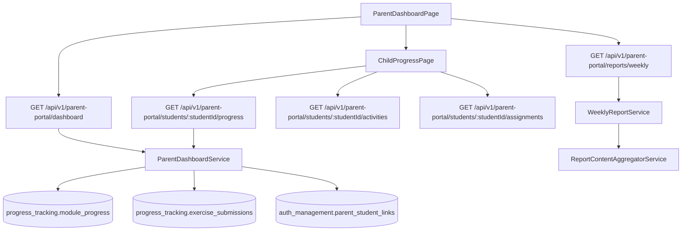

# FL-PRN-02 - Seguimiento de Progreso Academico

**Portal:** Parents
**Prioridad:** Alta
**Estado:** Documentado (planificado)

---

## 1. Resumen

Flujo para consultar avance del estudiante (modulos, tareas, actividades recientes, asignaciones pendientes) desde el portal de padres. Incluye dashboard consolidado, vista detallada por estudiante y generacion de reportes semanales.

## 2. Precondiciones

| Condicion | Detalle |
|-----------|---------|
| Rol requerido | Cuenta de tipo `parent` (autenticacion via `ParentAuthGuard`) |
| Sesion activa | JWT de padre valido |
| Vinculo activo | El padre debe tener al menos un vinculo con estado `active` en `auth_management.parent_student_links` |
| Datos de progreso | El estudiante debe tener registros en `progress_tracking.module_progress` y/o `progress_tracking.exercise_submissions` |

## 3. Diagrama Mermaid

## 4. Secuencia FE -> BE -> DB

1. Padre abre `ParentDashboardPage`, store `useParentStore` ejecuta `loadDashboard()` via `GET /api/v1/parent-portal/dashboard`.
2. Backend (`ParentPortalController`) delega a `ParentDashboardService.getDashboard(parentId)`.
3. Service valida vinculos activos en `auth_management.parent_student_links` y consulta:
   - `progress_tracking.module_progress` para progreso por modulo.
   - `progress_tracking.exercise_submissions` para actividad reciente.
   - `educational_content.assignments` para asignaciones pendientes.
4. FE renderiza dashboard con tarjetas de estudiantes, progreso y actividades.
5. Padre selecciona estudiante, navega a `ChildProgressPage`.
6. FE ejecuta en paralelo:
   - `GET /api/v1/parent-portal/students/:studentId/progress` -- progreso detallado.
   - `GET /api/v1/parent-portal/students/:studentId/activities?limit=20` -- actividades recientes.
   - `GET /api/v1/parent-portal/students/:studentId/assignments?limit=10` -- asignaciones proximas.
7. `ChildProgressCard` y `WeeklyReportView` renderizan los datos.
8. Para reportes semanales: `GET /api/v1/parent-portal/reports/weekly` lista historial; `POST /api/v1/parent-portal/reports/weekly/:studentId` genera nuevo reporte.
9. `WeeklyReportService` usa `ReportContentAggregatorService` para agregar datos de progreso.

## 5. Componentes y artefactos implicados

| Capa | Archivo | Descripcion |
|------|---------|-------------|
| FE Page | `apps/frontend/src/apps/parent/pages/ParentDashboardPage.tsx` | Dashboard principal padre |
| FE Page | `apps/frontend/src/apps/parent/pages/ChildProgressPage.tsx` | Vista detallada progreso hijo |
| FE Component | `apps/frontend/src/features/parent/ChildProgressCard.tsx` | Tarjeta de progreso del hijo |
| FE Component | `apps/frontend/src/features/parent/WeeklyReportView.tsx` | Vista de reporte semanal |
| FE API | `apps/frontend/src/features/parent/api/parentAPI.ts` | Cliente API (getStudentProgress, getStudentActivities, getStudentAssignments, getWeeklyReports) |
| FE Store | `apps/frontend/src/features/parent/store/parentStore.ts` | Zustand store (loadDashboard, loadStudentProgress) |
| FE Types | `apps/frontend/src/features/parent/types/parent.types.ts` | Tipos TypeScript |
| BE Controller | `apps/backend/src/modules/parents/controllers/parent-portal.controller.ts` | Endpoints dashboard, progress, activities, assignments, reports |
| BE Service | `apps/backend/src/modules/parents/services/parent-dashboard.service.ts` | Logica de dashboard y progreso |
| BE Service | `apps/backend/src/modules/parents/services/weekly-report.service.ts` | Generacion reportes semanales |
| BE Service | `apps/backend/src/modules/parents/services/report-content-aggregator.service.ts` | Agregacion de datos para reportes |
| BE DTO | `apps/backend/src/modules/parents/dto/parent-response.dto.ts` | ParentDashboardDto, StudentProgressSummaryDto, RecentActivityDto, UpcomingAssignmentDto |
| DB Table | `apps/database/ddl/schemas/progress_tracking/tables/01-module_progress.sql` | Progreso por modulo |
| DB Table | `apps/database/ddl/schemas/progress_tracking/tables/04-exercise_submissions.sql` | Entregas de ejercicios |
| DB Table | `apps/database/ddl/schemas/progress_tracking/tables/03-exercise_attempts.sql` | Intentos de ejercicios |
| DB Table | `apps/database/ddl/schemas/progress_tracking/tables/02-learning_sessions.sql` | Sesiones de aprendizaje |
| DB Table | `apps/database/ddl/schemas/educational_content/tables/05-assignments.sql` | Asignaciones pendientes |
| DB Table | `apps/database/ddl/schemas/auth_management/tables/15-parent_student_links.sql` | Vinculos padre-estudiante |
| DB Table | `apps/database/ddl/schemas/auth_management/tables/16-parent_notifications.sql` | Notificaciones de padre |
| DB Function | `apps/database/ddl/schemas/progress_tracking/functions/03-get_user_progress.sql` | Funcion de progreso usuario |

## 6. Reglas y validaciones

| Regla | Detalle |
|-------|---------|
| Guard dedicado | Todos los endpoints usan `ParentAuthGuard` (sistema auth independiente) |
| Vinculo activo requerido | El padre solo puede ver progreso de estudiantes con vinculo `active` en `parent_student_links` |
| Validacion de acceso | `ParentDashboardService` verifica que `parentId` tiene vinculo activo con `studentId` antes de retornar datos |
| Limite de resultados | Activities y assignments tienen parametro `limit` con defaults (20 y 10 respectivamente) |
| Datos agregados | El dashboard retorna datos pre-agregados (no raw data) para optimizar transferencia |
| Reportes semanales | Se generan bajo demanda o via cron (`WeeklyReportCronService`) |
| Privacidad | Los datos del estudiante solo son visibles para padres con vinculo verificado |

## 7. Manejo de errores

| Escenario | Capa | Codigo HTTP | Comportamiento |
|-----------|------|-------------|----------------|
| Token de padre expirado | BE Guard | 401 Unauthorized | FE ejecuta `refreshSession()` automaticamente o redirige a login |
| Sin acceso al estudiante (vinculo no activo) | BE Service | 403 Forbidden | FE muestra mensaje "No tienes acceso a este estudiante" |
| Estudiante no encontrado | BE Service | 404 Not Found | FE muestra mensaje "Estudiante no encontrado" |
| Sin datos de progreso | BE Service | 200 OK (empty) | FE muestra estado vacio "Aun no hay actividad registrada" |
| Error al generar reporte semanal | BE Service | 500 Internal Server Error | FE muestra toast "Error al generar reporte, intenta de nuevo" |
| Error de red / timeout | FE Store | - | `useParentStore` establece `error` state, UI muestra banner de reintento |

## 8. Trazabilidad cruzada

| Capa | Archivo | Evidencia |
|------|---------|-----------|
| Requerimiento | `docs/10-requirements/epics/EPIC-GAM-F3-PARENT-PORTAL/` | Epic portal padres |
| Especificacion | `docs/10-requirements/epics/EPIC-GAM-F3-PARENT-PORTAL/specifications/ET-PP-001-progress-view.md` | Vista de progreso |
| Especificacion | `docs/10-requirements/epics/EPIC-GAM-F3-PARENT-PORTAL/specifications/ET-PP-003-portal-dashboard.md` | Dashboard portal |
| DDL | `apps/database/ddl/schemas/progress_tracking/tables/01-module_progress.sql` | CREATE TABLE progress_tracking.module_progress |
| DDL | `apps/database/ddl/schemas/auth_management/tables/15-parent_student_links.sql` | CREATE TABLE auth_management.parent_student_links |
| Controller | `apps/backend/src/modules/parents/controllers/parent-portal.controller.ts` | @Controller('parent-portal') |
| Frontend | `apps/frontend/src/apps/parent/pages/ChildProgressPage.tsx` | Vista progreso hijo |
| API Client | `apps/frontend/src/features/parent/api/parentAPI.ts` | parentAPI.getStudentProgress |

## 9. Referencias

- Requerimiento: `EPIC-GAM-F3-PARENT-PORTAL`
- Cobertura total: `../COBERTURA-TOTAL-PROCESOS.md`
- Plan de cierre residual: `../../../../orchestration/tareas/TASK-2026-02-17-CIERRE-RIESGOS-RESIDUALES-FULL/02-PLAN-IMPLEMENTACION-ISSUES.md`
