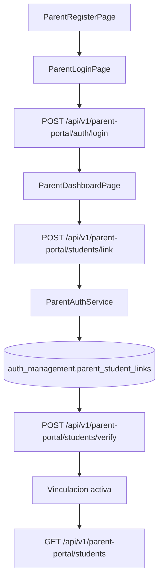

# FL-PRN-01 - Vinculacion Padre-Estudiante

**Portal:** Parents
**Prioridad:** Alta
**Estado:** Documentado (planificado)

---

## 1. Resumen

Flujo de vinculacion entre cuenta de padre/madre y estudiante para habilitar seguimiento academico. El padre se registra, inicia sesion y solicita vinculacion con un estudiante usando un codigo. El vinculo se verifica y activa, permitiendo acceso al dashboard de progreso.

## 2. Precondiciones

| Condicion | Detalle |
|-----------|---------|
| Rol requerido | Cuenta de tipo `parent` (autenticacion independiente via `ParentAuthGuard`) |
| Sesion activa | JWT de padre valido emitido por `POST /api/v1/parent-portal/auth/login` |
| Cuenta registrada | El padre debe tener una cuenta en `auth_management.parent_accounts` |
| Estudiante existente | El estudiante destino debe existir en `auth_management.profiles` con rol estudiante |
| Codigo de vinculacion | El estudiante debe haber generado o recibido un codigo de vinculacion |

## 3. Diagrama Mermaid

## 4. Secuencia FE -> BE -> DB

1. Padre accede a `ParentRegisterPage` y se registra via `POST /api/v1/parent-portal/auth/register` con email y password.
2. Backend (`ParentAuthController`) crea cuenta en `auth_management.parent_accounts` y retorna JWT tokens.
3. Padre inicia sesion en `ParentLoginPage` via `POST /api/v1/parent-portal/auth/login`.
4. En `ParentDashboardPage`, padre solicita vinculacion con `POST /api/v1/parent-portal/students/link` enviando `LinkStudentDto` (codigo del estudiante).
5. `ParentAuthService` valida el codigo, crea registro pendiente en `auth_management.parent_student_links`.
6. Padre verifica vinculacion con `POST /api/v1/parent-portal/students/verify` enviando `VerifyLinkDto` (codigo de verificacion).
7. Backend activa el vinculo (status = `active`) en `auth_management.parent_student_links`.
8. FE refresca listado de estudiantes via `GET /api/v1/parent-portal/students` y habilita dashboard de progreso.
9. Store `useParentStore` actualiza estado local con `linkStudent()` y `verifyLink()`.

## 5. Componentes y artefactos implicados

| Capa | Archivo | Descripcion |
|------|---------|-------------|
| FE Page | `apps/frontend/src/apps/parent/pages/ParentRegisterPage.tsx` | Registro de cuenta padre |
| FE Page | `apps/frontend/src/apps/parent/pages/ParentLoginPage.tsx` | Login de padre |
| FE Page | `apps/frontend/src/apps/parent/pages/ParentDashboardPage.tsx` | Dashboard principal padre |
| FE API | `apps/frontend/src/features/parent/api/parentAPI.ts` | Cliente API portal padres |
| FE Store | `apps/frontend/src/features/parent/store/parentStore.ts` | Zustand store portal padres |
| FE Types | `apps/frontend/src/features/parent/types/parent.types.ts` | Tipos TypeScript parent |
| BE Controller | `apps/backend/src/modules/parents/controllers/parent-auth.controller.ts` | Auth endpoints (register, login, refresh, forgot-password, verify-email) |
| BE Controller | `apps/backend/src/modules/parents/controllers/parent-portal.controller.ts` | Portal endpoints (link, verify, students) |
| BE Service | `apps/backend/src/modules/parents/services/parent-auth.service.ts` | Logica autenticacion y vinculacion |
| BE Guard | `apps/backend/src/modules/parents/guards/parent-auth.guard.ts` | Guard de autenticacion padre |
| BE Decorator | `apps/backend/src/modules/parents/decorators/parent-account.decorator.ts` | Decorator @ParentAccountId |
| BE DTO | `apps/backend/src/modules/parents/dto/link-student.dto.ts` | LinkStudentDto, VerifyLinkDto |
| BE DTO | `apps/backend/src/modules/parents/dto/parent-register.dto.ts` | ParentRegisterDto |
| BE DTO | `apps/backend/src/modules/parents/dto/parent-login.dto.ts` | ParentLoginDto |
| BE Entity | `apps/backend/src/modules/auth/entities/parent-account.entity.ts` | Entity ParentAccount |
| BE Entity | `apps/backend/src/modules/auth/entities/parent-student-link.entity.ts` | Entity ParentStudentLink |
| DB Table | `apps/database/ddl/schemas/auth_management/tables/14-parent_accounts.sql` | Cuentas de padres |
| DB Table | `apps/database/ddl/schemas/auth_management/tables/15-parent_student_links.sql` | Vinculos padre-estudiante |
| DB Table | `apps/database/ddl/schemas/auth_management/tables/03-profiles.sql` | Perfiles de usuario (estudiantes) |

## 6. Reglas y validaciones

| Regla | Detalle |
|-------|---------|
| Autenticacion independiente | Los padres usan sistema de auth propio (`ParentAuthGuard`), separado del auth principal |
| Guard dedicado | Todos los endpoints protegidos usan `ParentAuthGuard`, no `JwtAuthGuard` |
| Vinculo unico | No se permite duplicar vinculacion entre el mismo padre y estudiante (409 Conflict) |
| Verificacion requerida | El vinculo se crea en estado `pending` y requiere verificacion con codigo para activarse |
| Codigo temporal | El codigo de verificacion tiene expiracion (token temporal) |
| Visibilidad restringida | Un padre solo puede ver datos de estudiantes con vinculo `active` |
| Email unico | No se permite registrar multiples cuentas de padre con el mismo email |

## 7. Manejo de errores

| Escenario | Capa | Codigo HTTP | Comportamiento |
|-----------|------|-------------|----------------|
| Email ya registrado | BE Service | 409 Conflict | FE muestra mensaje "Este email ya esta registrado" |
| Credenciales invalidas (login) | BE Service | 401 Unauthorized | FE muestra mensaje "Credenciales incorrectas" |
| Codigo de estudiante no encontrado | BE Service | 404 Not Found | FE muestra mensaje "Codigo de estudiante no encontrado" |
| Vinculo ya existente | BE Service | 409 Conflict | FE muestra mensaje "Ya existe un vinculo con este estudiante" |
| Codigo de verificacion invalido o expirado | BE Service | 400 Bad Request | FE muestra mensaje "Codigo invalido o expirado" |
| Token de padre expirado | BE Guard | 401 Unauthorized | FE ejecuta `refreshSession()` o redirige a login |

## 8. Trazabilidad cruzada

| Capa | Archivo | Evidencia |
|------|---------|-----------|
| Requerimiento | `docs/10-requirements/epics/EPIC-GAM-F3-PARENT-PORTAL/` | Epic portal padres |
| Especificacion | `docs/10-requirements/epics/EPIC-GAM-F3-PARENT-PORTAL/specifications/ET-PP-001-progress-view.md` | Vista de progreso |
| DDL | `apps/database/ddl/schemas/auth_management/tables/14-parent_accounts.sql` | CREATE TABLE auth_management.parent_accounts |
| DDL | `apps/database/ddl/schemas/auth_management/tables/15-parent_student_links.sql` | CREATE TABLE auth_management.parent_student_links |
| Controller | `apps/backend/src/modules/parents/controllers/parent-auth.controller.ts` | @Controller('parent-portal/auth') |
| Controller | `apps/backend/src/modules/parents/controllers/parent-portal.controller.ts` | @Controller('parent-portal') |
| Frontend | `apps/frontend/src/apps/parent/pages/ParentDashboardPage.tsx` | Dashboard padre |
| API Client | `apps/frontend/src/features/parent/api/parentAPI.ts` | parentAPI |

## 9. Referencias

- Requerimiento: `EPIC-GAM-F3-PARENT-PORTAL`
- Cobertura total: `../COBERTURA-TOTAL-PROCESOS.md`
- Plan de cierre residual: `../../../../orchestration/tareas/TASK-2026-02-17-CIERRE-RIESGOS-RESIDUALES-FULL/02-PLAN-IMPLEMENTACION-ISSUES.md`
