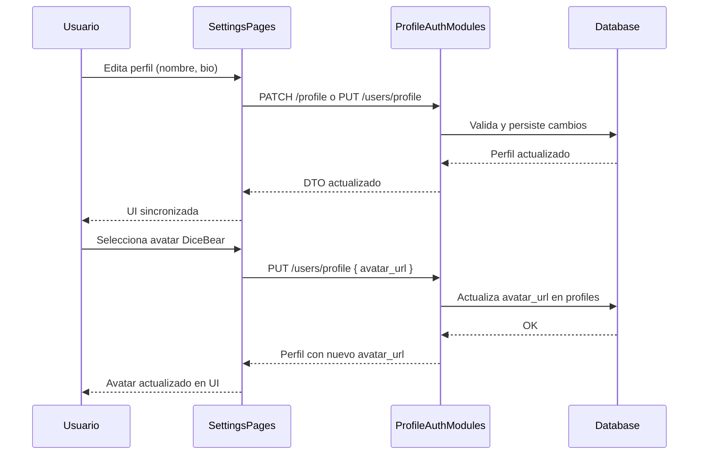

# Flujo Shared - Perfil y Configuracion (Student/Teacher/Admin)

**Version:** 1.2.0
**Fecha:** 2026-02-18
**Estado:** Activo

---

## Resumen

Estandariza el flujo de edicion de perfil y avatar, incluyendo sincronizacion de estado en frontend y persistencia backend. El avatar se selecciona de un catalogo predefinido DiceBear (12 opciones) y se persiste como URL en `avatar_url`.

## Diagrama Mermaid

## Trazabilidad

### Frontend
- `apps/frontend/src/apps/student/pages/SettingsPage.tsx` (orquestador)
- `apps/frontend/src/apps/student/pages/settings/ProfileSection.tsx` (seccion perfil estudiante)
- `apps/frontend/src/shared/components/profile/AvatarSelectionModal.tsx` (modal DiceBear)
- `apps/frontend/src/apps/teacher/pages/TeacherSettings.tsx`
- `apps/frontend/src/apps/admin/components/settings/GeneralSettings.tsx`
- `apps/frontend/src/apps/admin/components/settings/SecuritySettings.tsx`

### Backend
- `apps/backend/src/modules/profile/controllers/profile.controller.ts`
- `apps/backend/src/modules/profile/services/profile.service.ts`
- `apps/backend/src/modules/auth/services/auth.service.ts`

### Datos
- `auth_management.profiles` (avatar_url, display_name, bio, grade_level)
- `auth.users`

## Gap funcional a validar

- **Avatar file upload** (POST /profile/avatar) retorna URL placeholder — documentado como tech debt (requiere S3/MinIO). Mientras tanto, se usa seleccion DiceBear que persiste URL directamente en `avatar_url`.
- Consistencia entre actualizacion de `profiles` y `users` — validar que `PUT /users/profile` actualiza ambas tablas si aplica.
