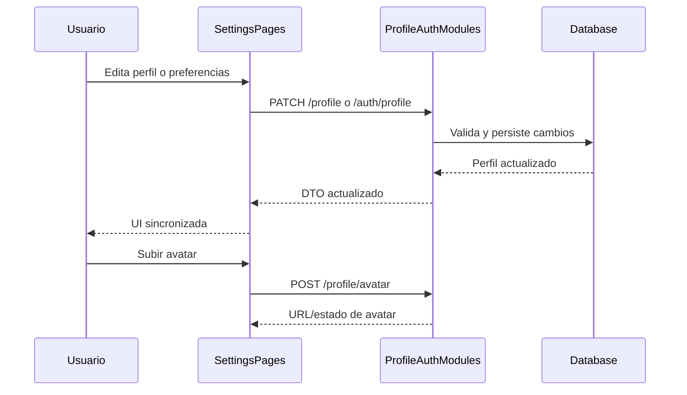

# Flujo Shared - Perfil y Configuracion (Student/Teacher/Admin)

**Version:** 1.0.0  
**Fecha:** 2026-02-17  
**Estado:** Activo

---

## Resumen

Estandariza el flujo de edicion de perfil, preferencias y avatar, incluyendo sincronizacion de estado en frontend y persistencia backend.

## Diagrama Mermaid

## Trazabilidad

### Frontend
- `apps/frontend/src/apps/student/pages/SettingsPage.tsx`
- `apps/frontend/src/apps/teacher/pages/TeacherSettingsPage.tsx`
- `apps/frontend/src/apps/admin/components/settings/GeneralSettings.tsx`
- `apps/frontend/src/apps/admin/components/settings/SecuritySettings.tsx`

### Backend
- `apps/backend/src/modules/profile/controllers/profile.controller.ts`
- `apps/backend/src/modules/profile/services/profile.service.ts`
- `apps/backend/src/modules/auth/services/auth.service.ts`

### Datos
- `auth_management.profiles`
- `auth.users`

## Gap funcional a validar

- Confirmar implementacion de almacenamiento real de avatar (no placeholder) y consistencia entre actualizacion de `profiles` y `users`.
