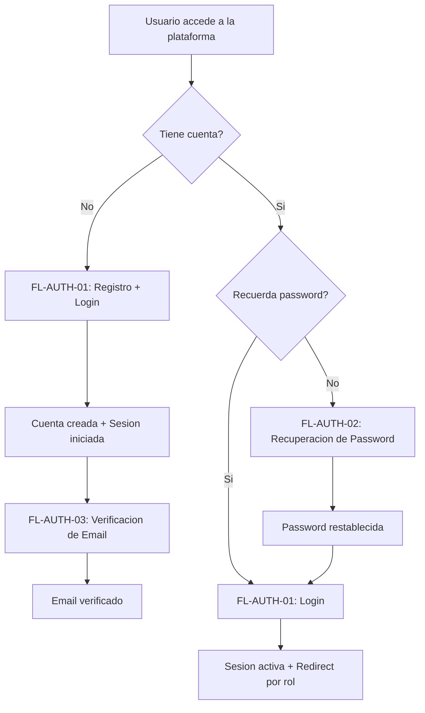

# FL-SHR-02 - Sesion, Seguridad y Recuperacion de Acceso

**ID:** FL-SHR-02
**Version:** 1.0.0
**Fecha:** 2026-02-17
**Estado:** Activo
**Portal:** Shared (todos los portales)
**Prioridad:** P0

---

## Tipo de Flujo

**Tipo:** Compuesto
**Sub-flujos:**
- FL-AUTH-01 — Registro + Login + Inicializacion (creacion de cuenta y autenticacion)
- FL-AUTH-02 — Recuperacion de password (solicitud de reset y restablecimiento)
- FL-AUTH-03 — Verificacion de email (validacion de correo electronico)

---

## 1. Resumen

Flujo compuesto que agrupa todos los procesos de gestion de sesion, seguridad de cuenta y recuperacion de acceso. Abarca desde el registro inicial (FL-AUTH-01), pasando por verificacion de email (FL-AUTH-03), hasta la recuperacion de password cuando el usuario pierde acceso (FL-AUTH-02). Estos tres sub-flujos comparten infraestructura de autenticacion (JWT, tokens temporales, email service) y tablas del schema `auth` y `auth_management`.

Impacto funcional: Garantiza que el usuario pueda crear, verificar, acceder y recuperar su cuenta de forma segura en cualquier portal de la plataforma.

## 2. Precondiciones

- Backend con modulo `auth` operativo.
- Servicio de email configurado para envio de tokens de verificacion y reset.
- Tablas de `auth.users`, `auth_management.profiles`, `auth_management.email_verification_tokens`, `auth_management.password_reset_tokens` creadas.

## 3. Diagrama Mermaid

## 4. Secuencia FE -> BE -> DB

Este flujo delega a sus sub-flujos. Los escenarios principales son:

### Escenario A: Nuevo usuario
1. **Registro (FL-AUTH-01):** `POST /auth/register` -> crea usuario + perfil + triggers de inicializacion. Ver [FLUJO-REGISTRO-LOGIN](../auth/FLUJO-REGISTRO-LOGIN.md).
2. **Verificacion (FL-AUTH-03):** Token de verificacion enviado por email, usuario confirma enlace. Ver [FLUJO-VERIFICACION-EMAIL](../auth/FLUJO-VERIFICACION-EMAIL.md).

### Escenario B: Usuario existente con acceso
3. **Login (FL-AUTH-01):** `POST /auth/login` -> valida credenciales, emite JWT. Ver [FLUJO-REGISTRO-LOGIN](../auth/FLUJO-REGISTRO-LOGIN.md).

### Escenario C: Usuario sin acceso
4. **Recuperacion (FL-AUTH-02):** `POST /auth/forgot-password` -> genera token de reset, envia email. `POST /auth/reset-password` -> valida token, actualiza hash. Ver [FLUJO-RECUPERACION-PASSWORD](../auth/FLUJO-RECUPERACION-PASSWORD.md).

## 5. Componentes y artefactos implicados

### Frontend (puntos de entrada)
- `apps/frontend/src/features/auth/components/RegisterForm.tsx`
- `apps/frontend/src/features/auth/components/LoginForm.tsx`
- `apps/frontend/src/pages/auth/ForgotPasswordPage.tsx`
- `apps/frontend/src/apps/student/pages/PasswordResetPage.tsx`
- `apps/frontend/src/app/providers/AuthContext.tsx`
- `apps/frontend/src/features/auth/store/authStore.ts`

### Sub-flujos referenciados
| Sub-flujo | Archivo de flujo | Endpoints principales |
|-----------|-----------------|----------------------|
| FL-AUTH-01 | `auth/FLUJO-REGISTRO-LOGIN.md` | `POST /auth/register`, `POST /auth/login` |
| FL-AUTH-02 | `auth/FLUJO-RECUPERACION-PASSWORD.md` | `POST /auth/forgot-password`, `POST /auth/reset-password` |
| FL-AUTH-03 | `auth/FLUJO-VERIFICACION-EMAIL.md` | Endpoints de verificacion en modulo auth |

### Backend (compartido)
- `apps/backend/src/modules/auth/controllers/auth.controller.ts`
- `apps/backend/src/modules/auth/services/auth.service.ts`
- `apps/backend/src/modules/auth/services/password-recovery.service.ts`
- `apps/backend/src/modules/auth/services/email-verification.service.ts`

### Datos (agregados)
- `auth.users` (credenciales, estado de cuenta)
- `auth_management.profiles` (perfil academico)
- `auth_management.user_sessions` (sesiones activas)
- `auth_management.password_reset_tokens` (tokens de reset)
- `auth_management.email_verification_tokens` (tokens de verificacion)
- `auth_management.login_attempts` (registro de intentos)

## 6. Reglas y validaciones

- Cada sub-flujo tiene sus propias reglas (ver documentos referenciados).
- **Rate-limiting:** Aplica en todos los endpoints de auth (login, register, forgot-password).
- **JWT:** Tokens de acceso con expiracion corta + refresh tokens para renovacion.
- **Audit trail:** Todos los eventos de sesion quedan registrados en `auth_management.login_attempts`.
- **No revelar existencia de cuentas:** `POST /auth/forgot-password` retorna 200 independientemente de si el email existe.

## 7. Manejo de errores

Delegado a cada sub-flujo. Los patrones comunes son:
- Credenciales invalidas -> mensaje generico, no revelar cual campo fallo.
- Token expirado/invalido -> solicitar nuevo token.
- Rate-limit excedido -> 429 con tiempo de espera.
- Servicio de email caido -> retry con backoff, no bloquear registro.

## 8. Trazabilidad cruzada

| Capa | Archivo | Evidencia |
|------|---------|-----------|
| Sub-flujo FL-AUTH-01 | `docs/30-ux-ui/flujos/auth/FLUJO-REGISTRO-LOGIN.md` | Registro + Login |
| Sub-flujo FL-AUTH-02 | `docs/30-ux-ui/flujos/auth/FLUJO-RECUPERACION-PASSWORD.md` | Recuperacion password |
| Sub-flujo FL-AUTH-03 | `docs/30-ux-ui/flujos/auth/FLUJO-VERIFICACION-EMAIL.md` | Verificacion email |
| Requerimiento | `docs/10-requirements/epics/EPIC-GAM-F1-AUTH/` | RBAC, estados de cuenta, OAuth |
| Especificacion | `docs/10-requirements/epics/EPIC-GAM-F1-AUTH/specifications/ET-AUTH-001-rbac.md` | RBAC detallado |
| Especificacion | `docs/10-requirements/epics/EPIC-GAM-F1-AUTH/specifications/ET-AUTH-002-estados-cuenta.md` | Estados de cuenta |

## 9. Referencias

- FL-AUTH-01 Registro y Login: `docs/30-ux-ui/flujos/auth/FLUJO-REGISTRO-LOGIN.md`
- FL-AUTH-02 Recuperacion de Password: `docs/30-ux-ui/flujos/auth/FLUJO-RECUPERACION-PASSWORD.md`
- FL-AUTH-03 Verificacion de Email: `docs/30-ux-ui/flujos/auth/FLUJO-VERIFICACION-EMAIL.md`
- Flujo de inicializacion de usuario: `docs/80-references/transversal/arquitectura/FLUJO-INICIALIZACION-USUARIO.md`
- Matriz de trazabilidad: `docs/30-ux-ui/flujos/TRACEABILITY-MATRIX.md`
