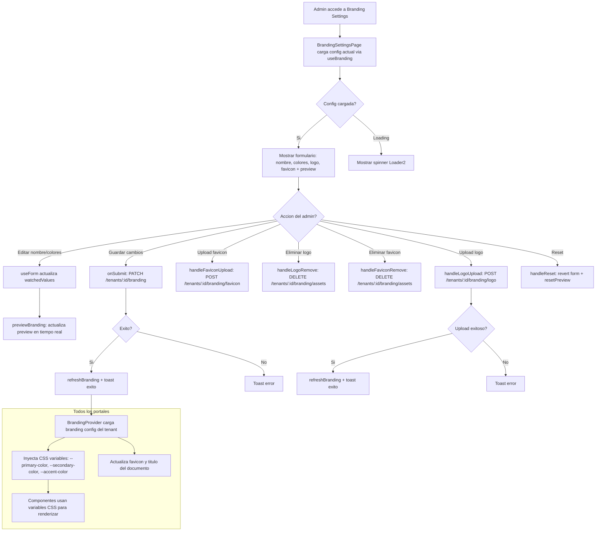

# FL-SHR-03 - White-Label / Theming

**ID:** FL-SHR-03
**Version:** 1.0.0
**Fecha:** 2026-02-17
**Estado:** Parcialmente Implementado
**Portal:** Shared (Admin configures, all portals consume)
**Prioridad:** P3

---

## 1. Resumen

Flujo de configuracion de white-label y theming para personalizar la apariencia visual de la plataforma por tenant. El administrador configura desde el portal Admin: nombre de plataforma, colores principales (primary, secondary, accent), logo, y favicon. Los cambios se aplican en tiempo real via preview y, al guardar, se propagan a todos los portales (Student, Teacher, Admin, Parents) a traves de un BrandingProvider que inyecta variables CSS en runtime. Cada tenant puede tener su propia identidad visual. El sistema forma parte de EXT-008 White Label System.

---

## 2. Precondiciones

- Usuario autenticado con rol `super_admin`.
- Sesion activa con JWT valido.
- Tenant asignado con ID valido.
- Endpoint de branding accesible (GET sin auth para carga inicial de pagina).
- Directorio de assets configurado para upload de logo/favicon en backend.

---

## 3. Diagrama Mermaid



---

## 4. Secuencia FE -> BE -> DB

```text
=== Carga inicial (todos los portales) ===
1. FE: App monta → BrandingProvider.useEffect → brandingApi.getBranding(tenantId)
2. FE: GET /tenants/:tenantId/branding (endpoint publico, sin auth requerido)
3. BE: BrandingController.get() → BrandingService.getBrandingConfig()
4. DB: SELECT FROM tenant branding config (tabla o columnas en auth_management.tenants)
5. BE: Retorna BrandingConfigDto { platformName, primaryColor, secondaryColor, accentColor, logoUrl, faviconUrl }
6. FE: BrandingProvider inyecta CSS variables en :root + actualiza document.title + favicon

=== Admin edita colores/nombre (preview en tiempo real) ===
7. FE: BrandingSettingsPage.useForm → watch() detecta cambios → isDirty = true
8. FE: useEffect → previewBranding({ platformName, primaryColor, secondaryColor, accentColor })
9. FE: ThemePreview renderiza preview con valores actuales del formulario
10. FE: NO hay llamada al backend hasta que se guarda

=== Admin guarda configuracion ===
11. FE: handleSubmit → onSubmit(data) → brandingApi.updateBranding(tenantId, data)
12. FE: PATCH /tenants/:tenantId/branding con body { platformName, primaryColor, secondaryColor, accentColor }
13. BE: BrandingController.update() → BrandingService.updateBrandingConfig()
14. DB: UPDATE branding config para el tenant
15. BE: Retorna config actualizada
16. FE: refreshBranding() → re-fetch config → actualiza CSS variables globales + toast exito

=== Admin sube logo ===
17. FE: LogoUploader.onUpload(file) → handleLogoUpload(file)
18. FE: brandingApi.uploadLogo(tenantId, file) → POST /tenants/:tenantId/branding/logo (multipart/form-data)
19. BE: BrandingController.uploadLogo() (FileInterceptor) → BrandingService.processAndStoreLogo()
20. BE: Procesa imagen, optimiza, almacena en filesystem/S3
21. DB: UPDATE logo_url para el tenant
22. FE: refreshBranding() → logo visible en todos los portales

=== Admin sube favicon ===
23. FE: FaviconUploader.onUpload(file) → handleFaviconUpload(file)
24. FE: brandingApi.uploadFavicon(tenantId, file) → POST /tenants/:tenantId/branding/favicon
25. BE: BrandingController.uploadFavicon() → BrandingService.processAndStoreFavicon()
26. DB: UPDATE favicon_url para el tenant
27. FE: refreshBranding() → favicon actualizado en browser tabs

=== Admin obtiene CSS variables (endpoint alternativo) ===
28. FE: GET /tenants/:tenantId/branding/css (opcional)
29. BE: BrandingController.getCss() → genera string CSS con variables custom
30. FE: Puede inyectar directamente como <style>

=== Admin elimina logo/favicon ===
31. FE: handleLogoRemove/handleFaviconRemove → brandingApi.deleteLogo/deleteFavicon(tenantId)
32. FE: DELETE /tenants/:tenantId/branding/assets
33. BE: BrandingController.deleteAssets() → BrandingService.removeAssets()
34. DB: SET logo_url/favicon_url = NULL para el tenant
35. FE: refreshBranding() → revierte a defaults
```

---

## 5. Componentes y artefactos implicados

### Frontend

| Tipo | Archivo |
|------|---------|
| Pagina Branding | `apps/frontend/src/features/admin/branding/BrandingSettingsPage.tsx` |
| Provider global | `apps/frontend/src/app/providers/BrandingProvider.tsx` |
| API Branding | `apps/frontend/src/services/api/branding/brandingAPI.ts` |
| Color Picker | `apps/frontend/src/features/admin/branding/components/ColorPicker.tsx` |
| Logo Uploader | `apps/frontend/src/features/admin/branding/components/LogoUploader.tsx` |
| Favicon Uploader | `apps/frontend/src/features/admin/branding/components/FaviconUploader.tsx` |
| Theme Preview | `apps/frontend/src/features/admin/branding/components/ThemePreview.tsx` |
| Components Index | `apps/frontend/src/features/admin/branding/components/index.ts` |
| CSS Variables Util | `apps/frontend/src/utils/cssVariables.ts` |
| Admin Layout | `apps/frontend/src/apps/admin/layouts/AdminLayout.tsx` |
| Rutas | `apps/frontend/src/App.tsx` |

### Backend

| Tipo | Archivo |
|------|---------|
| Controller | `apps/backend/src/modules/admin/controllers/branding.controller.ts` |
| Service | `apps/backend/src/modules/admin/services/branding.service.ts` |
| DTO Config | `apps/backend/src/modules/admin/dto/branding/branding-config.dto.ts` |
| DTO Update | `apps/backend/src/modules/admin/dto/branding/update-branding.dto.ts` |
| DTO Index | `apps/backend/src/modules/admin/dto/branding/index.ts` |
| Entity Tenant Config | `apps/backend/src/modules/admin/entities/tenant-configuration.entity.ts` |
| Entity Tenant | `apps/backend/src/modules/auth/entities/tenant.entity.ts` |
| Guard JWT | `apps/backend/src/modules/auth/guards/jwt-auth.guard.ts` |

### Base de Datos

| Tipo | Archivo |
|------|---------|
| Tabla tenants | `apps/database/ddl/schemas/auth_management/tables/01-tenants.sql` |

---

## 6. Reglas y validaciones

| Regla | Capa | Descripcion |
|-------|------|-------------|
| GET branding es publico | BE | No requiere auth para carga inicial (pre-login) |
| PATCH/POST/DELETE requieren admin | BE | JwtAuthGuard + AdminGuard para modificaciones |
| Nombre de plataforma requerido | FE + BE | maxLength: 100 caracteres, required |
| Colores en formato hex | FE + BE | Validacion de formato #RRGGBB |
| Logo max 200x50 recomendado | FE | Guidance en UI, PNG/SVG preferido |
| Favicon max 32x32 o 16x16 | FE + BE | Procesamiento automatico en backend |
| Upload multipart/form-data | BE | FileInterceptor para archivos |
| Cambios aplican inmediatamente | FE | Post-save, refreshBranding() actualiza todos los portales |
| Preview no persiste | FE | previewBranding() solo modifica estado local, no llama API |
| CSS variables en :root | FE | --primary-color, --secondary-color, --accent-color |
| Tenant isolation | DB | Cada tenant tiene su propia configuracion de branding |

---

## 7. Manejo de errores

| Escenario | Capa | Codigo HTTP | Comportamiento |
|-----------|------|-------------|----------------|
| Tenant no encontrado | BE | 404 | Error "Tenant not found" |
| Token JWT expirado | BE | 401 | Redirige a login |
| No es admin | BE | 403 | AdminGuard rechaza |
| No tenant ID disponible | FE | N/A | toast.error("No tenant ID available") - return early |
| Error upload logo | FE | 400/500 | toast.error("Failed to upload logo") + throw |
| Error upload favicon | FE | 400/500 | toast.error("Failed to upload favicon") + throw |
| Error guardar branding | FE | 400/500 | toast.error("Failed to save branding settings") |
| Archivo demasiado grande | BE | 413 | Payload too large |
| Formato de imagen no soportado | BE | 400 | Validacion en FileInterceptor |
| Error al eliminar assets | FE | 400/500 | toast.error("Failed to remove logo/favicon") |
| GET branding falla (pre-login) | FE | N/A | Usa valores por defecto de la plataforma |

---

## 8. Trazabilidad cruzada

| Capa | Archivo | Evidencia |
|------|---------|-----------|
| Frontend Pagina | `apps/frontend/src/features/admin/branding/BrandingSettingsPage.tsx` | Formulario con react-hook-form, preview en tiempo real |
| Frontend Provider | `apps/frontend/src/app/providers/BrandingProvider.tsx` | Context global que inyecta CSS variables |
| Frontend API | `apps/frontend/src/services/api/branding/brandingAPI.ts` | getBranding, updateBranding, uploadLogo, uploadFavicon, deleteLogo, deleteFavicon |
| Frontend Components | `apps/frontend/src/features/admin/branding/components/` | ColorPicker, LogoUploader, FaviconUploader, ThemePreview |
| Frontend CSS | `apps/frontend/src/utils/cssVariables.ts` | Utilidad para manipular CSS variables |
| Backend Controller | `apps/backend/src/modules/admin/controllers/branding.controller.ts` | 6 endpoints: GET, PATCH, POST logo, POST favicon, GET css, DELETE assets |
| Backend Service | `apps/backend/src/modules/admin/services/branding.service.ts` | Logica de branding, procesamiento de assets |
| Backend DTOs | `apps/backend/src/modules/admin/dto/branding/` | BrandingConfigDto, UpdateBrandingDto |
| DDL Tenants | `apps/database/ddl/schemas/auth_management/tables/01-tenants.sql` | Tabla principal de tenants |

---

## 9. Referencias

- Epic: EPIC-GAM-F3-WHITE-LABEL
- Especificacion Theming: `docs/10-requirements/epics/EPIC-GAM-F3-WHITE-LABEL/specifications/ET-WL-001-theming.md`
- Especificacion Tenant: `docs/10-requirements/epics/EPIC-GAM-F3-WHITE-LABEL/specifications/ET-WL-002-tenant-customization.md`
- Especificacion Assets: `docs/10-requirements/epics/EPIC-GAM-F3-WHITE-LABEL/specifications/ET-WL-003-asset-management.md`
- Especificacion CSS: `docs/10-requirements/epics/EPIC-GAM-F3-WHITE-LABEL/specifications/ET-WL-004-css-runtime-variables.md`
- Portal admin: `docs/60-portals/admin/PORTAL-ADMIN-GUIDE.md`
