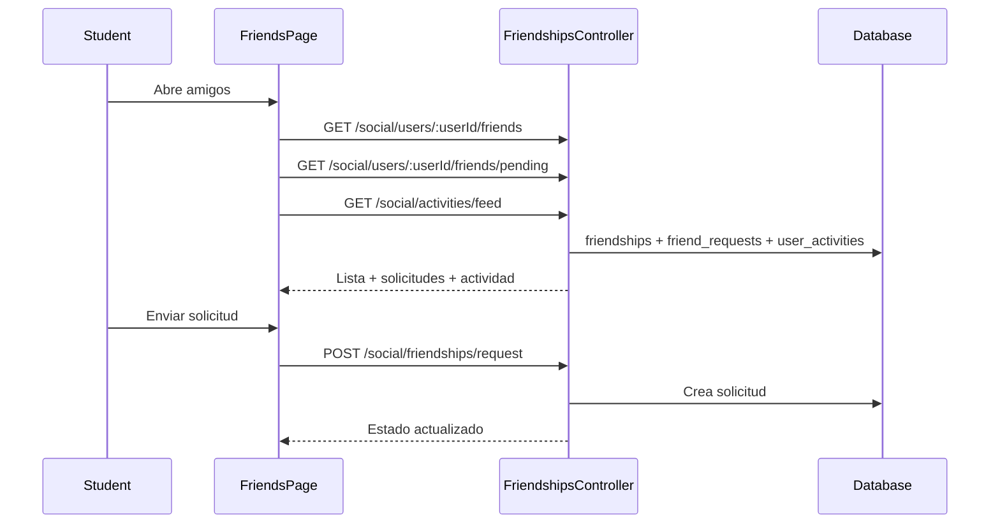

# Flujo Student - Amigos

**Version:** 1.0.0  
**Fecha:** 2026-02-17  
**Estado:** Activo

---

## Resumen

Flujo para consultar lista de amigos, enviar solicitudes, aceptarlas y visualizar actividad social.

## Diagrama Mermaid

## Trazabilidad

### Frontend
- `apps/frontend/src/apps/student/pages/FriendsPage.tsx`
- `apps/frontend/src/services/api/friendsAPI.ts`

### Backend
- `apps/backend/src/modules/social/controllers/friendships.controller.ts`
- `apps/backend/src/modules/social/services/friendships.service.ts`
- `apps/backend/src/modules/social/controllers/user-activities.controller.ts`

### Datos
- `social_features.friendships`
- `social_features.friend_requests`
- `social_features.user_activities`
