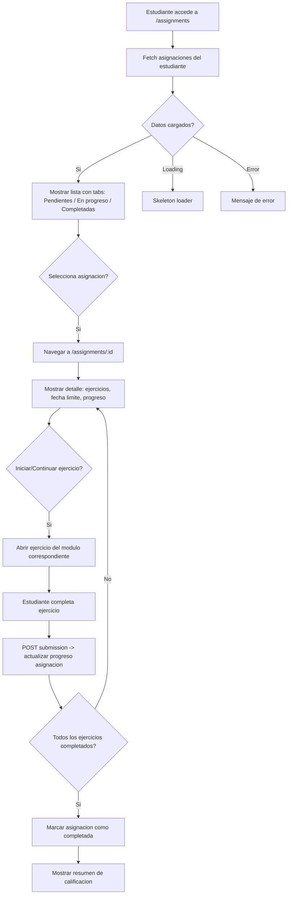

# FL-STU-17 - Asignaciones del Estudiante

**ID:** FL-STU-17
**Version:** 1.0.0
**Fecha:** 2026-02-17
**Estado:** Activo
**Portal:** Student
**Prioridad:** P1

---

## 1. Resumen

Flujo de gestion de asignaciones desde la perspectiva del estudiante. El estudiante accede a su lista de asignaciones pendientes, en progreso y completadas, asignadas por sus docentes. Puede seleccionar una asignacion para ver los ejercicios que contiene, completarlos secuencialmente y enviar la asignacion. El sistema registra el avance y calcula la calificacion final. Las asignaciones tienen fechas limite que se validan tanto en frontend como backend.

---

## 2. Precondiciones

- Usuario autenticado con rol `student`.
- Sesion activa con JWT valido.
- Estudiante asignado a al menos un classroom.
- Docente ha creado al menos una asignacion para el classroom del estudiante.
- Asignacion dentro del periodo de vigencia (fecha inicio <= hoy <= fecha limite).

---

## 3. Diagrama Mermaid



---

## 4. Secuencia FE -> BE -> DB

```
=== Carga inicial - Lista de asignaciones ===
1. FE: AssignmentsPage monta -> solicita asignaciones
2. FE: GET /api/v1/assignments/student/me
3. BE: AssignmentStudentController.getMyAssignments() -> AssignmentStudentService.findByStudent()
4. DB: SELECT FROM educational_content.assignment_students AS JOIN educational_content.assignments WHERE student_id = :userId (RLS)
5. BE: Retorna array con { id, title, dueDate, status, exerciseCount, completedCount }
6. FE: Renderiza lista agrupada por estado (pending, in_progress, completed)

=== Detalle de asignacion ===
7. FE: Estudiante selecciona asignacion -> navega a /assignments/:id
8. FE: AssignmentDetailPage monta
9. FE: GET /api/v1/assignments/:id/student-view
10. BE: AssignmentController.getStudentView() -> AssignmentService.getWithStudentProgress()
11. DB: SELECT assignment + exercises + student submissions JOIN
12. BE: Retorna { assignment, exercises[], submissions[], progress }
13. FE: Renderiza lista de ejercicios con estado individual (pending/completed/graded)

=== Completar ejercicio de asignacion ===
14. FE: Estudiante hace click en ejercicio pendiente -> abre componente de ejercicio
15. FE: POST /api/v1/progress/submissions/submit { assignmentId, exerciseId, answers }
16. BE: SubmissionController.submit() -> valida -> registra intento
17. DB: INSERT INTO educational_content.assignment_submissions + progress_tracking.exercise_attempts
18. BE: Auto-grade (M1-M2) o marcar pending_review (M3-M5)
19. FE: Actualiza estado del ejercicio en la lista

=== Asignacion completada ===
20. BE: Trigger verifica si todos los ejercicios estan completados
21. DB: UPDATE educational_content.assignment_students SET status = 'completed'
22. FE: Muestra resumen con calificacion final
```

---

## 5. Componentes y artefactos implicados

### Frontend

| Tipo | Archivo |
|------|---------|
| Pagina lista | `apps/frontend/src/apps/student/pages/AssignmentsPage.tsx` |
| Pagina detalle | `apps/frontend/src/apps/student/pages/AssignmentDetailPage.tsx` |
| API assignments | `apps/frontend/src/lib/api/assignments.api.ts` |
| Rutas | `apps/frontend/src/App.tsx` (rutas: `/assignments`, `/assignments/:id`) |

### Backend

| Tipo | Archivo |
|------|---------|
| Controller asignaciones | `apps/backend/src/modules/educational/controllers/assignment.controller.ts` |
| Controller estudiante | `apps/backend/src/modules/educational/controllers/assignment-student.controller.ts` |
| Service asignaciones | `apps/backend/src/modules/educational/services/assignment.service.ts` |
| Guard JWT | `apps/backend/src/modules/auth/guards/jwt-auth.guard.ts` |

### Base de Datos

| Tipo | Archivo |
|------|---------|
| Tabla assignments | `apps/database/ddl/schemas/educational_content/tables/assignments.sql` |
| Tabla assignment_students | `apps/database/ddl/schemas/educational_content/tables/assignment_students.sql` |
| Tabla assignment_submissions | `apps/database/ddl/schemas/educational_content/tables/assignment_submissions.sql` |

---

## 6. Reglas y validaciones

| Regla | Capa | Descripcion |
|-------|------|-------------|
| Autenticacion requerida | BE | JwtAuthGuard en todos los endpoints |
| Solo asignaciones propias | BE | Estudiante solo ve asignaciones de sus classrooms |
| Fecha limite | FE + BE | No se aceptan submissions despues de due_date |
| Intentos maximos | BE | Limite de reintentos configurado por asignacion |
| RLS por tenant | DB | Datos filtrados automaticamente por tenant_id |
| Estado valido | BE | Transiciones: pending -> in_progress -> completed |
| Orden cronologico | BE | Asignaciones ordenadas por due_date ASC (urgentes primero) |

---

## 7. Manejo de errores

| Escenario | Capa | Codigo HTTP | Comportamiento |
|-----------|------|-------------|----------------|
| Token JWT expirado | BE | 401 | Redirige a login |
| Asignacion no encontrada | BE | 404 | NotFoundException |
| Asignacion expirada (past due_date) | BE | 400 | BadRequestException "Asignacion vencida" |
| Sin asignaciones pendientes | FE | 200 | Estado vacio "No tienes asignaciones pendientes" |
| Error al enviar submission | FE | N/A | Toast de error con opcion de reintentar |
| Intentos maximos alcanzados | BE | 403 | ForbiddenException "Maximo de intentos alcanzado" |

---

## 8. Trazabilidad cruzada

| Capa | Archivo | Evidencia |
|------|---------|-----------|
| Frontend Pagina | `apps/frontend/src/apps/student/pages/AssignmentsPage.tsx` | Lista de asignaciones |
| Frontend Pagina | `apps/frontend/src/apps/student/pages/AssignmentDetailPage.tsx` | Detalle y ejercicios |
| Backend Controller | `apps/backend/src/modules/educational/controllers/assignment.controller.ts` | CRUD asignaciones |
| Backend Controller | `apps/backend/src/modules/educational/controllers/assignment-student.controller.ts` | Vista estudiante |
| DDL assignments | `apps/database/ddl/schemas/educational_content/tables/assignments.sql` | Tabla asignaciones |
| DDL assignment_students | `apps/database/ddl/schemas/educational_content/tables/assignment_students.sql` | Relacion estudiante-asignacion |
| DDL assignment_submissions | `apps/database/ddl/schemas/educational_content/tables/assignment_submissions.sql` | Entregas |

---

## 9. Referencias

- Flujo docente de asignaciones: [FL-TCH-02](../teacher/FLUJO-ASIGNACIONES-CLASE.md)
- Flujo ejercicio completo: [FL-STU-01](./FLUJO-EJERCICIO-COMPLETO.md)
- Guia portal estudiante: `docs/60-portals/student/PORTAL-STUDENT-GUIDE.md`
