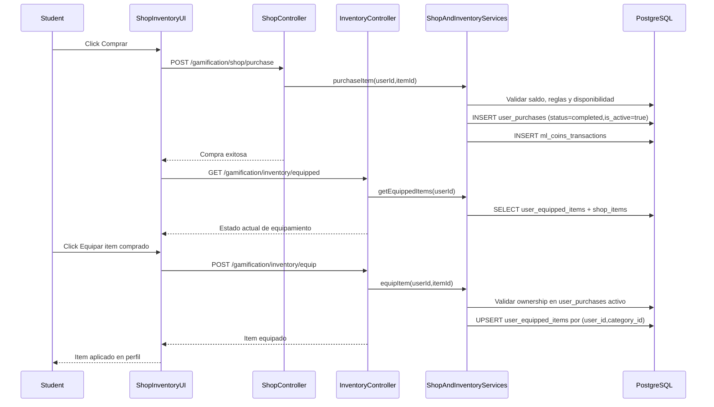
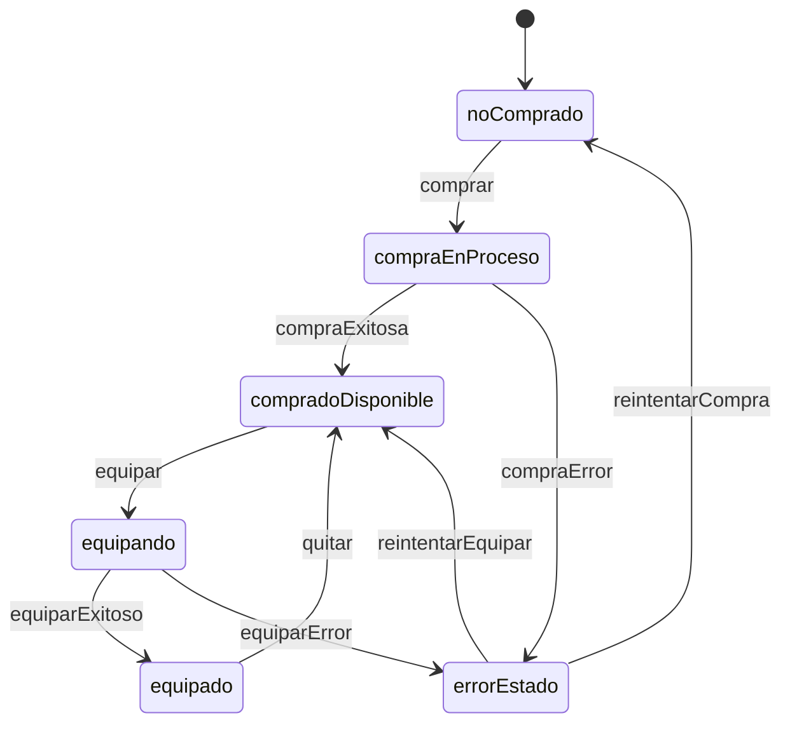

# Flujo Student - Compra Inventario Equipar

**Version:** 1.0.0  
**Fecha:** 2026-02-17  
**Estado:** Activo  
**Tipo:** Compuesto (integra FL-STU-03 + FL-STU-19)

---

## Resumen

Flujo maestro que integra el proceso completo para variantes visuales:
1. compra en tienda,
2. disponibilidad en inventario del usuario,
3. equipamiento/aplicación en perfil.

---

## Diagrama Mermaid (E2E)

---

## Diagrama de estados UX

---

## Reglas de negocio integradas

1. El item debe existir y estar disponible para compra.
2. Compra válida genera ownership activo en `user_purchases`.
3. Equipamiento solo permitido para items no consumibles.
4. Equipamiento requiere `status='completed'` e `is_active=true`.
5. Solo un item activo por categoría (`user_id`, `category_id`).

---

## Errores esperados E2E

| Operacion | HTTP | Condicion |
|----------|------|-----------|
| Compra | 400 | Saldo insuficiente / regla de negocio |
| Compra | 404 | Item no existe |
| Equipar | 400 | Item consumible o payload inválido |
| Equipar | 403 | Usuario no posee item activo |
| Equipar | 404 | Item no existe |
| Equipar | 409 | Conflicto de equipamiento por categoría (si aplica) |

---

## Trazabilidad

### Frontend
- `apps/frontend/src/apps/student/pages/ShopPage.tsx` (Thin Shell, 235 lines post-refactor v10.0.0)
- `apps/frontend/src/apps/student/pages/InventoryPage.tsx` (Thin Shell, 258 lines post-refactor v10.0.0)
- `apps/frontend/src/features/gamification/social/hooks/useEquipment.ts` (equip/unequip React Query)
- `apps/frontend/src/features/gamification/social/hooks/useInventoryData.ts` (inventory data React Query)
- `apps/frontend/src/features/gamification/economy/hooks/useShopData.ts` (shop items React Query)
- `apps/frontend/src/features/gamification/economy/hooks/useShopPurchase.ts` (purchase mutation)

### Backend
- `apps/backend/src/modules/gamification/controllers/shop.controller.ts`
- `apps/backend/src/modules/gamification/controllers/inventory.controller.ts`
- `apps/backend/src/modules/gamification/services/shop.service.ts`
- `apps/backend/src/modules/gamification/services/inventory.service.ts`

### Datos
- `gamification_system.shop_items`
- `gamification_system.user_purchases`
- `gamification_system.user_equipped_items`
- `gamification_system.ml_coins_transactions`

### Documentos relacionados
- `docs/30-ux-ui/flujos/student/FLUJO-TIENDA-COMPRA.md`
- `docs/30-ux-ui/flujos/student/FLUJO-INVENTARIO-ITEMS.md`
- `docs/30-ux-ui/flujos/student/FLUJO-EQUIPAMIENTO-ITEMS-COSMETICOS.md`
- `docs/40-api/ENDPOINTS-INVENTORY-EQUIP.md`
