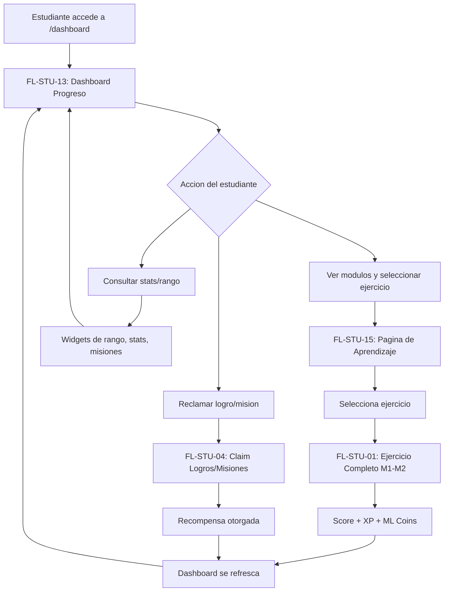

# FL-STU-06 - Dashboard y Progreso Academico

**ID:** FL-STU-06
**Version:** 1.0.0
**Fecha:** 2026-02-17
**Estado:** Activo
**Portal:** Student
**Prioridad:** P0

---

## Tipo de Flujo

**Tipo:** Compuesto
**Sub-flujos:**
- FL-STU-13 — Dashboard y overview de progreso (vista principal con widgets de rango, stats, modulos)
- FL-STU-01 — Ejercicio completo auto-grade M1-M2 (resolucion y calificacion automatica)
- FL-STU-04 — Claim de logros y misiones (reclamar recompensas de logros/misiones)
- FL-STU-15 — Pagina de aprendizaje (seleccion de modulo y ejercicio)

---

## 1. Resumen

Flujo compuesto que representa el ciclo completo de la experiencia academica del estudiante en la plataforma. Comienza en el dashboard (FL-STU-13) donde el estudiante visualiza su progreso global, rangos maya, estadisticas y misiones activas. Desde ahi navega a la pagina de aprendizaje (FL-STU-15) para seleccionar un modulo y ejercicio, completa el ejercicio (FL-STU-01), recibe recompensas automaticas, y puede reclamar logros/misiones pendientes (FL-STU-04). El dashboard se refresca automaticamente reflejando el nuevo progreso.

Impacto funcional: Orquesta el ciclo principal de uso de la plataforma: ver progreso -> seleccionar ejercicio -> resolver -> obtener recompensas -> ver progreso actualizado.

## 2. Precondiciones

- Usuario autenticado con rol `student`.
- Al menos un modulo educativo asignado.
- Backend con datasources `gamification`, `progress`, `educational` operativos.

## 3. Diagrama Mermaid

## 4. Secuencia FE -> BE -> DB

Este flujo delega a sus sub-flujos en secuencia. El ciclo tipico es:

1. **Dashboard (FL-STU-13):** Carga paralela de 9+ endpoints (gamificacion, progreso, modulos, misiones). Ver [FLUJO-DASHBOARD-PROGRESO](./FLUJO-DASHBOARD-PROGRESO.md).
2. **Aprendizaje (FL-STU-15):** Navegacion a `/learning`, listado de modulos y ejercicios. Ver [FLUJO-PAGINA-APRENDIZAJE](./FLUJO-PAGINA-APRENDIZAJE.md).
3. **Ejercicio (FL-STU-01):** Resolucion, autosave, submit, auto-grade, recompensas. Ver [FLUJO-EJERCICIO-COMPLETO](./FLUJO-EJERCICIO-COMPLETO.md).
4. **Claim (FL-STU-04):** Si hay logros/misiones completadas, el estudiante reclama recompensas. Ver [FLUJO-LOGROS-MISIONES-CLAIM](./FLUJO-LOGROS-MISIONES-CLAIM.md).
5. **Refresh:** React Query invalida caches y el dashboard se actualiza automaticamente.

## 5. Componentes y artefactos implicados

### Frontend (orquestacion)
- Pagina principal: `apps/frontend/src/apps/student/pages/DashboardComplete.tsx`
- Navegacion: `apps/frontend/src/App.tsx` (rutas `/dashboard`, `/learning`, `/exercise/:id`)

### Sub-flujos referenciados
| Sub-flujo | Archivo de flujo | Pagina principal |
|-----------|-----------------|-----------------|
| FL-STU-13 | `student/FLUJO-DASHBOARD-PROGRESO.md` | `DashboardComplete.tsx` |
| FL-STU-15 | `student/FLUJO-PAGINA-APRENDIZAJE.md` | `LearningPage.tsx` |
| FL-STU-01 | `student/FLUJO-EJERCICIO-COMPLETO.md` | `ExercisePage.tsx` |
| FL-STU-04 | `student/FLUJO-LOGROS-MISIONES-CLAIM.md` | `AchievementsPage.tsx`, `MissionsPage.tsx` |

### Datos (agregados de todos los sub-flujos)
- `progress_tracking.exercise_attempts`, `exercise_submissions`, `module_progress`
- `gamification_system.user_stats`, `user_ranks`, `maya_ranks`, `ml_coins_transactions`
- `gamification_system.user_achievements`, `achievements`, `missions`, `classroom_missions`
- `educational_content.modules`, `exercises`

## 6. Reglas y validaciones

- Cada sub-flujo tiene sus propias reglas (ver documentos referenciados).
- El ciclo completo es no-bloqueante: el estudiante puede acceder a cualquier sub-flujo independientemente.
- React Query maneja la invalidacion de cache entre sub-flujos (al completar ejercicio, el dashboard se refresca).
- RBAC: Solo rol `student` (o superior) accede a estas rutas.

## 7. Manejo de errores

Delegado a cada sub-flujo. El patron general es:
- Fallo en un widget del dashboard no bloquea los demas (Promise.allSettled).
- Fallo en submit de ejercicio permite retry.
- Fallo en claim de recompensa no pierde el logro (queda pendiente).

## 8. Trazabilidad cruzada

| Capa | Archivo | Evidencia |
|------|---------|-----------|
| Sub-flujo FL-STU-13 | `docs/30-ux-ui/flujos/student/FLUJO-DASHBOARD-PROGRESO.md` | Dashboard principal |
| Sub-flujo FL-STU-15 | `docs/30-ux-ui/flujos/student/FLUJO-PAGINA-APRENDIZAJE.md` | Seleccion de modulo/ejercicio |
| Sub-flujo FL-STU-01 | `docs/30-ux-ui/flujos/student/FLUJO-EJERCICIO-COMPLETO.md` | Resolucion y auto-grade |
| Sub-flujo FL-STU-04 | `docs/30-ux-ui/flujos/student/FLUJO-LOGROS-MISIONES-CLAIM.md` | Claim de recompensas |
| Requerimiento | `docs/10-requirements/epics/EPIC-GAM-F1-ANALYTICS/` | Dashboard y progreso |
| Requerimiento | `docs/10-requirements/epics/EPIC-GAM-F1-EXERCISES/` | Ejercicios educativos |

## 9. Referencias

- FL-STU-13 Dashboard progreso: `docs/30-ux-ui/flujos/student/FLUJO-DASHBOARD-PROGRESO.md`
- FL-STU-01 Ejercicio completo: `docs/30-ux-ui/flujos/student/FLUJO-EJERCICIO-COMPLETO.md`
- FL-STU-04 Logros y misiones: `docs/30-ux-ui/flujos/student/FLUJO-LOGROS-MISIONES-CLAIM.md`
- FL-STU-15 Pagina aprendizaje: `docs/30-ux-ui/flujos/student/FLUJO-PAGINA-APRENDIZAJE.md`
- Guia de portal estudiante: `docs/60-portals/student/PORTAL-STUDENT-GUIDE.md`
- Matriz de trazabilidad: `docs/30-ux-ui/flujos/TRACEABILITY-MATRIX.md`
