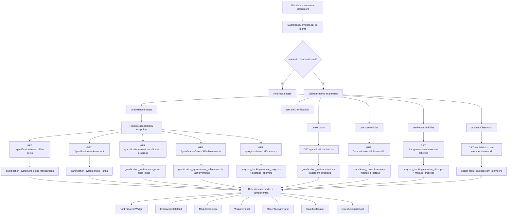

# FL-STU-13 - Student Dashboard / Progress Overview

**ID:** FL-STU-13
**Version:** 1.0.0
**Fecha:** 2026-02-17
**Estado:** Activo
**Portal:** Student
**Prioridad:** P1

---

## 1. Resumen

Flujo principal del portal estudiante. Al ingresar a la plataforma, el estudiante visualiza un dashboard completo con: su rango maya actual y progreso de XP, estadisticas de desempeno (ejercicios completados, racha, tiempo total, XP), modulos educativos asignados con porcentaje de avance, misiones activas con recompensas pendientes, y actividad reciente. Este dashboard es el punto central de la experiencia gamificada y orquesta 5 llamadas API en paralelo (Promise.allSettled) para maximizar la resiliencia: si un endpoint falla, los demas widgets siguen funcionando con fallbacks.

Impacto funcional: Proporciona al estudiante una vision 360 de su avance academico y gamificacion, motivandolo a continuar con ejercicios, misiones y la exploracion de modulos.

## 2. Precondiciones

- Usuario autenticado con JWT valido (rol `student` o superior).
- Sesion activa en el frontend (`useAuth` retorna `isAuthenticated: true` y `user.id` disponible).
- Al menos un perfil de usuario existente en `auth_management.profiles`.
- Opcionalmente: el estudiante esta vinculado a un aula (`social_features.classroom_members`) para filtrar modulos.
- Backend en ejecucion con datasources `gamification`, `progress`, `educational`, `social` operativos.
- Redis disponible para caching de datos de rango y misiones.

## 3. Diagrama Mermaid

## 4. Secuencia FE -> BE -> DB

### Paso 1: Carga inicial del dashboard
1. **Frontend:** React Router renderiza `DashboardComplete` en ruta `/dashboard`.
2. **Frontend:** `useAuth()` provee `user.id` y `isAuthenticated`.
3. **Frontend:** `useUserClassroom(user.id)` resuelve el aula principal del estudiante.

### Paso 2: Fetch paralelo de datos (useDashboardData)
4. **Frontend:** `useDashboardData()` ejecuta `Promise.allSettled()` con 5 llamadas:
   - `GET /api/v1/gamification/users/:userId/ml-coins`
   - `GET /api/v1/gamification/ranks/current`
   - `GET /api/v1/gamification/ranks/users/:userId/rank-progress`
   - `GET /api/v1/gamification/users/:userId/achievements`
   - `GET /api/v1/progress/users/:userId/summary`
5. **Backend:** Cada controller consulta su datasource respectivo (gamification, progress).
6. **DB:** Lecturas de `gamification_system.user_stats`, `user_ranks`, `maya_ranks`, `ml_coins_transactions`, `user_achievements`, `achievements`, `progress_tracking.module_progress`, `exercise_attempts`.
7. **Frontend:** Datos transformados de snake_case a camelCase con fallbacks para endpoints fallidos.

### Paso 3: Fetch de misiones (useMissions)
8. **Frontend:** `useMissions()` llama al endpoint de misiones activas.
9. **Backend:** `MissionsController` consulta misiones activas filtradas por usuario.
10. **DB:** `gamification_system.missions`, `classroom_missions`, `mission_templates`.

### Paso 4: Fetch de modulos (useUserModules)
11. **Frontend:** `useUserModules({ classroomId })` solicita modulos filtrados por aula.
12. **Backend:** `ModulesController.getUserModules()` consulta modulos con progreso.
13. **DB:** `educational_content.modules` JOIN `progress_tracking.module_progress`.

### Paso 5: Fetch de actividad reciente (useRecentActivities)
14. **Frontend:** `useRecentActivities(5)` obtiene las 5 actividades mas recientes.
15. **Backend:** `ModuleProgressController` endpoint `users/:userId/recent-activities`.
16. **DB:** `progress_tracking.exercise_attempts`, `module_progress` ordenados por fecha.

### Paso 6: Renderizado de widgets
17. **Frontend:** Cada componente recibe datos transformados y muestra loading/error/data.
18. **Frontend:** Layout de 12 columnas: Rango (4) + Modulos (8) | Stats (4) + Misiones (4) + Actividad (4).

## 5. Componentes y artefactos implicados

### Frontend

| Tipo | Ruta | Descripcion |
|------|------|-------------|
| Pagina | `apps/frontend/src/apps/student/pages/DashboardComplete.tsx` | Pagina principal del dashboard |
| Componente | `apps/frontend/src/apps/student/components/dashboard/EnhancedStatsGrid.tsx` | Grid de estadisticas (ejercicios, racha, tiempo, XP) |
| Componente | `apps/frontend/src/apps/student/components/dashboard/MissionsPanel.tsx` | Panel de misiones activas |
| Componente | `apps/frontend/src/apps/student/components/dashboard/ModulesSection.tsx` | Seccion de modulos educativos |
| Componente | `apps/frontend/src/apps/student/components/dashboard/RecentActivityPanel.tsx` | Panel de actividad reciente |
| Componente | `apps/frontend/src/apps/student/components/dashboard/RankProgressWidget.tsx` | Widget de rango maya y XP |
| Componente | `apps/frontend/src/apps/student/components/dashboard/QuickActionsWidget.tsx` | Acciones rapidas |
| Componente | `apps/frontend/src/shared/components/layout/GamifiedHeader.tsx` | Header con datos de gamificacion |
| Hook | `apps/frontend/src/apps/student/hooks/useDashboardData.ts` | Fetch paralelo de 5 endpoints (React Query) |
| Hook | `apps/frontend/src/features/gamification/missions/hooks/useMissions.ts` | Fetch de misiones activas |
| Hook | `apps/frontend/src/apps/student/hooks/useUserModules.ts` | Modulos del usuario con progreso |
| Hook | `apps/frontend/src/apps/student/hooks/useRecentActivities.ts` | Actividades recientes |
| Hook | `apps/frontend/src/shared/hooks/useUserGamification.ts` | Datos de gamificacion del header |
| Hook | `apps/frontend/src/apps/student/hooks/useUserClassroom.ts` | Aula principal del estudiante |
| API Client | `apps/frontend/src/services/api/apiClient.ts` | Cliente HTTP (axios) |
| API Service | `apps/frontend/src/services/api/educationalAPI.ts` | API de modulos educativos |

### Backend

| Tipo | Ruta | Descripcion |
|------|------|-------------|
| Controller | `apps/backend/src/modules/gamification/controllers/ml-coins.controller.ts` | `GET users/:userId/ml-coins` |
| Controller | `apps/backend/src/modules/gamification/controllers/ranks.controller.ts` | `GET ranks/current`, `GET ranks/users/:userId/rank-progress` |
| Controller | `apps/backend/src/modules/gamification/controllers/achievements.controller.ts` | `GET users/:userId/achievements` |
| Controller | `apps/backend/src/modules/progress/controllers/module-progress.controller.ts` | `GET users/:userId/summary`, `GET users/:userId/recent-activities` |
| Controller | `apps/backend/src/modules/educational/controllers/modules.controller.ts` | `GET modules/user/:userId` |
| Controller | `apps/backend/src/modules/gamification/controllers/missions.controller.ts` | Misiones activas |

### Datos (Base de Datos)

| Schema | Tabla | Uso |
|--------|-------|-----|
| `gamification_system` | `user_stats` | XP total, nivel, rachas del usuario |
| `gamification_system` | `user_ranks` | Rango maya actual del usuario |
| `gamification_system` | `maya_ranks` | Catalogo de rangos (Ajaw, Nacom, Ah K'in, etc.) |
| `gamification_system` | `ml_coins_transactions` | Balance y transacciones de ML Coins |
| `gamification_system` | `user_achievements` | Logros desbloqueados por el usuario |
| `gamification_system` | `achievements` | Catalogo de logros disponibles |
| `gamification_system` | `missions` | Misiones activas y completadas |
| `gamification_system` | `classroom_missions` | Misiones asignadas por aula |
| `gamification_system` | `mission_templates` | Plantillas de misiones |
| `progress_tracking` | `module_progress` | Porcentaje de avance por modulo |
| `progress_tracking` | `exercise_attempts` | Intentos de ejercicios (score, tiempo) |
| `educational_content` | `modules` | Catalogo de 5 modulos educativos |
| `social_features` | `classroom_members` | Vinculacion estudiante-aula |

## 6. Reglas y validaciones

- **RBAC:** Solo usuarios con rol `student`, `admin_teacher`, o `super_admin` pueden acceder a `/dashboard`.
- **RLS (Row-Level Security):** Todas las tablas de gamificacion y progreso tienen politicas RLS que filtran por `tenant_id` y `user_id`.
- **Promise.allSettled:** Si un endpoint falla, los demas widgets siguen funcionando. El dashboard NO se rompe por un servicio caido.
- **Fallback de rango:** Si no hay datos de rango, se asume `Ajaw` (rango inicial) con 0 XP y multiplicador 1.0.
- **Multiplicadores maya:** Sincronizados con backend y DB: Ajaw=1.0, Nacom=1.25, Ah K'in=1.5, Halach Uinic=1.75, K'uk'ulkan=2.0.
- **React Query cache:** `staleTime: 5min`, `gcTime: 10min`, `refetchOnWindowFocus: true`. Datos frescos sin sobre-cargar el backend.
- **Filtro por aula:** Si el estudiante pertenece a un aula, los modulos se filtran por `classroomId`.
- **Limite de actividades:** Se muestran maximo 5 actividades recientes.
- **Misiones:** Se priorizan misiones activas; si no hay, se muestran las 3 primeras del catalogo completo.

## 7. Manejo de errores

| Escenario | Capa | Codigo HTTP | Comportamiento |
|-----------|------|-------------|----------------|
| Token JWT expirado | FE | 401 | Redirect a `/login` via interceptor axios |
| Endpoint de ML Coins falla | BE | 500 | Dashboard muestra balance=0, otros widgets OK |
| Endpoint de rango falla | BE | 404/500 | Fallback a rango Ajaw, 0 XP, multiplicador 1.0 |
| Endpoint de progreso falla | BE | 500 | Widget de stats muestra zeros, boton "Reintentar" |
| Endpoint de misiones falla | BE | 500 | Panel de misiones muestra estado vacio |
| Endpoint de modulos falla | BE | 500 | Seccion de modulos muestra error con retry |
| Usuario sin aula asignada | BE | 404 | `useUserClassroom` retorna null, modulos sin filtro |
| Base de datos no disponible | DB | 500 | Todos los widgets muestran fallbacks, error global con boton refresh |
| Red timeout (>30s) | FE | - | React Query retry (2 intentos, backoff exponencial max 30s) |
| Datos vacios (nuevo usuario) | BE | 200 | Widgets muestran estados iniciales (0 ejercicios, Ajaw, sin misiones) |

## 8. Trazabilidad cruzada

| Capa | Archivo | Evidencia |
|------|---------|-----------|
| Frontend (pagina) | `apps/frontend/src/apps/student/pages/DashboardComplete.tsx` | Ruta `/dashboard`, importa 7 hooks |
| Frontend (hook principal) | `apps/frontend/src/apps/student/hooks/useDashboardData.ts` | Promise.allSettled con 5 endpoints gamificacion/progreso |
| Frontend (hook modulos) | `apps/frontend/src/apps/student/hooks/useUserModules.ts` | GET `/educational/modules/user/:userId` |
| Frontend (hook misiones) | `apps/frontend/src/features/gamification/missions/hooks/useMissions.ts` | Misiones activas del usuario |
| Frontend (hook actividad) | `apps/frontend/src/apps/student/hooks/useRecentActivities.ts` | GET actividades recientes (limit=5) |
| Frontend (hook aula) | `apps/frontend/src/apps/student/hooks/useUserClassroom.ts` | GET `/social/classroom-members/users/:userId` |
| Frontend (ruta) | `apps/frontend/src/App.tsx` linea 202-205 | `<Route path="/dashboard" element={<DashboardComplete />} />` |
| Backend (rango) | `apps/backend/src/modules/gamification/controllers/ranks.controller.ts` | `GET ranks/current`, `GET ranks/users/:userId/rank-progress` |
| Backend (coins) | `apps/backend/src/modules/gamification/controllers/ml-coins.controller.ts` | `GET users/:userId/ml-coins` |
| Backend (achievements) | `apps/backend/src/modules/gamification/controllers/achievements.controller.ts` | `GET users/:userId/achievements` |
| Backend (progreso) | `apps/backend/src/modules/progress/controllers/module-progress.controller.ts` | `GET users/:userId/summary`, `GET users/:userId/recent-activities` |
| Backend (modulos) | `apps/backend/src/modules/educational/controllers/modules.controller.ts` | `GET modules/user/:userId` |
| Database | `apps/database/ddl/schemas/gamification_system/tables/01-user_stats.sql` | XP, nivel, rachas |
| Database | `apps/database/ddl/schemas/gamification_system/tables/02-user_ranks.sql` | Rango maya asignado |
| Database | `apps/database/ddl/schemas/gamification_system/tables/13-maya_ranks.sql` | Catalogo de rangos maya |
| Database | `apps/database/ddl/schemas/progress_tracking/tables/01-module_progress.sql` | Progreso por modulo |
| Database | `apps/database/ddl/schemas/progress_tracking/tables/03-exercise_attempts.sql` | Intentos de ejercicios |

## 9. Referencias

- Guia de portal estudiante: `docs/60-portals/student/PORTAL-STUDENT-GUIDE.md`
- Especificacion de rangos maya: `docs/10-requirements/epics/EPIC-GAM-F1-GAMIFICATION/specifications/ET-GAM-003-rangos-maya.md`
- Especificacion de economia ML Coins: `docs/10-requirements/epics/EPIC-GAM-F1-GAMIFICATION/specifications/ET-GAM-004-tipos-compartidos-gamificacion.md`
- Especificacion dashboard progreso: `docs/10-requirements/epics/EPIC-GAM-F1-ANALYTICS/specifications/ET-ANA-006-dashboard-progreso.md`
- Arquitectura de API frontend: `docs/50-guides/frontend/impl/API-ARCHITECTURE.md`
- ADR React Query: `docs/90-adr/ADR-013-react-query-adoption.md`
- Modelo de datos: `docs/20-architecture/MODELO-DATOS.md`
