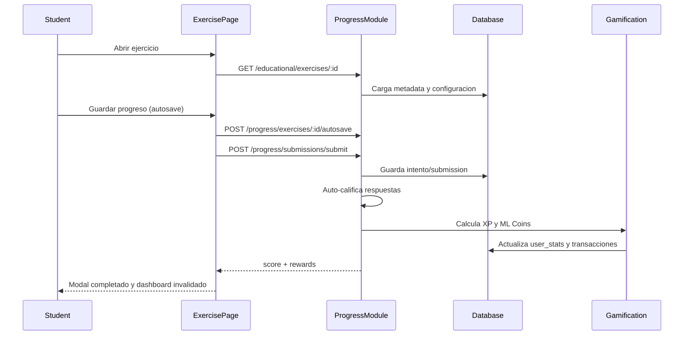

# Flujo Student - Ejercicio Completo (M1-M2 Auto-Grade)

**Version:** 1.0.0  
**Fecha:** 2026-02-17  
**Estado:** Activo

---

## Resumen

Describe el ciclo completo desde que el estudiante abre un ejercicio autocorregible hasta que recibe score/recompensas y se refresca el dashboard.

## Diagrama Mermaid

## Trazabilidad

### Frontend
- `apps/frontend/src/apps/student/pages/ExercisePage.tsx`
- `apps/frontend/src/apps/student/hooks/useExerciseAutoSave.example.tsx`
- `apps/frontend/src/services/api/educationalAPI.ts`

### Backend
- `apps/backend/src/modules/progress/controllers/exercise-submission.controller.ts`
- `apps/backend/src/modules/progress/services/exercise-submission.service.ts`
- `apps/backend/src/modules/progress/services/grading/exercise-grading.service.ts`
- `apps/backend/src/modules/progress/services/grading/exercise-rewards.service.ts`

### Datos
- `progress_tracking.exercise_attempts`
- `progress_tracking.exercise_submissions`
- `gamification_system.user_stats`
- `gamification_system.ml_coins_transactions`

## Validaciones clave

- Integridad del payload de respuestas.
- Prevencion de doble submit.
- Asignacion atomica de recompensas o manejo de compensacion.
