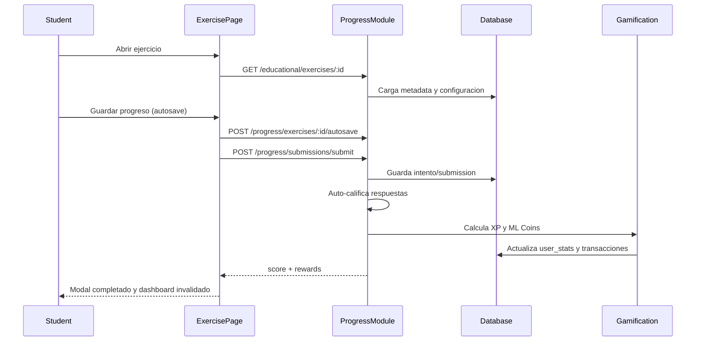

# Flujo Student - Ejercicio Completo (M1-M2 Auto-Grade)

**Version:** 1.2.0
**Fecha:** 2026-02-18
**Estado:** Activo

---

## Resumen

Describe el ciclo completo desde que el estudiante abre un ejercicio autocorregible hasta que recibe score/recompensas y se refresca el dashboard.

## Diagrama Mermaid



## Trazabilidad

### Frontend (Post-Restructuring v2.0.0)
- `apps/frontend/src/apps/student/pages/ExercisePage.tsx` (thin shell: ExerciseProvider + ExerciseLayout)
- `apps/frontend/src/features/exercises/context/ExerciseContext.tsx` (state management: datos, progreso, comodines, submission)
- `apps/frontend/src/features/exercises/components/ExerciseLayout.tsx` (composición UI: header, guide, loader, sidebar, feedback)
- `apps/frontend/src/features/exercises/hooks/useExerciseData.ts` (fetch ejercicio + registro mecánica)
- `apps/frontend/src/features/exercises/hooks/useExerciseProgress.ts` (progreso + auto-save)
- `apps/frontend/src/features/exercises/hooks/useExerciseComodines.ts` (inventario real via API backend)
- `apps/frontend/src/features/exercises/registry/registrations.ts` (29 mecánicas registradas (comprension_auditiva en BACKLOG))
- `apps/frontend/src/services/api/educationalAPI.ts`

### Backend
- `apps/backend/src/modules/progress/controllers/exercise-submission.controller.ts`
- `apps/backend/src/modules/progress/services/exercise-submission.service.ts`
- `apps/backend/src/modules/progress/services/grading/exercise-grading.service.ts`
- `apps/backend/src/modules/progress/services/grading/exercise-rewards.service.ts`

### Datos
- `progress_tracking.exercise_attempts`
- `progress_tracking.exercise_submissions`
- `gamification_system.user_stats`
- `gamification_system.ml_coins_transactions`

## Guard de ejercicio completado

- **ExercisePage.tsx:** Si `exercise.completed === true` al cargar, se muestra `ExerciseCompletedState` con botón "Volver al Módulo" en lugar de renderizar la mecánica. Esto previene re-envíos por URL directa.
- **ModuleDetailPage.tsx:** Ejercicios completados tienen el botón deshabilitado (`disabled`), texto "Ejercicio Completado", gradiente verde, y la card no navega al hacer click.

## Validaciones clave

- Integridad del payload de respuestas.
- Prevención de doble submit (guard frontend + backend idempotency).
- Guard de completado en ExerciseContext previene acceso directo por URL a ejercicios ya completados.
- Asignación atómica de recompensas o manejo de compensación.
- Comodines usados incluidos en payload de submission (`powerupsUsed[]` merge de legacy + comodin types).

## Implementación Técnica v2.0

### Arquitectura Post-Restructuring

```
ExercisePage.tsx (thin shell, ~30 líneas)
└── ExerciseProvider (compone hooks en React Context)
    ├── useExerciseData (fetch + registry lookup + mechanic loading)
    ├── useExerciseProgress (estado progreso + auto-save)
    ├── useExerciseComodines (inventario real API /gamification/comodines/)
    └── ExerciseLayout
        ├── GamifiedHeader
        ├── ExercisePageHeader
        ├── ExerciseGuide (pedagogicalGuide, forceExpanded cuando hintsRevealed > 0)
        ├── Banner "Segunda Oportunidad activa" (condicional: comodinesContext.hasSecondChance)
        ├── ExerciseLoader (con clase .vision-lectora-active si comodinesContext.visionActive)
        │   └── MechanicCompatWrapper → [29 mecánicas (comprension_auditiva en BACKLOG) con comodinesContext prop]
        ├── ExerciseSidebar
        │   ├── ConsumablesPanel (comodines reales del backend)
        │   ├── ActionsPanel (guardar, enviar, reiniciar, verificar)
        │   ├── ScoreDisplay
        │   ├── TimerWidget
        │   └── ProgressTracker
        └── FeedbackModal
```

### Registry Pattern

Agregar una nueva mecánica requiere solo:
1. Crear componente que implemente `ExerciseMechanicProps`
2. Registrar en `registrations.ts` (4 líneas)

No requiere modificar: ExercisePage, ExerciseLayout, App.tsx routing.

### Comodines (Real Backend Integration)

`useExerciseComodines` consume endpoints reales:
- `GET /gamification/comodines/inventory/:userId` — inventario del usuario
- `POST /gamification/comodines/use` — activar comodín

Tipos: pistas (máx 3/intento), visión lectora (máx 1), segunda oportunidad (máx 1).
Reemplaza el mock data de `PowerUpBar` con inventario real.

**Efectos en UI (implementado):**
- `hintsRevealed > 0` → ExerciseGuide se auto-expande via `forceExpanded` prop
- `visionActive` → Clase CSS `vision-lectora-active` resalta texto con underline amber
- `hasSecondChance` → Banner visual + mecánicas M1-M2 permiten reintento si score < 70
- `handleSubmit` incluye `getUsedComodinTypes()` en el payload `powerupsUsed[]`
- `comodinesContext.hintsRevealed` se pasa como `externalRevealCount` al `HintSystem` en `ActionsPanel`, revelando hints programáticamente al usar el comodín "Pistas"

### Detección de Logros Post-Submission

Tras completar un ejercicio exitosamente, el backend ejecuta:
1. `ExerciseRewardsService` calcula XP + ML Coins y los otorga atómicamente
2. `AchievementsService.detectAndGrantEarned()` evalúa **18 condition types** contra el perfil actualizado
3. Si algún achievement es desbloqueado: INSERT `user_achievements` + notificación
4. Cron de auto-reconciliación (cada 5 min) reclama recompensas no reclamadas manualmente

**Nota (REC-005):** La DB function `check_and_award_achievements()` está **@DEPRECATED** — la evaluación se hace exclusivamente en backend (NestJS). Los condition types en la DB function usan UPPERCASE que no coincide con los seeds lowercase.

Ver: [FLUJO-LOGROS-MISIONES-CLAIM.md](FLUJO-LOGROS-MISIONES-CLAIM.md) para el flujo completo de detección y claim.
