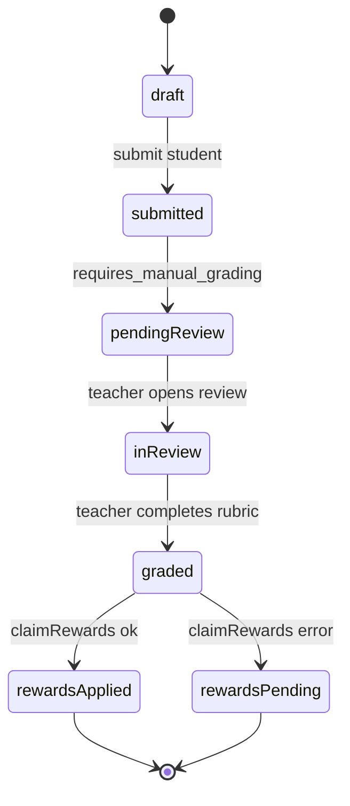

# Flujo Student - Ejercicio M3-M5 (Revision Manual)

**Version:** 1.0.0  
**Fecha:** 2026-02-17  
**Estado:** Activo

---

## Resumen

En modulos 3 al 5, la respuesta pasa a estado de revision manual hasta que un docente completa rubricado, calificacion y cierre de recompensas.

## Diagrama Mermaid

## Trazabilidad

### Frontend
- `apps/frontend/src/apps/student/pages/ExercisePage.tsx` (submit)
- `apps/frontend/src/apps/teacher/pages/TeacherReviewPanel.tsx`
- `apps/frontend/src/apps/teacher/components/review-panel/ReviewDetail.tsx`

### Backend
- `apps/backend/src/modules/progress/services/exercise-submission.service.ts`
- `apps/backend/src/modules/teacher/services/manual-review.service.ts`
- Endpoints de `teacher/reviews/*` para cierre de revision.

### Datos
- `progress_tracking.exercise_submissions`
- `progress_tracking.manual_reviews`
- `gamification_system.user_stats`

## Riesgo funcional documentado

- Si la etapa de recompensas falla despues de marcar revision completada, puede existir inconsistencia `graded` sin `rewardsApplied`.
