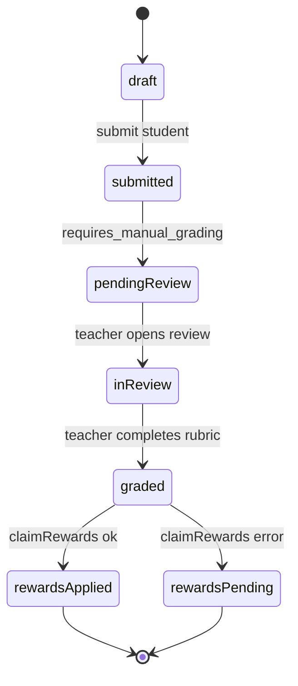

# Flujo Student - Ejercicio M3-M5 (Revision Manual)

**Version:** 1.3.0
**Fecha:** 2026-02-21
**Estado:** Activo

---

## Resumen

En modulos 3 al 5, **todos los ejercicios (13 total) son evaluados exclusivamente por el docente**. No hay interaccion con IA ni auto-scoring en ninguno de ellos. La respuesta pasa a estado de revision manual hasta que un docente completa rubricado, calificacion y cierre de recompensas.

Mensaje mostrado al estudiante al enviar:

- "Tu actividad fue enviada para evaluacion del maestro. Las recompensas (XP y ML Coins) se otorgaran cuando el maestro complete la evaluacion."

## Diagrama Mermaid

## Trazabilidad

### Frontend
- `apps/frontend/src/apps/student/pages/ExercisePage.tsx` (routing container)
- `apps/frontend/src/features/mechanics/module{3-5}/*/Exercise.tsx` (13 exercise components — status check + submitAsync)
- `apps/frontend/src/features/mechanics/shared/hooks/useExerciseSubmission.ts` (submit mutation)
- `apps/frontend/src/features/mechanics/constants/manualReviewMessages.ts` (MANUAL_REVIEW_PENDING_SHORT_MESSAGE)
- `apps/frontend/src/apps/teacher/pages/TeacherReviewPanelPage.tsx`
- `apps/frontend/src/apps/teacher/components/review-panel/ReviewDetail.tsx`

### Backend
- `apps/backend/src/modules/progress/services/exercise-submission.service.ts`
- `apps/backend/src/modules/teacher/services/manual-review.service.ts`
- Endpoints de `teacher/reviews/*` para cierre de revision.

### Datos
- `progress_tracking.exercise_submissions`
- `progress_tracking.manual_reviews`
- `gamification_system.user_stats`

## Riesgo funcional documentado

- Si la etapa de recompensas falla despues de marcar revision completada, puede existir inconsistencia `graded` sin `rewardsApplied`.

## Flujo de recompensas diferidas (UI)

1. Estudiante envia ejercicio M3-M5.
2. Frontend muestra estado `pendingReview` en `FeedbackModal`.
3. Docente completa revision.
4. Backend envia notificacion in-app con `notificationType=exercise_feedback` y payload de `score`, `xpEarned`, `mlCoinsEarned`.
5. Frontend dispara evento `gamilit:exercise:feedback`.
6. `StudentPageShell` abre `DelayedRewardsModal` con calificacion y recompensas otorgadas.

## Mecanicas por ejercicio

Todos los ejercicios de M3-M5 comparten las mismas caracteristicas: sin interaccion con IA, sin auto-scoring, y evaluacion 100% manual por el docente.

### Modulo 3 — Pensamiento Critico (5 ejercicios)

| Ejercicio | Mecanica | Entregable del estudiante |
|-----------|----------|---------------------------|
| Debate Digital | Ensayo estructurado con 4 secciones: tesis (min 50 chars), argumentos a favor (min 100 chars), contraargumentos (min 80 chars), conclusion (min 80 chars). Sin oponente IA. | `EssaySections` (thesis, arguments_for, counterarguments, conclusion) |
| Matriz Perspectivas | Perspectivas pre-cargadas desde datos del ejercicio. El estudiante responde preguntas de analisis sobre las perspectivas mostradas. Sin generacion de perspectivas por IA. | `answers` (Record de respuestas a preguntas de analisis) + `perspectives` (pre-loaded) |
| Analisis de Fuentes | Ranking manual de fuentes por credibilidad (drag & drop) con justificacion escrita (min 100 chars). Sin analisis de credibilidad por IA ni fact-checker automatico. | `currentRanking` (string[]) + `justification` (string) |
| Podcast Argumentativo | Grabacion de audio + transcripcion via speech-to-text del navegador + edicion del guion. Sin analisis de argumentos por IA post-grabacion. | `script` (string) + `audioUrl` (string, uploaded via mediaApi) |
| Tribunal Opiniones | Sin cambios, ya operaba correctamente sin IA. | Opiniones y veredictos escritos |

### Modulo 4 — Lectura Digital (5 ejercicios)

| Ejercicio | Mecanica | Entregable del estudiante |
|-----------|----------|---------------------------|
| Quiz TikTok | Seleccion multiple con justificacion escrita obligatoria por pregunta (min 30 chars cada una). Sin auto-scoring ni feedback correcto/incorrecto. | `answers` (number[]) + `justifications` (Record<number, string>) |
| Navegacion Hipertextual | Exploracion de documentos hipertextuales + seccion de reflexion con 3 campos: resumen (min 150 chars), ruta alternativa (min 80 chars), lo mas importante (min 80 chars). Sin `calculateScore()`. | `path` (string[]) + `information_found` + `reflections` (summary, alternative_route, most_important) |
| Infografia Interactiva | Exploracion de tarjetas + drag & drop + seccion de analisis con 3 campos: relacion entre conceptos (min 80 chars), dato sorprendente (min 80 chars), sintesis (min 100 chars). Sin `calculateScore()`. | `droppedCards` (Record) + `analysis_questions` (relationship, surprising, summary) |
| Verificador Fake News | Identificacion de afirmaciones + verificacion manual con evidencia escrita. Sin `calculateScore()`, calificacion 100% manual. | `claims_verified` (array de {claim_id, is_fake, evidence}) |
| Analisis de Memes | Sin cambios, ya operaba correctamente con anotaciones manuales. | Anotaciones (x, y, texto, categoria) por meme |

### Modulo 5 — Produccion Textual (3 ejercicios)

| Ejercicio | Mecanica | Entregable del estudiante |
|-----------|----------|---------------------------|
| Diario Multimedia | Sin cambios, ya operaba correctamente. | Entradas de diario con multimedia |
| Comic Digital | Sin cambios, ya operaba correctamente. | Paneles de comic con texto y diseño |
| Video Carta | Sin cambios, ya operaba correctamente. | Video grabado + guion escrito |

## Ejercicios con recursos multimedia

### M4 — Analisis de Memes (multi-meme)

El ejercicio `analisis_memes` soporta multiples memes en un solo ejercicio. El adapter `adaptToAnalisisMemesData` mapea `content.memes[0].imageUrl` al campo `memeUrl` que el componente consume.

**Flujo multi-meme:**
1. Se carga el array `memes[]` desde `content` JSON en BD (o mock data).
2. El componente muestra navegacion "Anterior / Siguiente" si hay >1 meme.
3. El estudiante coloca anotaciones (x, y, texto, categoria) sobre cada meme.
4. Al enviar, las anotaciones incluyen `memeId` del meme activo en metadata.
5. El docente ve todas las anotaciones + el meme correspondiente en revision.

**Recursos:** 6 SVGs ilustrados en `public/memes/*.svg` (600x500px, flat design).

### Auxiliar — Comprension Auditiva

El ejercicio `comprension_auditiva` reproduce audio narrado y desbloquea preguntas en timestamps especificos.

**Flujo:**
1. Se carga `content.audioUrl` y `content.questions[]` desde BD (o mock data).
2. El adapter `adaptToComprensionAuditivaData` mapea audio metadata + preguntas.
3. El estudiante escucha el audio; las preguntas se desbloquean al alcanzar cada timestamp.
4. Las respuestas se envian como array de indices seleccionados.

**Recursos:** MP3 narracion en `public/audio/marie-curie-biografia.mp3` (~2 min, gTTS).
