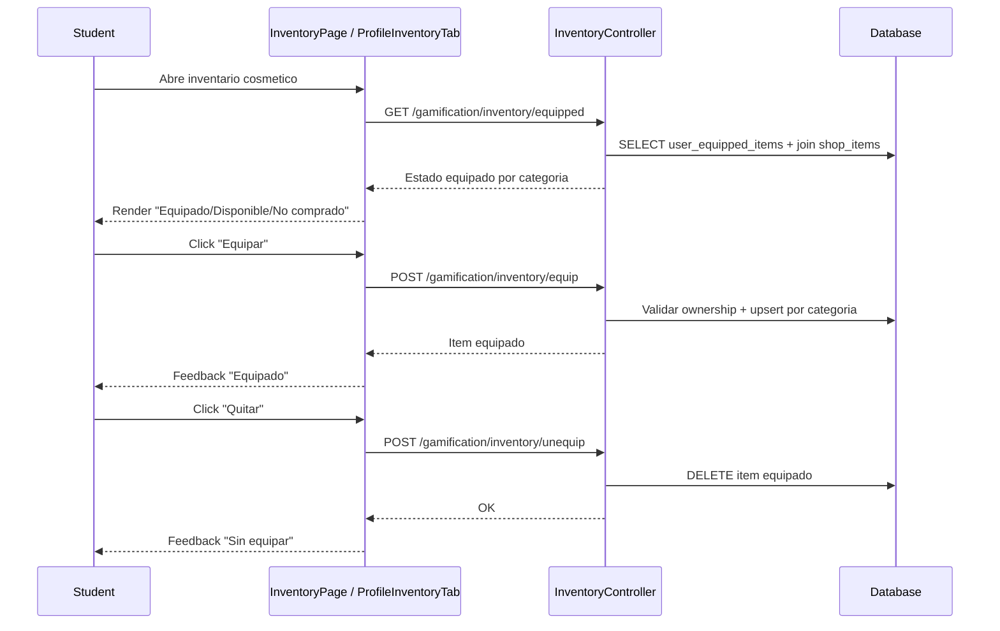

# Flujo Student - Equipamiento de Items Cosmeticos

**Version:** 1.1.0
**Fecha:** 2026-02-21
**Estado:** Activo

---

## Resumen

Flujo para equipar y quitar items cosmeticos (marcos, efectos de nombre, temas, variantes de avatar) previamente comprados en tienda.

> Flujo maestro relacionado: `FLUJO-COMPRA-INVENTARIO-EQUIPAR.md`.

---

## Diagrama Mermaid

---

## Estados UI

| Estado | Condicion | CTA principal | Feedback |
|--------|-----------|---------------|----------|
| No comprado | No existe `user_purchases` para item | Comprar | Mensaje informativo |
| Comprado disponible | Comprado pero no equipado | Equipar | Toast exito/error |
| Equipado | Coincide con categoria activa | Quitar | Indicador visual activo |
| Reemplazado | Se equipa otro item misma categoria | Equipar nuevo | Toast "reemplazado" |
| Error | Respuesta 4xx/5xx | Reintentar | Mensaje contextual |

---

## Reglas UX

1. Un solo item equipado por categoria visible al usuario.
2. Boton `Equipar` deshabilitado para items no comprados.
3. Boton `Quitar` solo visible cuando el item esta equipado.
4. Mostrar fallback visual si `metadata` no cumple contrato.

---

## Trazabilidad

### Frontend
- `apps/frontend/src/apps/student/pages/InventoryPage.tsx`
- `apps/frontend/src/apps/student/components/profile/ProfileInventoryTab.tsx`
- `apps/frontend/src/features/gamification/social/hooks/useEquipment.ts` (equip/unequip mutations)
- `apps/frontend/src/features/gamification/social/hooks/useInventoryData.ts` (cosmetics + power-ups queries)
- `apps/frontend/src/features/gamification/social/api/inventory.api.ts`
- `apps/frontend/src/features/gamification/social/types/inventory.types.ts`

### Backend
- `apps/backend/src/modules/gamification/controllers/inventory.controller.ts`
- `apps/backend/src/modules/gamification/services/inventory.service.ts`

### Datos
- `gamification_system.user_purchases`
- `gamification_system.shop_items`
- `gamification_system.user_equipped_items`

### Relacion documental
- `docs/40-api/ENDPOINTS-INVENTORY-EQUIP.md`
- `docs/20-architecture/gamificacion/FLUJO-TECNICO-EQUIPAMIENTO.md`
- `docs/30-ux-ui/flujos/student/FLUJO-COMPRA-INVENTARIO-EQUIPAR.md`