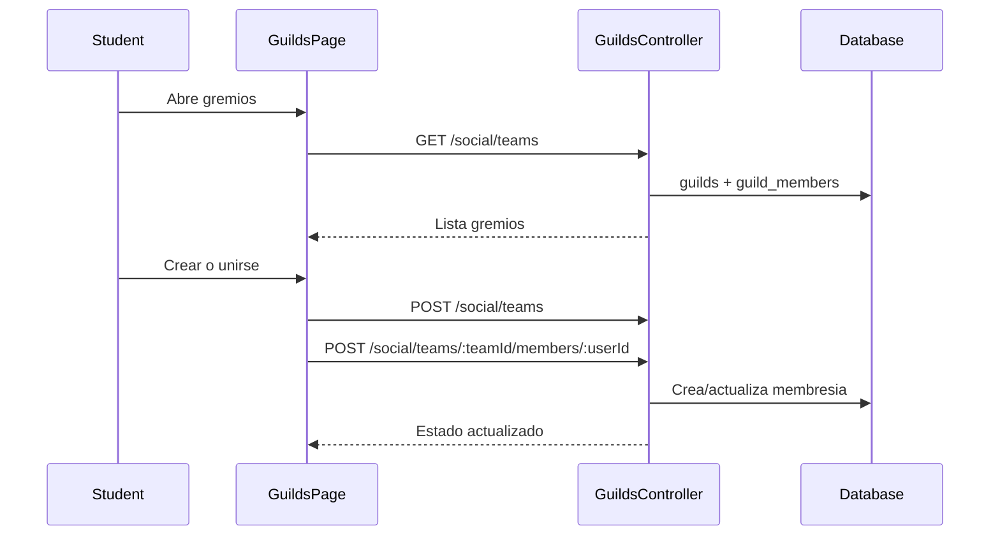

# Flujo Student - Gremios

**Version:** 1.0.0  
**Fecha:** 2026-02-17  
**Estado:** Activo

---

## Resumen

Flujo para buscar gremios, unirse/crear y gestionar miembros desde el portal estudiante.

## Diagrama Mermaid

## Trazabilidad

### Frontend
- `apps/frontend/src/apps/student/pages/GuildsPage.tsx`
- `apps/frontend/src/features/gamification/social/api/socialAPI.ts`

### Backend
- `apps/backend/src/modules/social/controllers/guilds.controller.ts`
- `apps/backend/src/modules/social/services/guilds.service.ts`

### Datos
- `social_features.guilds`
- `social_features.guild_members`
