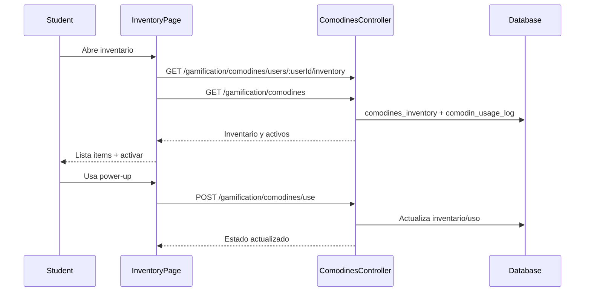

# Flujo Student - Inventario de Items

**Version:** 1.0.0  
**Fecha:** 2026-02-17  
**Estado:** Activo

---

## Resumen

Flujo para consultar inventario de comodines y activar power-ups desde el portal estudiante.

## Diagrama Mermaid

## Trazabilidad

### Frontend
- `apps/frontend/src/apps/student/pages/InventoryPage.tsx`
- `apps/frontend/src/features/gamification/social/api/socialAPI.ts`

### Backend
- `apps/backend/src/modules/gamification/controllers/comodines.controller.ts`
- `apps/backend/src/modules/gamification/services/comodines.service.ts`

### Datos
- `gamification_system.comodines_inventory`
- `gamification_system.comodin_usage_log`
