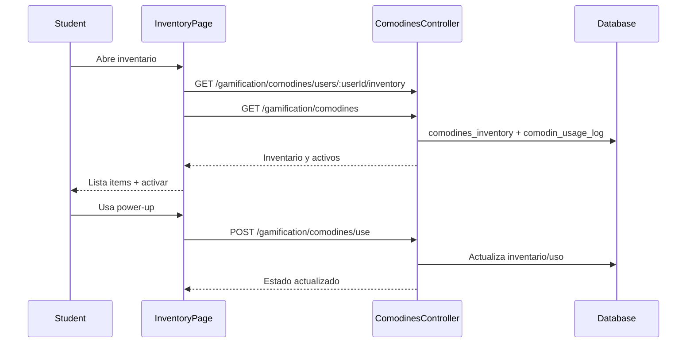

# Flujo Student - Inventario de Items

**Version:** 1.0.0  
**Fecha:** 2026-02-17  
**Estado:** Activo

---

## Resumen

Flujo para consultar inventario de comodines y activar power-ups desde el portal estudiante.

> Nota de alcance (2026-02-17): este documento cubre inventario de comodines/consumibles.  
> El equipamiento cosmético se documenta en `FLUJO-EQUIPAMIENTO-ITEMS-COSMETICOS.md`.
> Flujo maestro integrado: `FLUJO-COMPRA-INVENTARIO-EQUIPAR.md`.

## Diagrama Mermaid

---

## Cobertura de inventario por tipo

| Tipo | Documento | API principal |
|------|-----------|---------------|
| Comodines/consumibles | `FLUJO-INVENTARIO-ITEMS.md` | `/gamification/comodines/*` |
| Cosmeticos equipables | `FLUJO-EQUIPAMIENTO-ITEMS-COSMETICOS.md` | `/gamification/inventory/*` |

## Trazabilidad

### Frontend
- `apps/frontend/src/apps/student/pages/InventoryPage.tsx` (Thin Shell, 258 lines post-refactor v10.0.0)
- `apps/frontend/src/features/gamification/social/hooks/useInventoryData.ts` (React Query: cosmetics + power-ups)
- `apps/frontend/src/features/gamification/social/hooks/useActivatePowerUp.ts` (mutation + ARCH-015 mapping)
- `apps/frontend/src/apps/student/components/inventory/InventoryItemCard.tsx` (item card + actions)
- `apps/frontend/src/apps/student/components/inventory/PowerUpModal.tsx` (activation confirmation)
- `apps/frontend/src/apps/student/components/inventory/ActivePowerUpsBanner.tsx` (active power-ups)
- `apps/frontend/src/apps/student/components/inventory/ActivePowerUpsList.tsx` (active tab content)
- `apps/frontend/src/apps/student/components/inventory/InventoryStatsGrid.tsx` (stats overview)
- `apps/frontend/src/features/gamification/social/api/socialAPI.ts`

### Backend
- `apps/backend/src/modules/gamification/controllers/comodines.controller.ts`
- `apps/backend/src/modules/gamification/services/comodines.service.ts`

### Datos
- `gamification_system.comodines_inventory`
- `gamification_system.comodin_usage_log`

### Ver también
- `docs/30-ux-ui/flujos/student/FLUJO-EQUIPAMIENTO-ITEMS-COSMETICOS.md`
- `docs/30-ux-ui/flujos/student/FLUJO-COMPRA-INVENTARIO-EQUIPAR.md`
