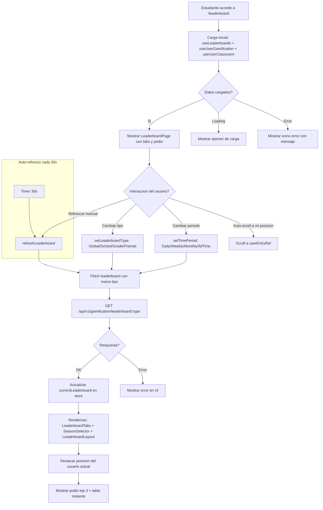

# FL-STU-14 - Leaderboards

**ID:** FL-STU-14
**Version:** 1.0.0
**Fecha:** 2026-02-17
**Estado:** Activo
**Portal:** Student
**Prioridad:** P2

---

## 1. Resumen

Flujo de visualizacion e interaccion con los leaderboards (rankings) desde el portal Student. El estudiante puede consultar diferentes tipos de leaderboard (global, escuela, grado, amigos), seleccionar periodos de tiempo (diario, semanal, mensual, historico), ver su posicion actual destacada, visualizar el podio de top 3 jugadores, y navegar entre tabs. La pagina incluye auto-refresco cada 30 segundos, animaciones suaves con Framer Motion, y paneles laterales con estadisticas. Los datos provienen del modulo de gamificacion del backend, que calcula rankings basados en XP total, nivel, rango maya, racha y logros.

---

## 2. Precondiciones

- Usuario autenticado con rol `student`.
- Sesion activa con JWT valido.
- Tenant asignado (multi-tenancy RLS activo).
- El estudiante pertenece a al menos un classroom (para leaderboard por aula).
- Datos de gamificacion existentes (XP, nivel, rango) para el usuario.

---

## 3. Diagrama Mermaid



---

## 4. Secuencia FE -> BE -> DB

```
=== Carga inicial ===
1. FE: LeaderboardPage monta → useLeaderboards() (Zustand store)
2. FE: useUserGamification(user.id) → datos de XP, nivel, rango del header
3. FE: useUserClassroom(user.id) → classroomId para filtro de aula
4. FE: useDashboardData() → progress y achievements para paneles laterales
5. Store: Leaderboards store dispara fetch del leaderboard seleccionado (default: global, all_time)
6. FE: socialAPI o gamification.api → GET /api/v1/gamification/leaderboard/global?limit=100&offset=0
7. BE: LeaderboardController.getGlobal() → LeaderboardService.getGlobalLeaderboard()
8. DB: SELECT con JOIN gamification_system.user_stats + auth_management.profiles ORDER BY total_xp DESC (RLS)
9. BE: Retorna { type, entries[], totalEntries, lastUpdated, timePeriod }
10. FE: Renderiza podio (top 3) + tabla + posicion usuario

=== Cambiar tipo de leaderboard ===
11. FE: LeaderboardTabs.onClick → setLeaderboardType('school')
12. Store: Actualiza selectedType → dispara fetch
13. FE: GET /api/v1/gamification/leaderboard/school?schoolId=...
14. BE: LeaderboardController.getBySchool() → LeaderboardService.getSchoolLeaderboard()
15. DB: SELECT ... WHERE school_id = :schoolId (filtrado por RLS y parametro)
16. FE: Actualiza UI con datos de escuela

=== Cambiar periodo de tiempo ===
17. FE: SeasonSelector.onChange → setTimePeriod('this_week')
18. Store: Actualiza selectedPeriod → re-fetch con filtro temporal
19. BE: Query con filtro WHERE created_at >= start_of_period
20. FE: Actualiza rankings con datos del periodo

=== Refrescar manualmente ===
21. FE: Boton refresh → refreshLeaderboard()
22. FE: isRefreshing = true → muestra icono spinning
23. BE: Misma query que carga inicial
24. FE: Actualiza datos + isRefreshing = false

=== Auto-refresh ===
25. FE: setInterval(30000) → refreshLeaderboard() cada 30 segundos
```

---

## 5. Componentes y artefactos implicados

### Frontend

| Tipo | Archivo |
|------|---------|
| Pagina | `apps/frontend/src/apps/student/pages/LeaderboardPage.tsx` |
| Hook Leaderboards | `apps/frontend/src/features/gamification/social/hooks/useLeaderboards.ts` |
| Store Leaderboards | `apps/frontend/src/features/gamification/social/store/leaderboardsStore.ts` |
| API Social | `apps/frontend/src/features/gamification/social/api/socialAPI.ts` |
| API Gamification | `apps/frontend/src/lib/api/gamification.api.ts` |
| Layout Leaderboard | `apps/frontend/src/features/gamification/social/components/Leaderboards/LeaderboardLayout.tsx` |
| Tabs | `apps/frontend/src/features/gamification/social/components/Leaderboards/LeaderboardTabs.tsx` |
| Podio | `apps/frontend/src/features/gamification/social/components/Leaderboards/LeaderboardPodium.tsx` |
| Entry Row | `apps/frontend/src/features/gamification/social/components/Leaderboards/LeaderboardEntry.tsx` |
| Filtros | `apps/frontend/src/features/gamification/social/components/Leaderboards/LeaderboardFilters.tsx` |
| Season Selector | `apps/frontend/src/features/gamification/social/components/Leaderboards/SeasonSelector.tsx` |
| User Position | `apps/frontend/src/features/gamification/social/components/Leaderboards/UserPositionCard.tsx` |
| Rank Change | `apps/frontend/src/features/gamification/social/components/Leaderboards/RankChangeIndicator.tsx` |
| Enhanced Tabs | `apps/frontend/src/features/gamification/social/components/Leaderboards/EnhancedLeaderboardTabs.tsx` |
| Advanced Table | `apps/frontend/src/features/gamification/social/components/Leaderboards/AdvancedLeaderboardTable.tsx` |
| Preview (Dashboard) | `apps/frontend/src/apps/student/components/gamification/LeaderboardPreview.tsx` |
| Hook Classroom | `apps/frontend/src/apps/student/hooks/useUserClassroom.ts` |
| Hook Gamification | `apps/frontend/src/shared/hooks/useUserGamification.ts` |
| Header | `apps/frontend/src/shared/components/layout/GamifiedHeader.tsx` |
| Rutas | `apps/frontend/src/App.tsx` (ruta: `/leaderboard`) |

### Backend

| Tipo | Archivo |
|------|---------|
| Controller | `apps/backend/src/modules/gamification/controllers/leaderboard.controller.ts` |
| Service | `apps/backend/src/modules/gamification/services/leaderboard.service.ts` |
| Entity Leaderboard Metadata | `apps/backend/src/modules/gamification/entities/leaderboard-metadata.entity.ts` |
| Entity User Stats | `apps/backend/src/modules/gamification/entities/user-stats.entity.ts` |
| Entity User Rank | `apps/backend/src/modules/gamification/entities/user-rank.entity.ts` |
| Entity Maya Rank | `apps/backend/src/modules/gamification/entities/maya-rank.entity.ts` |
| Guard JWT | `apps/backend/src/modules/auth/guards/jwt-auth.guard.ts` |

### Base de Datos

| Tipo | Archivo |
|------|---------|
| Tabla user_stats | `apps/database/ddl/schemas/gamification_system/tables/01-user_stats.sql` |
| Tabla user_ranks | `apps/database/ddl/schemas/gamification_system/tables/02-user_ranks.sql` |
| Tabla leaderboard_metadata | `apps/database/ddl/schemas/gamification_system/tables/09-leaderboard_metadata.sql` |
| Tabla maya_ranks | `apps/database/ddl/schemas/gamification_system/tables/13-maya_ranks.sql` |
| Tabla profiles | `apps/database/ddl/schemas/auth_management/tables/03-profiles.sql` |

---

## 6. Reglas y validaciones

| Regla | Capa | Descripcion |
|-------|------|-------------|
| Autenticacion requerida | BE | JwtAuthGuard en todos los endpoints de leaderboard |
| Tipos de leaderboard validos | FE + BE | global, school, grade, friends |
| Periodos validos | FE + BE | all_time, this_week, this_month (daily future) |
| Limite por defecto 100 | BE | Paginacion: limit=100, offset=0 por defecto |
| RLS por tenant | DB | Rankings filtrados por tenant automaticamente |
| Auto-refresh 30 segundos | FE | Polling automatico con setInterval |
| Posicion usuario destacada | FE | getUserEntry() y getUserPosition() para highlight |
| Podio top 3 | FE | Primeros 3 entries renderizados en LeaderboardPodium |
| Leaderboard por escuela requiere schoolId | BE | Parametro obligatorio para filtro por escuela |
| Leaderboard por aula requiere classroomId | BE | Se obtiene de useUserClassroom hook |

---

## 7. Manejo de errores

| Escenario | Capa | Codigo HTTP | Comportamiento |
|-----------|------|-------------|----------------|
| Token JWT expirado | BE | 401 | Redirige a login |
| Leaderboard no encontrado (school sin datos) | BE | 404 | NotFoundException, FE muestra mensaje vacio |
| Error de red en carga inicial | FE | N/A | leaderboardError mostrado con icono AlertCircle |
| Error en auto-refresh | FE | N/A | Silencioso, reintenta en proximo ciclo |
| classroomId no disponible | FE | N/A | Tab de aula deshabilitado o fallback a global |
| Leaderboard vacio (sin entradas) | FE | 200 | Muestra estado vacio "No hay rankings disponibles" |
| Timeout en query de leaderboard | BE | 504 | FE muestra error con opcion de reintentar |
| Offset fuera de rango | BE | 200 | Retorna array vacio con totalEntries correcto |

---

## 8. Trazabilidad cruzada

| Capa | Archivo | Evidencia |
|------|---------|-----------|
| Frontend Pagina | `apps/frontend/src/apps/student/pages/LeaderboardPage.tsx` | Pagina completa con tabs, podio, auto-refresh |
| Frontend Hook | `apps/frontend/src/features/gamification/social/hooks/useLeaderboards.ts` | Hook principal para fetch y estado de leaderboards |
| Frontend Store | `apps/frontend/src/features/gamification/social/store/leaderboardsStore.ts` | Zustand store con selectedType, selectedPeriod, entries |
| Frontend API | `apps/frontend/src/features/gamification/social/api/socialAPI.ts` | Llamadas HTTP a leaderboard endpoints |
| Frontend Components | `apps/frontend/src/features/gamification/social/components/Leaderboards/` | 14 componentes de UI para leaderboard |
| Backend Controller | `apps/backend/src/modules/gamification/controllers/leaderboard.controller.ts` | GET global, school, classroom endpoints |
| Backend Service | `apps/backend/src/modules/gamification/services/leaderboard.service.ts` | Logica de ranking y consultas |
| DDL user_stats | `apps/database/ddl/schemas/gamification_system/tables/01-user_stats.sql` | Tabla principal de XP, nivel, streaks |
| DDL leaderboard_metadata | `apps/database/ddl/schemas/gamification_system/tables/09-leaderboard_metadata.sql` | Metadata de leaderboards |

---

## 9. Referencias

- Epic: EPIC-GAM-F1-GAMIFICATION
- Especificacion: `docs/10-requirements/epics/EPIC-GAM-F1-GAMIFICATION/specifications/ET-GAM-003-rangos-maya.md`
- Especificacion: `docs/10-requirements/epics/EPIC-GAM-F3-SOCIAL-GAMIFICATION/requirements/RF-SOC-002-gremios.md`
- Guia portal estudiante: `docs/60-portals/student/PORTAL-STUDENT-GUIDE.md`
- ADR-016: Simplificar Backend XP Acumulacion (`docs/90-adr/ADR-016-simplificar-backend-xp-acumulacion.md`)
- Modelo datos gamificacion: `docs/20-architecture/DATOS-GAMIFICACION.md`
