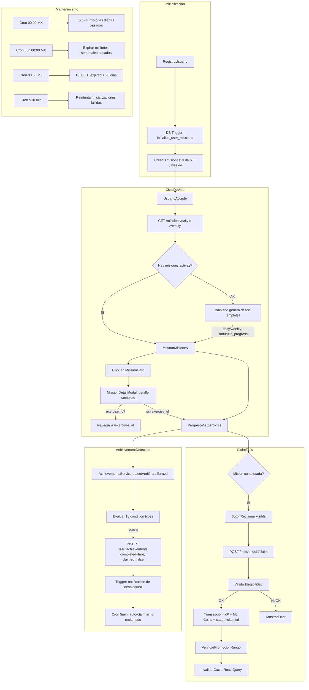

# Flujo Student - Logros y Misiones (Claim Rewards)

**Version:** 2.1.0
**Fecha:** 2026-02-21
**Estado:** Activo
**Tarea:** TASK-2026-02-18-ANALISIS-MISIONES-LOGROS

---

## 1. Resumen

Describe el ciclo de vida completo del sistema de misiones y logros: inicializacion, generacion, deteccion, reclamacion de recompensas, y procesos de mantenimiento automatico.

---

## 2. Diagrama Mermaid

---

## 3. Inicializacion de Misiones (Registro de Usuario)

Al crear un perfil, el DB trigger `trg_initialize_user_stats` invoca `gamilit.initialize_user_missions()`:

1. Busca 8 templates por `type + target_type` (UUID lookup, REC-009)
2. Crea **3 misiones diarias**: complete_exercises, earn_xp, use_comodines
3. Crea **5 misiones semanales**: complete_module, daily_streak, perfect_scores, explore_modules, complete_exercises
4. Usa `ON CONFLICT DO NOTHING` para idempotencia
5. Si algun template no existe, registra error en `pending_user_initializations` para retry

**Nota:** El backend genera solo 3 daily y 2 weekly al renovar (on-demand). La inicializacion DB crea 5 weekly como bienvenida.

---

## 4. Generacion y Reset de Misiones

### Cron Jobs (America/Mexico_City)

| Job | Schedule | Accion |
|-----|----------|--------|
| `daily-missions-reset` | `0 0 * * *` | Expira misiones diarias con end_date pasada |
| `weekly-missions-reset` | `0 0 * * 1` | Expira misiones semanales con end_date pasada |
| `cleanup-expired-missions` | `0 3 * * *` | DELETE expired > 90 dias (REC-010) |
| `check-missions-progress` | `*/5 * * * *` | Monitoreo (progreso via DB triggers) |

### Generacion On-Demand

Cuando el usuario pide misiones (`findByTypeAndUser`) y no hay activas:
- **Daily:** Selecciona 3 templates aleatorios (filtrado por nivel y activos) → status inicial `in_progress`
- **Weekly:** Selecciona 2 templates aleatorios → status inicial `in_progress`
- **exercise_id:** Se propaga desde `mission_templates.exercise_id` a `missions.exercise_id` al crear

> **Cambio v2.1.0:** Las misiones daily/weekly se crean directamente como `in_progress` (no requieren "Iniciar Mision"). Las misiones special siguen creándose como `active`.

---

## 5. Deteccion de Logros (Backend-Only)

`AchievementsService.detectAndGrantEarned()` evalua **18 condition types**:

| Tipo | Descripcion |
|------|-------------|
| `exercise_completion` | N ejercicios completados |
| `streak` | N dias consecutivos |
| `module_completion` | Completar modulo especifico |
| `all_modules_completion` | Completar todos los modulos |
| `perfect_score` | N puntuaciones perfectas |
| `skill_mastery` | Dominio de habilidad |
| `exploration` | Modulos explorados |
| `social` | Actividad social (aulas, grupos) |
| `special` | Primer login, etc. |
| `module_first_exercise` | Primer ejercicio en modulo |
| `exercise_score` | Puntuacion minima en tipo de ejercicio |
| `exercise_repetition` | N completaciones de tipo especifico |
| `exercise_speed` | Completar dentro de tiempo limite |
| `content_analysis` | N analisis con puntuacion minima |
| `module_average_score` | Promedio minimo en modulo |
| `progress` | Ejercicios + modulos completados |
| `level` | Nivel minimo alcanzado |
| `rank` | Rango Maya alcanzado |

**Rate limit:** 5 achievements/minuto/usuario.

**DB function deprecated:** `check_and_award_achievements()` tiene condition types UPPERCASE que NO coinciden con los seeds lowercase. Evaluacion se hace exclusivamente en backend (REC-005).

---

## 6. Auto-Reconciliacion de Achievements

El cron `reconcile-pending-achievement-claims` (cada 5 min) busca achievements con `is_completed=true AND rewards_claimed=false` y los reclama automaticamente.

**Implicacion:** Los logros NO requieren claim explicito del usuario para otorgar recompensas. El sistema los auto-reclama dentro de 5 minutos. El boton "Reclamar" en el frontend es una mejora UX pero no es necesario para recibir las recompensas.

---

## 7. Flujo de Reclamacion (Claim)

### Misiones (claim explicito obligatorio)

1. Usuario completa objetivo → status cambia a `completed`
2. Usuario hace click en "Reclamar" → `POST /missions/:id/claim`
3. Backend usa `pessimistic_write` lock + transaccion atomica
4. Actualiza `user_stats.total_xp`, `user_stats.ml_coins`, inserta `ml_coins_transactions`
5. Marca mision como `claimed` con `claimed_at`

### Logros (claim automatico + manual)

1. Backend detecta logro → INSERT `user_achievements` con `is_completed=true, rewards_claimed=false`
2. Trigger crea notificacion de desbloqueo
3. **Path A:** Usuario hace click "Reclamar" → SQL function `claim_achievement_reward()`
4. **Path B:** Cron auto-claim a los 5 min si no reclamado manualmente

---

## 7b. Navegacion por exercise_id y MissionDetailModal (v2.1.0)

### exercise_id en Misiones

Las tablas `mission_templates` y `missions` ahora incluyen `exercise_id UUID` (FK a `educational_content.exercises`). Cuando un template tiene exercise_id definido, la mision generada hereda el vinculo.

**Prioridad de navegacion:**
1. Si `mission.exercise_id` → navegar directo a `/exercises/:exercise_id`
2. Si `mission.type === 'special'` con `required_module` → navegar al modulo
3. Fallback → hub de aprendizaje

### MissionDetailModal

Al hacer click en cualquier MissionCard se abre un modal con:
- Descripcion completa (sin truncar)
- Progreso individual por objetivo con barras
- Recompensas (ML Coins + XP)
- Timer con urgencia
- Boton de accion contextual (Iniciar/Ir al Ejercicio/Reclamar/Completado)

**Componente:** `features/gamification/missions/components/MissionDetailModal.tsx`

---

## 8. Trazabilidad

### Frontend
- `apps/frontend/src/apps/student/pages/AchievementsPage.tsx`
- `apps/frontend/src/apps/student/pages/MissionsPage.tsx`
- `apps/frontend/src/features/gamification/missions/hooks/useMissions.ts`
- `apps/frontend/src/services/api/gamification/gamificationAPI.ts` (canonical)
- `apps/frontend/src/features/gamification/missions/components/MissionDetailModal.tsx`

### Backend
- `apps/backend/src/modules/gamification/services/achievements.service.ts` — deteccion + claim
- `apps/backend/src/modules/gamification/services/missions.service.ts` — generacion + claim
- `apps/backend/src/modules/gamification/services/missions/mission-claim.service.ts` — claim extraido
- `apps/backend/src/modules/tasks/services/missions-cron.service.ts` — 4 cron jobs
- `apps/backend/src/modules/tasks/services/achievement-reconciliation-cron.service.ts` — auto-claim
- `apps/backend/src/modules/tasks/services/pending-initializations-cron.service.ts` — retry init (REC-007)

### DDL
- `gamification_system.missions` — instancias por usuario (template_id UUID FK, REC-009)
- `gamification_system.mission_templates` — catalogo de 12 templates
- `gamification_system.user_achievements` — logros desbloqueados (rewards_claimed boolean)
- `gamification_system.achievements` — catalogo de 40 logros (rewards JSONB canonical, REC-012)
- `gamification_system.user_stats` — XP, ML Coins, rachas
- `gamification_system.ml_coins_transactions` — historial de transacciones

---

## 9. Riesgos y Mitigaciones

| Riesgo | Severidad | Mitigacion |
|--------|-----------|------------|
| Race condition misiones duplicadas | MITIGADO | UNIQUE constraint (REC-001) |
| Timezone desalineado cron | MITIGADO | America/Mexico_City en todos los cron (REC-002) |
| Claim parcial (XP sin coins) | MITIGADO | Transaccion con pessimistic_write lock |
| Trigger init falla silenciosamente | MITIGADO | Retry cron cada 10 min (REC-007) |
| Misiones expired acumulacion infinita | MITIGADO | Cleanup daily 03:00 (REC-010) |
| DB function condition type mismatch | DOCUMENTADO | @DEPRECATED, evaluacion solo en backend (REC-005) |
| Bonus frontend sin backend | ELIMINADO | bonusXP/bonusMLCoins hardcoded a 0 (REC-006) |

---

*Generado: 2026-02-21 | Sistema SIMCO v4.0.0*
