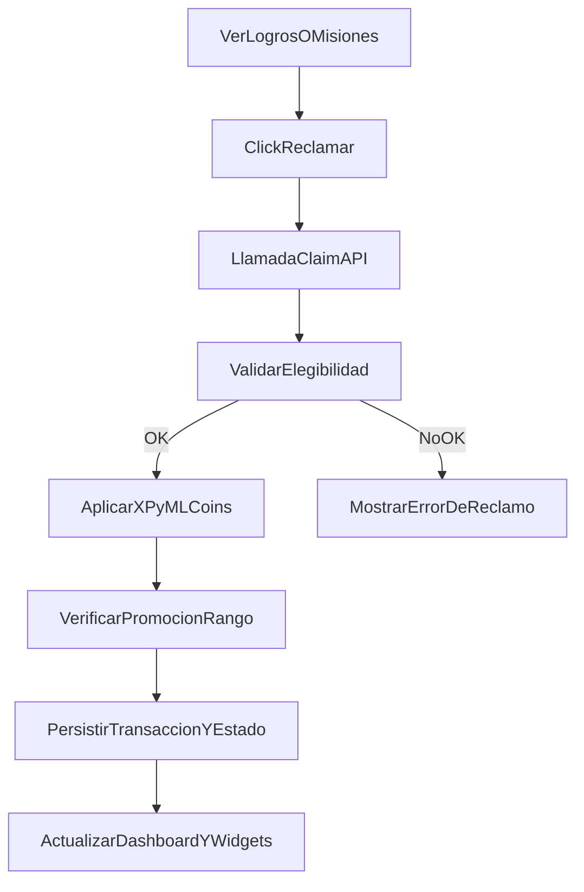

# Flujo Student - Logros y Misiones (Claim Rewards)

**Version:** 1.0.0  
**Fecha:** 2026-02-17  
**Estado:** Activo

---

## Resumen

Describe el reclamo de recompensas de logros y misiones, y la propagacion de cambios en balance, XP, rango y UI.

## Diagrama Mermaid

## Trazabilidad

### Frontend
- `apps/frontend/src/pages/AchievementsPage.tsx`
- `apps/frontend/src/apps/student/pages/MissionsPage.tsx`
- `apps/frontend/src/services/api/missionsAPI.ts`
- `apps/frontend/src/lib/api/gamification.api.ts`

### Backend
- `apps/backend/src/modules/gamification/services/achievements.service.ts`
- `apps/backend/src/modules/gamification/services/missions.service.ts`
- Endpoints claim en modulo gamification.

### Datos
- `gamification_system.user_achievements`
- `gamification_system.missions`
- `gamification_system.user_stats`
- `gamification_system.ml_coins_transactions`

## Riesgo funcional documentado

- Si aplicacion de XP y ML Coins se ejecuta en pasos separados sin transaccion atomica, pueden ocurrir estados parciales.
